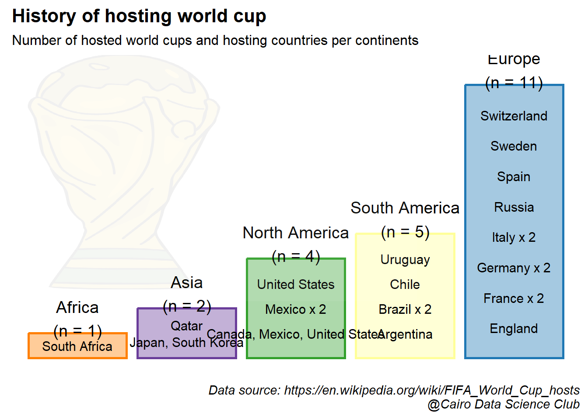
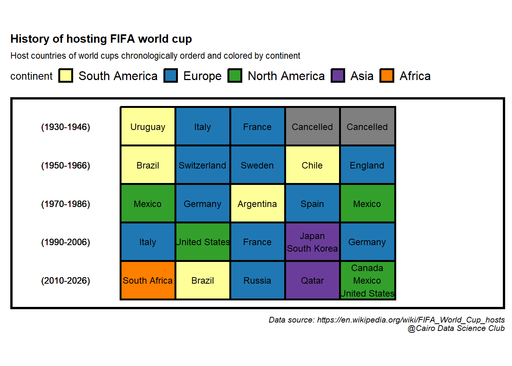
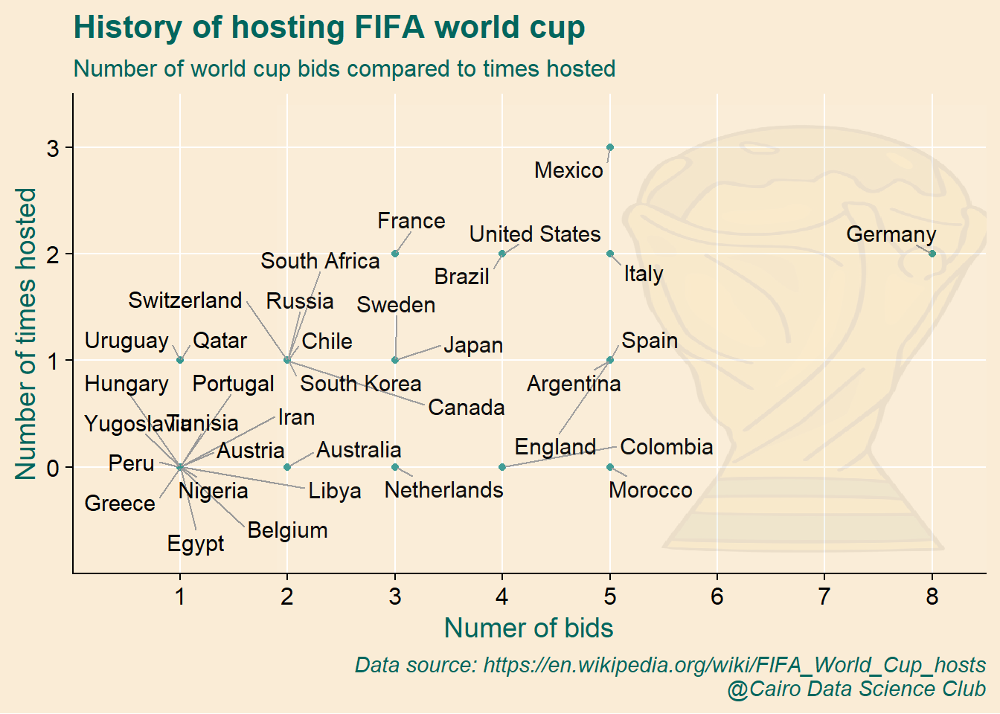
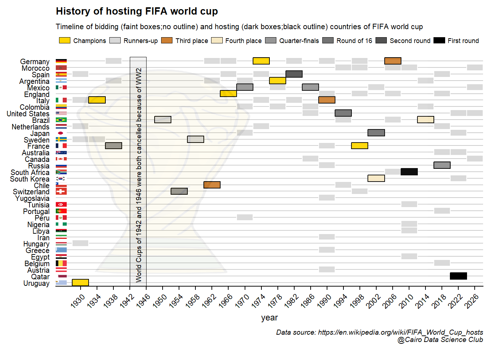

```{r setup, include=FALSE}
#set knitting options
knitr::opts_chunk$set(out.width = "90%",
                      out.height = "90%")
```

# History of hosting FIFA World Cup

**Overview**

An exploratory data analysis project on the history of hosting FIFA world cup.

**Outline**

1.  [Where and how can we get the data?]

    To start with, we will learn how to scrape Wikipedia directly into R, parse the data tables, and apply quality control to make them ready for the analysis.

    {width="265"}

2.  [How many world cups were hosted in each continent?]

    Will then move on to explore the number of hosted cups at the level of continents and the geographical distribution of hosting countries.

    {width="490"}{width="491"}

3.  [What is the timeline of hosting the world cup?]

    Next, will add the time component by generating a condensed timeline of the history of hosting world cups on the level countries and continents.

    {width="494"}

4.  [What is the history of bidding for world cup?]

    Finally, we will go beyond the mere hosting the championship to explore the bidding process and the performance of the hosting team over the years.

    {width="487"}{width="498"}{width="499"}

Let's start by loading the libraries that we'll utilize in our analysis

```{r message=FALSE, warning=FALSE}
#web scrapping
library(rvest)
#everything tidy?
library(tidyverse)
#handling spatial-data 
library(rnaturalearth)
library(rnaturalearthdata)
library(sf)
library(ggflags)
library(ggspatial)
library(giscoR)
library(rasterpic)
library(countrycode)
#adding flags in ggplot
library(ggimage)
#Visually explore data tables 
library(visdat)
#fit text within a defined area
library(ggfittext)
#set the default ggplot theme
theme_set(cowplot::theme_cowplot())
```

and with that, we're ready to ride!


## Where and how can we get the data?

### Data retrieval

Generally, we would like to know **who** (country, continent) *hosted* **when**. Since *hosting* is a lengthy process that starts by *bidding* and followed by FIFA evaluation. it would be interesting to incorporate *bidding* data into the analysis.

In this project we will use the data made available in this Wikipedia article about [FIFA World Cup hosts](https://en.wikipedia.org/wiki/FIFA_World_Cup_hosts)

To do that, we are going to use the [rvest](https://rvest.tidyverse.org/) package to explore and scrape this tables directly into R.

```{r}
# URL of the article
url <- "https://en.wikipedia.org/wiki/FIFA_World_Cup_hosts"
# Read the webpage and obtain the pieces of the article containing tables
tbls_lst <-  url %>%
  read_html %>%
  html_table()
#number of retrieved tables
length(tbls_lst)
```

We've scrapped the Wikipedia article and parsed all the tables, 15 in total! hmm, we don't need all of them for our analysis. Let's select only the tables of interest for this tutorial. We'll limit our data analysis to the subset of tables showing the list of countries that have submitted a bid or actually hosted the world cup and the performance of host countries in our analysis.

```{r}
# Select tables of interest
tbls_lst <- tbls_lst[c(1,9,10)]

# Assign names to the tables
tables_names <- c("List of hosts",
                  "Total bids by country",
                  "Host country performances")
names(tbls_lst) <- tolower(tables_names) %>% str_replace_all(" ","_")
```

Let's have a quick look at the top of the selected tables

```{r}
gt::gt(head(tbls_lst$list_of_hosts))
gt::gt(head(tbls_lst$total_bids_by_country))
gt::gt(head(tbls_lst$host_country_performances))
```

Looks good! Next, we'll have a deeper look at the data to insure that everything is in the right place.

### Data quality control

Parsing data from Web is not a perfect process due to different formatting. We'll start by having a visual inspection of the tables using the package `visdat` and combine all the tables in a single plot.

```{r}
#Visualize the content of the tables
(vis_dat_lst <- lapply(tbls_lst,visdat::vis_dat))
#Add title of the data to the plot
(vis_dat_lst <- lapply(names(vis_dat_lst), function(dat_name){
  #subset the plot of by name
  vis <- vis_dat_lst[[dat_name]]
  #add title
  vis + 
    labs(title = dat_name)
  }))
#combine all the tables in a single plot
vis_dat_lst %>%
  patchwork::wrap_plots() &
  theme(legend.position = "bottom")
```

The plots reveal two issues. First, the type of the column "Years" in the second table is character! We'll fix this later, but now let's deal with the second issue. The third table shows missing data in many columns! Let's have a deeper look on this table

```{r}
gt::gt(tbls_lst[[3]])
```

Apparently, the missing values are yet-to-be-determined performances of the hosting countries in 2026! Therefore, this shouldn't be a concern and is not a failure of parsing the table.

Before rushing to the analysis, let's push the tables through a few rounds of quality control.

let's start by cleaning column names by handling special characters, spaces, and applying a consistent format.

```{r}
#names of columns before cleaning
lapply(tbls_lst, colnames)
# Clean columns' names
tbls_lst <- lapply(tbls_lst,  janitor::clean_names)
#names of columns after cleaning
lapply(tbls_lst, colnames)
```

One can see that the column with the countries has a different name ("host_nation_s", "country", "team") in each table. Let's fix this inconsistency and set an new name ( "country_name") to all of them.

```{r}
#old inconsistent names
cols_old <- c("country", "team", "host_nation_s")
#new column name
col_new <- "country_name"
#apply the replacement
(tbls_lst <- lapply(tbls_lst, function(tbl){
  tbl %>%
    rename_with(~ ifelse(.x %in% cols_old,
                         col_new,
                         .x))
  }))

```

Similarly, the year column is called "years" in the second table. Let's make it consistent with the other tables and rename it to "year".

```{r}
tbls_lst$total_bids_by_country <- tbls_lst$total_bids_by_country %>% 
  dplyr::rename(year = "years")
```

Next, we need to insure that the data is "tidy". Obviously, this is not the case for the table below where the column column "years" show mutliple dates concatenated in the same row

```{r}
tbls_lst$total_bids_by_country
```

what we need to do is to split years of bids into separate entries and convert it to numeric

```{r}
#separate concatenated years into separate rows
(tbls_lst$total_bids_by_country <- tbls_lst$total_bids_by_country %>% 
  mutate(year = str_extract_all(year, "[0-9]+")) %>% 
  unnest(year) %>% 
  mutate(year = as.numeric(year)))
```

and do the same thing by splitting cohosts of the same world cup (e.g. "Japan South Korea") into separate rows entries ("Japan", "South Korea").

```{r}
#separate cohosting countries into separate entries
tbls_lst$list_of_hosts <- tbls_lst$list_of_hosts %>% 
  mutate(country_name = str_split(country_name, "\\s{2}")) %>%
  unnest(country_name) %>% 
  dplyr::rename(host_year = "year")
```

Have a look on `separate_rows()` for another way to achieve the same effect

Next, let's give a meaningful order to the results of the teams.

```{r}
#order of the results
results_order <- c("Champions",
                   "Runners-up",
                   "Third place",
                   "Fourth place",
                   "Quarter-finals",
                   "Round of 16",
                   "Second round",
                   "First round",
                   "TBD"
                   )
#set the order
tbls_lst$host_country_performances  <- tbls_lst$host_country_performances %>%
  mutate(result = ifelse(result == "Second round (top 12)", "Second round", result),
         result = factor(result, levels = results_order))
```

And we'll end this part by defining a new column with country code (isoc2).

```{r}
#get iso2 code of each country (flags for Yugoslavia and England are missing)
(tbls_lst <- lapply(tbls_lst,function(tbl){
  tbl$country_code <- countrycode::countrycode(tbl$country_name,
                                            "country.name",# the provided country label
                                            "iso2c"# the country code
                                            )
  tbl
  }))
```

Quality control is not over yet! We need to manually apply some historical modification to the data.

First, let's correct the entry of Colombia. After being chosen as a host in 1986, the country had to withdrew from hosting the cup due to economic concerns.

```{r}
tbls_lst$total_bids_by_country <- tbls_lst$total_bids_by_country %>% 
  mutate(times_hosted = ifelse(country_name == "Colombia", 0, times_hosted))
 
```

Second, as Berlin Wall was brought to the ground few decades ago, let's replace West Germany" with "Germany".


```{r}
tbls_lst <- lapply(tbls_lst, function(tbl){
  tbl %>%
    mutate(across(where(is.character), #select character columns
                  ~ str_replace(.x, "West Germany", "Germany") #define replacement
                  )
           )
  })
```

Now that the data is analysis-ready, it is time to explore some interesting questions!


## How many world cups were hosted in each continent?

Before embarking on our colorful journey of data visualization, let's define a caption that credits the source of the data and the analysis.

```{r}
caption_cdc <- glue::glue("Data source: {url}\n@Cairo Data Science Club")
theme_update(plot.caption = element_text(face = "italic"))
```

We'll start by having a quick look at the data.

```{r}
gt::gt(head(tbls_lst$list_of_hosts))
```

The table shows individual hosting countries of all world cups. But more than one country can cohost the same championship. What we need is a table of cohosts per world cup. To data that, we'll start by excluding the dates in which the championship was cancelled because of Warld War II and combine cohosts of the same year.

```{r}
df_host1 <- tbls_lst$list_of_hosts %>% 
  filter(!str_detect(continent, "Cancelled")) %>% #exclude cancelled events
  group_by(host_year) %>% 
  summarise(across(everything(),
                   ~ paste(unique(.x),collapse = ", ") #combine cohosts
                   )
            ) %>%
  ungroup() %>% 
  as.data.frame()

gt::gt(df_host1)
```

Let's look at a basic bar plot of the data

```{r}
(bar_host_plt <- df_host1 %>% 
  ggplot(aes(continent))+
  geom_bar())
```

This doesn't look pretty. Let's make it more attractive! First, let's add a some colors.

```{r}
#Assign colors to each continent
conti_cols <- c(Europe = "#1f78b4",
                Asia = "#6a3d9a",
                `South America` = "#ffff99",
                `North America` = "#33a02c",
                Africa = "#ff7f00")
```

... and have another look on the plot.

```{r}
#show colors in the plot
(bar_host_plt <- bar_host_plt +
    geom_bar(aes(fill = continent))+
  scale_color_manual(values = conti_cols)+
  scale_fill_manual(values = conti_cols))
```

Now let's add some text to give context to the visualized data.

```{r}
(bar_host_plt <- bar_host_plt +
    labs(title = "History of hosting world cup",
       subtitle = "Number of hosted world cups and hosting countries per continents",
       caption = caption_cdc))
```

Next, let's order continents by number of hosted games

```{r}
df_host2 <- df_host1 %>% 
  group_by(continent) %>% 
  summarise(n = n())%>% #number of world cups per continent
  ungroup() %>% 
  arrange(n) %>%
  mutate(continent = factor(continent, levels = unique(continent))) #set continents order based on number of hosts
```

and add a vector of characters showing both the name of continent and number of hosted cups to label each bar.

```{r}
df_host_3 <- df_host2 %>% 
              mutate(cont_n = glue::glue("{continent} (n = {n})"))
```

Let's put things together and have a look on the updated plot. Also, I think we can safely remove the axis and rather add the labels from the previous step on top of each bar.

```{r}

(bar_host_plt <- df_host2 %>% 
  ggplot(aes(continent, n))+
  #add a layer of bars with white fill and colored borders
  geom_col(aes(color = continent),
           fill = "white",
           show.legend = FALSE,
           linewidth = 1)+
  #then add another layer of bars with transparent fill
  geom_col(aes(fill = continent),
           alpha = 0.4,
           show.legend = FALSE)+
  #add the text labels on top of the bars
  geom_text(data = df_host_3,
            aes(label = cont_n),
            size = 4.5,
            nudge_y = 0.6)+
  labs(title = "History of hosting world cup",
       subtitle = "Number of hosted world cups and hosting countries per continents",
       caption = caption_cdc)+
  #define fill and colors of the bars
  scale_color_manual(values = conti_cols)+
  scale_fill_manual(values = conti_cols)+
  #define the theme
  theme(axis.line = element_blank(),
        axis.ticks = element_blank(),
        axis.text = element_blank(),
        axis.title = element_blank()))
```

These long bars, there's something about them. Something ... empty. I got an idea! Why not fill them with the names of the hosting countries?! That would look awesome!

The goal is stack countries' names in an equidistant fashion within each bar. To do this, we divide the bar, which indicates the number of hosted world cups, by the number of hosting countries. This would simply partition the bar into equally-sized parts equal to the number of hosting countries. Finally, to get the location of countries within the bar, we compute the cumulative sum of the size of these parts.

```{r}
df_txt_bar <- df_host1 %>%
              group_by(continent, country_name) %>% 
              summarise(n_host = n()) %>% # number of hosted world cups per country
              group_by(continent) %>% 
              mutate(n_countries = n(), #number of hosting countries 
                     n_cont = sum(n_host), #number of hosted world cups per continent (height of the bar)
                     prop = n_cont/(n_countries+1), # divides the bar height by the number of countries
                     cum_prop = cumsum(prop) #stack countries' names within the bar
                     )%>%
              ungroup() %>% 
              mutate(country_name = ifelse(n_host >1 , glue::glue("{country_name} x {n_host}"), country_name) # indicate the number of times a country hosted the world cup
                     ) 
```

Let's fill these empty bars with the names of the hosting countries

```{r}
(bar_host_plt <- bar_host_plt +
   geom_text(data = df_txt_bar,
                            aes(y = cum_prop, label = country_name),
                            size = 4
                            ))
```

This looks really beautiful, but with some deficits. One can notice some names of co-hosting countries and continents that are "overflowing" outside their bar.

Let's fix this by setting the boundaries of the each bar. First, let's calculate the boundaries

```{r}
#set the boundaries as 0.45 on each from the center of the bar
df_txt_bar2 <- df_txt_bar %>%
  mutate(continent = factor(continent, levels = levels(df_host2$continent)),
         x = as.integer(as.factor(continent)), #get the center of the bar
         xmin = x-0.45, #lower bound
         xmax = x+0.45) #upper bound
```

... then apply them to the plot using `geom_fit_text` from ggfittext package

```{r}
(bar_host_plt <- df_host2 %>% 
  ggplot(aes(continent, n))+
  geom_col(aes(color = continent), fill = "white",  show.legend = FALSE, linewidth = 1)+
  geom_col(aes(fill = continent), alpha = 0.4, show.legend = FALSE)+
  #continent name
  ggfittext::geom_fit_text(data = df_host_3 %>%
                           mutate(x = as.integer(as.factor(continent)),
                                  xmin = x-0.45,
                                  xmax = x+0.45),
                      aes(y = n+0.5, xmin = xmin, xmax = xmax, label = cont_n),
                      size =14
                      )+
  #Short countries' names 
   geom_text(data = df_txt_bar[-c(2,12),],
                            aes(y = cum_prop, label = country_name),
                            size = 4
                            )+
  #Add "Japan South Korea" 
  ggfittext::geom_fit_text(data =df_txt_bar2[2,],
                        aes(y = cum_prop,xmin = xmin, xmax = xmax, label = country_name),
                        size = 14
                        )+
  #Add "Canada, Mexico, United States"
  ggfittext::geom_fit_text(data =df_txt_bar2[12,],
                        aes(y = cum_prop,xmin = xmin, xmax = xmax, label = country_name),
                        size = 14
                        )+
  labs(title = "History of hosting world cup",
       subtitle = "Number of hosted world cups and hosting countries per continents",
       caption = caption_cdc)+
  scale_color_manual(values = conti_cols)+
  scale_fill_manual(values = conti_cols)+
  theme_nothing())
```

This worked nicely! I will finalize this plot by adding an image of world cup in the background! Yes, you can do this in R. I got the code for the function `trasparent` used below from an answer [here](#https://stackoverflow.com/questions/60820565/is-there-a-way-to-add-an-alpha-value-within-geom-image-in-ggplot).

```{r}
#get image
wc_img <- here::here("images/wc12.png")
#define function to control transparency and set to 0.2

transparent <- function(img) {
  magick::image_fx(img, expression = "0.2*a", channel = "alpha")
}
#add the image in the background
bar_host_plt+
  ggimage::geom_image(data = data.frame(x = 1.5, y = 7.5),
                      aes(x,y),
                      image = wc_img,image_fun = transparent,
                      size = 1)
  
```

Isn't that nice?!


Let's add some geographical-context to these results by throwing the data on the world map and see how it would look like.

```{r}
#get map of the world
world <- ne_countries(scale = "medium", returnclass = "sf")
head(world)
```

Additionally we'll retreive the country code as we'll need it later.

```{r}
host_iso2 <- na.omit(unique(tbls_lst$list_of_hosts$country_code))
wcp_hosts <- gisco_get_countries(country = host_iso2,
                                 epsg = 3857# Pseudo-Mercator projection
                                 )
wcp_hosts$iso2 <- host_iso2
```

Let's plot a basic map of the world using ggplot.

```{r}
# Base map of the world
(plot <- ggplot(world) +
  geom_sf(fill = "grey90") +
  theme_nothing() +
  theme(panel.background = element_rect(fill = "lightblue")))
```

Cool! Finally, let's make the map extra flashy by filling hosting countries with their maps.

```{r}
# get flags form this repo
flagrepo <- "https://raw.githubusercontent.com/hjnilsson/country-flags/master/png250px/"
```

Finally, we'll download the flags

```{r}
# Loop and add
for (iso in host_iso2) {
  # Download pic and plot
  imgurl <- paste0(flagrepo, tolower(iso), ".png")
  tmpfile <- tempfile(fileext = ".png")
  download.file(imgurl, tmpfile, quiet = TRUE, mode = "wb")
  
  # Raster
  x <- wcp_hosts %>% filter(iso2 == iso)
  x_rast <- rasterpic_img(x, tmpfile, crop = TRUE, mask = TRUE)
  plot <- plot + layer_spatial(x_rast)
}
```

and add them to world map

```{r}
plot +
  geom_sf(data = wcp_hosts, fill = NA)+
  labs(title = "World map of FIFA world cup hosts",
       subtitle = "Number of hosted world cups and hosting countries per continents",
       caption = caption_cdc)
```

I'm very happy with the end result!

\

Have a look at this [excellent blog](https://dieghernan.github.io/202201_maps-flags/) for more details on adding flags to maps This is where I got to know and learn this trick.

## What is the timeline of hosting the world cup?

What was missing from the previous representation of the data is the time component. In this section we'll explore a visualization method that would allow us to add this crucial aspect.

Let's have a look on the data.

```{r}
gt::gt(df_host1)
```

We'll start by preparing the hosting data for visualization by filling in the gap years where the world cup stopped due to WWII

```{r}
#add missing years in which world cup was cancelled
df_tm <- df_host1 %>% 
  #add rows with missing years in host_year column
  complete(host_year = full_seq(host_year, 4)) %>% 
  #fill the missing data in the other columns
  mutate(across(where(is.character),
                ~ ifelse(is.na(.x), "Cancelled", .x)
                )
         )

```

We'll use a chronologically ordered tiles plot (AKA waffle plot) to visualize the timeline of hosting the world cup. Each tile would represent a world cup host. Thus, we need to create a 25-tiles plot (the number of 4-years intervals that represent hosted and cancelled world cup) and order hosts chronologically from left to right, and top to bottom.

```{r}
#Define the position of each tile chronologically
df_tm <- df_tm %>%
  arrange(host_year) %>% 
  mutate(x = rep(1:5, 5), #number of columns (left to right order)
         y = rep(5:1, each = 5) #number of rows (top to bottom order)
         )
gt::gt(df_tm)
```

Let's have a first look at the time line

```{r}
df_tm %>% 
  ggplot(aes(x, y, fill = continent ))+
  geom_tile(color = "black", size = 1)+
  #add country names within each tile
  geom_text(aes(label = country_name),
                           size = 4,
                           show.legend = FALSE)+
  #fill by continent
  scale_fill_manual(values = conti_cols)
```

Nice! As you can see hosts are ordered so that the first world cup is in the left-top corner and the 2026 cup is in the right-bottom corner.

One can easily notice that for years where the world cup was cohosted by more than one country, the text doesn't fit within the tile. We'll fix this issue in two steps. First, we can split cohosts in different lines so that they are stacked on top of each other in each tile.

```{r}
#split cohosts into separate lines
df_tm <- df_tm %>%
  mutate(#add a new line between cohosts
         country_name = str_replace_all(country_name, ", ", "\n"),
         #order countries by appearance in the timeline
         continent = factor(continent, levels = unique(continent)))
```

Second, we'll use `geom_fit_text` instead of `geom_text` to confine the text to the area of each tile. Let's have another look at the plot after modifying the text.

```{r}
(plot <- df_tm %>% 
  ggplot()+
  geom_tile(aes(x, y, fill = continent ),
            color = "black", size = 1)+
  #fit country names within each tile
  ggfittext::geom_fit_text(aes(x, y, fill = continent,label = country_name), size = 13,show.legend = FALSE)+
  #fill by continent
  scale_fill_manual(values = conti_cols))
```

No doubt that countries' names are more readable now! We can safely remove the plots axes since they don't actually add anything and move the legend to the top.

```{r}
(plot <- plot +
    theme_nothing()+
    theme(legend.position = "top"))
```

Despite the fact that tiles are ordered by year, what's missing is the year of each cup. How can we add this to the plot? One way would be to indicate the range of years each to the left of each row.

```{r}
df_range <- df_tm %>% 
  group_by(y) %>% 
  #range of years (first tile - last tile)
  mutate(range = glue::glue("({min(host_year)}-{max(host_year)})")) %>%
  ungroup() %>%
  distinct(y, range)
```

Let's add the ranges to the plot and have yet another look

```{r}
(plot <- plot+
  #add the time interval of each row
  geom_text(data = df_range,
            aes(y = y, label = range),
            x = -0.1,
            size = 4)+
  #expand the plotting area
  scale_x_discrete(expand = expansion(add = c(1.3, 0.2)))
)
```

This worked well! We can now easily know the year of hosting of each world cup. Finally, let's beautify the plot by adding borders and some text for context.

```{r}
plot+
  labs(title = "History of hosting FIFA world cup",
       subtitle = "Host countries of world cups chronologically orderd and colored by continent",
       caption = caption_cdc)+
  coord_fixed(0.7)+
  theme(title = element_text(size = 10),
        panel.border = element_rect(linewidth = 2,
                                    linetype = "solid",
                                    color = "black",
                                    fill = NA))
```

YES!! This is a condensed and clear representation of our data, which are two desirable features -when in balance- in data visualization!


## What is the history of bidding for world cup?

Now let us shift our focus to yet another interesting question. In this section we will explore the bidding history to host the world cup.

Let's start by making a bar-plot that show the number of successful bids for each country of all submitted bids.

First, sort the countries based on the number of bids, then the times hosted.

```{r}
(bar_bid_df1 <- tbls_lst$total_bids_by_country %>% 
   distinct(country_name, bids, times_hosted) %>%
  arrange(bids,times_hosted) %>% 
  mutate(country_name = factor(country_name, levels = unique(country_name))) )
```

Next, add a layer of bars showing the times of bids using a transparent color

```{r}
(bar_bid_plt <- bar_bid_df1 %>% 
  ggplot()+
  geom_col(aes(country_name, bids), fill = "#35978f", alpha = 0.3))
```

Then, add yet another layer of bars showing the times hosted using solid version of the same color

```{r}
(bar_bid_plt <-bar_bid_plt +
  geom_col(aes(country_name, times_hosted), fill = "#35978f", alpha = 1)+
  coord_flip())
```

Finally, add world cup image in the background, text, and customize the theme

```{r}
(bar_bid_plt +
   #add world cup image
  ggimage::geom_image(data = data.frame(x = 16, y = 7),
                      aes(x,y),
                      image = wc_img,image_fun = transparent,
                      size = 1.1)+
   #add text
  labs(title = "History of hosting FIFA world cup",
     subtitle = "Number of world cup bids compared to times hosted",
     caption = caption_cdc,
       y = "Numer of bids")+
   #define theme
  theme(axis.title.y = element_blank(),
      axis.text.y = element_text(size = 7.6),
      plot.background = element_rect(fill =  "#FAECD6"),
        panel.background = element_rect(fill =  "#FAECD6"),
        title = element_text(colour = "#01665e", size = 9)))
```

Nice! The plot shows that most of the time, it takes more than one bid to host the world cup.


Let's enforce the relationship between bids and times hosted using a point plot.

First, let's plot the number of bids on the x-axis and the time hosted on the y-axis

```{r}
(point_bid_plt <- bar_bid_df1 %>% 
  ggplot(aes(bids, times_hosted))+
  geom_point(color = "#35978f"))
```

Next, let's add the name of the country to the repreresentitive point

```{r}
(point_bid_plt <- point_bid_plt+
  geom_text(aes(label = country_name),
            size = 4))
```

Oh no! Since many countries share the same bids and hosting statitics, we end up with a dramatic case of text over-plotting.


To overcome this, we'll replace `geom_text()` with `geom_text_repel()` from the package `ggrepel`. Let's first look at the effect of this function and then explain what it does.

```{r}
#remove the last layer added of geom_text() before using geom_text_repel()
point_bid_plt$layers[[2]] <- NULL
(point_bid_plt <- point_bid_plt+
  ggrepel::geom_text_repel(aes(label = country_name),
                           size = 4,
                           min.segment.length = 0,
                           max.overlaps = Inf,
                           segment.color="grey60",
                           box.padding = 0.4
                            )+
  #expand the plotting panel to free some room for the repelled text
  scale_x_continuous(breaks = 1:8,
                     expand = expansion(add = c(1,0.5)))+
  scale_y_continuous(breaks = 0:3,
                     expand = expansion(add = c(1,0.5))))
```

As the name says, `geom_text_repel()` makes the text repel away from each other to avoid over-plotting. The text also repel away from the edges of the plot. To avoid the undesired effect of later, we expanded the plotting are using the function `expansion()` in x and y direction

Finally, add world cup image, the title, and beautify the plot by coloring the background

```{r}
point_bid_plt+
   #add world cup image
  ggimage::geom_image(data = data.frame(x = 7, y = 1.2),
                      aes(x,y),
                      image = wc_img,image_fun = transparent,
                      size = 1.2)+
  labs(title = "History of hosting FIFA world cup",
       subtitle = "Number of world cup bids compared to times hosted",
       caption = caption_cdc,
       x = "Numer of bids",
       y = "Number of times hosted")+
  theme(plot.background = element_rect(fill =  "#FAECD6"),
        panel.background = element_rect(fill =  "#FAECD6"),
        panel.grid.major = element_line(colour = "white"),
        title = element_text(colour = "#01665e"))
```

It's now clear that Germany has the lion's share of submitted bids, while Morocco is obviously lacks a bit of luck!

What's missing from the plots above is the time where bids and hosting took place. Wouldn't it be interesting to have a single plot showing the number and dates of world cup bids? I would say YES!


Let's work towards building this exciting plot!

The data is ready for visual inspection! The idea is to look on the data in the form of a tile plot showing the year on the x axis and country on the y axis. Bids will be represented using faint colored boxes.

```{r}
df_bid_host1 <- tbls_lst$list_of_hosts %>%
   full_join(tbls_lst$total_bids_by_country) %>% 
  filter(!str_detect(country_name, "Cancelled")) %>% 
  arrange(bids) %>% 
  mutate(country_name = factor(country_name, levels = unique(country_name)),
         bids = factor(bids, levels = sort(unique(bids), decreasing = TRUE)))
```

```{r}
(tile_bid_host_plt <- df_bid_host1 %>% 
  ggplot()+
  geom_tile(aes(year, country_name),
            fill = "#c7eae5", color = "white", size = 0.5) )
```

Next, add another layer of tiles with solid color showing the years of hosting the world cup.

```{r}
#select data with at least one hosting
df_bid_host2 <- df_bid_host1 %>% 
              filter(times_hosted>=1 & host_year == year)
(tile_bid_host_plt <- tile_bid_host_plt +
  geom_tile(data = df_bid_host2,
            aes(year, country_name),
            fill="#35978f", color = "black", size = 0.5))
```

Whether you're a football fan or have an observant eye, it's not difficult to tell that there are gap years in the plot in which the world cup was cancelled. Let's highlight this part of the plot to, first, give a complete picture of the history of hosting the championship and , second, to make it clear that it's not a case of missing data.

```{r}
(tile_bid_host_plt <- tile_bid_host_plt +
  #add a transparent rectangle between 1942 and 1946
  geom_rect(data = tibble(xmin = 1942, xmax = 1946, ymin = -Inf, ymax = Inf),
            mapping = aes(ymin = ymin, ymax = ymax, xmin = xmin, xmax = xmax), 
            alpha = 0.05,
            fill = "black",
            color = "black",
            size = 0.1,
            inherit.aes = FALSE)+
  #overlay an explanation on top the rectangle
  annotate("text",
           angle = 90, x = 1944, y = 17.5,size = 2.5,color = "black",
           label = "World Cups of 1942 and 1946 were both cancelled because of WW2")+
  #represet years on the x axis with 4 year interval between 1930 and 2026
  scale_x_continuous(breaks = seq(1930, 2026,4)))
```

Let's finish by adding the title and removing the y axis

```{r}
(tile_bid_host_plt <- tile_bid_host_plt +
  labs(title = "History of hosting FIFA world cup",
       subtitle = "Timeline of bidding (faint boxes;no outline) and hosting (dark boxes;black outline) countries of FIFA world cup",
       caption = caption_cdc)+
  theme(title = element_text(size = 9),
        axis.text.x = element_text(size = 8, angle = 45,hjust = 1),
        axis.ticks.y = element_blank(),
        axis.line.y = element_blank(),
        axis.title.y = element_blank(),
        axis.text.y = element_text(size = 7.6),
        panel.grid.major = element_line(colour = "grey80"),
        panel.grid.major.x = element_blank()))
```

This a comprehensive, yet clear, visualization of bidding and hosting the world cup! We can simultaneously make interesting observations about the years (e.g. 1990 and 2019 received the largest number of bids!) and the history of the hosting countries (e.g. 2026 will be the first world cup to be hosted by three countries!).


Let's take this plot to the next level and augment it with the results of the hosting country. Furthermore, as a cherry on top, will add respective flag of each country. To start with, we'll get the country code that would allow us to find a country's flag.

```{r}
#colors of the different results (First place, runner up, third place, ... etc)
res_cols <- c("#FFD700",
              "#d9d9d9",
              "#CD7F32",
              "#f6e8c3",
              "#969696",
              "#737373",
              "#525252",
              "#000000"
              )
names(res_cols) <- results_order[-length(results_order )]
```

Already tired? We're almost there!


Let's piece everything together for one last time. We start by establishing the tiles layer and color the bids and hosts.

```{r}
(tile_bid_host_plt2 <- df_bid_host1 %>% 
  ggplot()+
  #tiles for bidding
  geom_tile(aes(year, country_name),
            fill = "grey85", color = "white", size = 0.5) +
  #over-plot tiles of the results
  geom_tile(data = tbls_lst$host_country_performances %>%
              filter(result != "TBD") ,
            aes(year, country_name, fill = result),
             color = "black", size = 0.5) +
  #add results colors
  scale_fill_manual(values = res_cols))
```

We then break the x-axis by 4 years interval, add country flag, and the world cup in the background.

```{r}
(tile_bid_host_plt2 <- tile_bid_host_plt2+
  #define the years intervals shown on the x axis and expand left side for the flags
  scale_x_continuous(breaks = seq(1930, 2026,4),
                     expand = expansion(add = c(4,NA)))+ 
   #add country flag
  ggimage::geom_flag(data = . %>%
                       filter(!is.na(country_code)) %>%
                       distinct(country_name, country_code),
                     aes(y = country_name, image=country_code),
            x = 1925,
            size =0.03)+
   #add world cup image
  ggimage::geom_image(data = data.frame(x = 1952, y = 18),
                      aes(x,y),
                      image = wc_img,image_fun = transparent,
                      size = 1.2))
```

Highlight and annotate the cancelled years

```{r}
(tile_bid_host_plt2 <- tile_bid_host_plt2 +
  #add rectangle to highlight cancelled years
  geom_rect(data = tibble(xmin = 1942, xmax = 1946, ymin = -Inf, ymax = Inf),
            mapping = aes(ymin = ymin, ymax = ymax, xmin = xmin, xmax = xmax), 
            alpha = 0.05,
            fill = "black",
            color = "black",
            size = 0.1,
            inherit.aes = FALSE)+
  #Annotate the rectangle
  annotate("text",
           angle = 90, x = 1944, y = 17.5,size = 2.5,color = "black",
           label = "World Cups of 1942 and 1946 were both cancelled because of WW2"))
```

Finally, add the title and the control the theme

```{r}
(tile_bid_host_plt2 <- tile_bid_host_plt2 +
  #define title and subtitle
  labs(title = "History of hosting FIFA world cup",
       subtitle = "Timeline of bidding (faint boxes;no outline) and hosting (dark boxes;black outline) countries of FIFA world cup",
       caption = caption_cdc)+
  #control the order and size of the legend keys
  guides(fill = guide_legend(nrow = 1,
                             keywidth = 0.85, 
                             keyheight = 0.25))+
  theme(title = element_text(size = 9),
        axis.text.x = element_text(size = 8, angle = 45,hjust = 1),
        axis.ticks.y = element_blank(),
        axis.line.y = element_blank(),
        axis.title.y = element_blank(),
        axis.text.y = element_text(size = 7.6),
        panel.grid.major = element_line(colour = "grey80"),
        panel.grid.major.x = element_blank(),
        legend.title = element_blank(),
        legend.text = element_text(size = 6.9),
        legend.spacing.x = unit(0.1,"cm" ),
        legend.position = "top"
        ))
```

WOW! We've managed to summarize the history of world cup in a single plot!

Mission accomplished!


