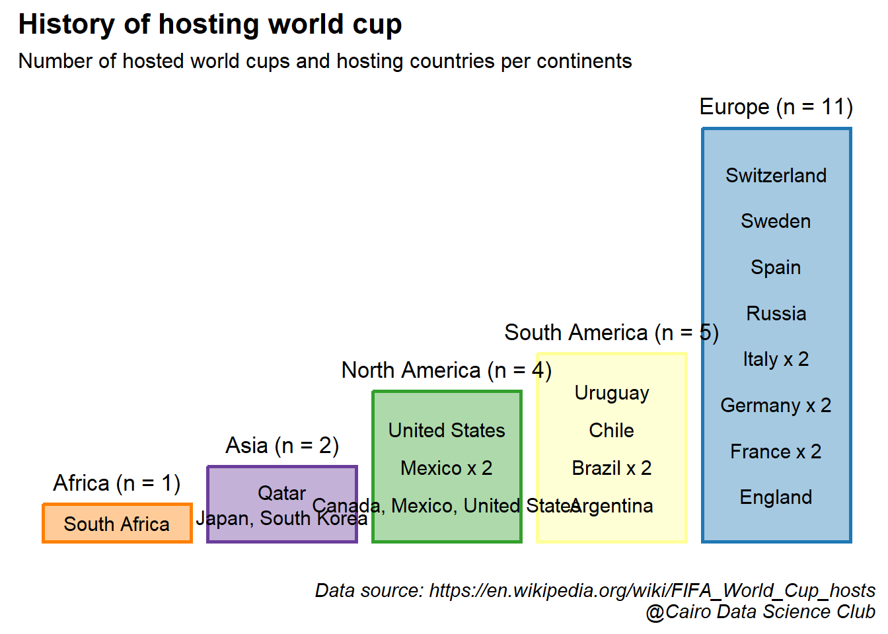

# History of hosting FIFA World Cup

Load libraries


```r
library("rnaturalearth")
library("rnaturalearthdata")
library(rvest)
library(tidyverse)
library(sf)
library(ggflags)
library(ggspatial)
library(ggplot2)
library(giscoR)
library(dplyr)
library(rasterpic)
library(countrycode)
library(ggimage)
#set the default ggplot theme
theme_set(cowplot::theme_cowplot())
```

## Data collection

In this project we will use the data made available in this Wikipedia article about [FIFA World Cup hosts](https://en.wikipedia.org/wiki/FIFA_World_Cup_hosts)

To do that, we are going to use the [rvest](https://rvest.tidyverse.org/) package to explore and scrape this tables directly into R.


```r
# URL of the article
url <- "https://en.wikipedia.org/wiki/FIFA_World_Cup_hosts"
# Read the webpage and obtain the pieces of the article containing tables
tbls_lst <-  url %>%
  read_html %>%
  html_table()
```

The tables are in the house! However, this too much. Let's select only the tables of interest for this tutorial. This is limited to the subset of tables showing the list of countries that have submitted a bid or actually hosted the world cup. As an extra, we will also utilize the performance of host countries in our analysis.


```r
# Select tables of interest
tbls_lst <- tbls_lst[c(1,9,10)]

# Assign names to the tables
tables_names <- c("List of hosts",
                  "Total bids by country",
                  "Host country performances")
names(tbls_lst) <- tolower(tables_names) %>% str_replace_all(" ","_")
```

Let's have a quick look at the three selected tables


```r
gt::gt(head(tbls_lst$list_of_hosts))
```

```{=html}
<div id="lbgcvbqvxz" style="overflow-x:auto;overflow-y:auto;width:auto;height:auto;">
<style>html {
  font-family: -apple-system, BlinkMacSystemFont, 'Segoe UI', Roboto, Oxygen, Ubuntu, Cantarell, 'Helvetica Neue', 'Fira Sans', 'Droid Sans', Arial, sans-serif;
}

#lbgcvbqvxz .gt_table {
  display: table;
  border-collapse: collapse;
  margin-left: auto;
  margin-right: auto;
  color: #333333;
  font-size: 16px;
  font-weight: normal;
  font-style: normal;
  background-color: #FFFFFF;
  width: auto;
  border-top-style: solid;
  border-top-width: 2px;
  border-top-color: #A8A8A8;
  border-right-style: none;
  border-right-width: 2px;
  border-right-color: #D3D3D3;
  border-bottom-style: solid;
  border-bottom-width: 2px;
  border-bottom-color: #A8A8A8;
  border-left-style: none;
  border-left-width: 2px;
  border-left-color: #D3D3D3;
}

#lbgcvbqvxz .gt_heading {
  background-color: #FFFFFF;
  text-align: center;
  border-bottom-color: #FFFFFF;
  border-left-style: none;
  border-left-width: 1px;
  border-left-color: #D3D3D3;
  border-right-style: none;
  border-right-width: 1px;
  border-right-color: #D3D3D3;
}

#lbgcvbqvxz .gt_title {
  color: #333333;
  font-size: 125%;
  font-weight: initial;
  padding-top: 4px;
  padding-bottom: 4px;
  padding-left: 5px;
  padding-right: 5px;
  border-bottom-color: #FFFFFF;
  border-bottom-width: 0;
}

#lbgcvbqvxz .gt_subtitle {
  color: #333333;
  font-size: 85%;
  font-weight: initial;
  padding-top: 0;
  padding-bottom: 6px;
  padding-left: 5px;
  padding-right: 5px;
  border-top-color: #FFFFFF;
  border-top-width: 0;
}

#lbgcvbqvxz .gt_bottom_border {
  border-bottom-style: solid;
  border-bottom-width: 2px;
  border-bottom-color: #D3D3D3;
}

#lbgcvbqvxz .gt_col_headings {
  border-top-style: solid;
  border-top-width: 2px;
  border-top-color: #D3D3D3;
  border-bottom-style: solid;
  border-bottom-width: 2px;
  border-bottom-color: #D3D3D3;
  border-left-style: none;
  border-left-width: 1px;
  border-left-color: #D3D3D3;
  border-right-style: none;
  border-right-width: 1px;
  border-right-color: #D3D3D3;
}

#lbgcvbqvxz .gt_col_heading {
  color: #333333;
  background-color: #FFFFFF;
  font-size: 100%;
  font-weight: normal;
  text-transform: inherit;
  border-left-style: none;
  border-left-width: 1px;
  border-left-color: #D3D3D3;
  border-right-style: none;
  border-right-width: 1px;
  border-right-color: #D3D3D3;
  vertical-align: bottom;
  padding-top: 5px;
  padding-bottom: 6px;
  padding-left: 5px;
  padding-right: 5px;
  overflow-x: hidden;
}

#lbgcvbqvxz .gt_column_spanner_outer {
  color: #333333;
  background-color: #FFFFFF;
  font-size: 100%;
  font-weight: normal;
  text-transform: inherit;
  padding-top: 0;
  padding-bottom: 0;
  padding-left: 4px;
  padding-right: 4px;
}

#lbgcvbqvxz .gt_column_spanner_outer:first-child {
  padding-left: 0;
}

#lbgcvbqvxz .gt_column_spanner_outer:last-child {
  padding-right: 0;
}

#lbgcvbqvxz .gt_column_spanner {
  border-bottom-style: solid;
  border-bottom-width: 2px;
  border-bottom-color: #D3D3D3;
  vertical-align: bottom;
  padding-top: 5px;
  padding-bottom: 5px;
  overflow-x: hidden;
  display: inline-block;
  width: 100%;
}

#lbgcvbqvxz .gt_group_heading {
  padding-top: 8px;
  padding-bottom: 8px;
  padding-left: 5px;
  padding-right: 5px;
  color: #333333;
  background-color: #FFFFFF;
  font-size: 100%;
  font-weight: initial;
  text-transform: inherit;
  border-top-style: solid;
  border-top-width: 2px;
  border-top-color: #D3D3D3;
  border-bottom-style: solid;
  border-bottom-width: 2px;
  border-bottom-color: #D3D3D3;
  border-left-style: none;
  border-left-width: 1px;
  border-left-color: #D3D3D3;
  border-right-style: none;
  border-right-width: 1px;
  border-right-color: #D3D3D3;
  vertical-align: middle;
}

#lbgcvbqvxz .gt_empty_group_heading {
  padding: 0.5px;
  color: #333333;
  background-color: #FFFFFF;
  font-size: 100%;
  font-weight: initial;
  border-top-style: solid;
  border-top-width: 2px;
  border-top-color: #D3D3D3;
  border-bottom-style: solid;
  border-bottom-width: 2px;
  border-bottom-color: #D3D3D3;
  vertical-align: middle;
}

#lbgcvbqvxz .gt_from_md > :first-child {
  margin-top: 0;
}

#lbgcvbqvxz .gt_from_md > :last-child {
  margin-bottom: 0;
}

#lbgcvbqvxz .gt_row {
  padding-top: 8px;
  padding-bottom: 8px;
  padding-left: 5px;
  padding-right: 5px;
  margin: 10px;
  border-top-style: solid;
  border-top-width: 1px;
  border-top-color: #D3D3D3;
  border-left-style: none;
  border-left-width: 1px;
  border-left-color: #D3D3D3;
  border-right-style: none;
  border-right-width: 1px;
  border-right-color: #D3D3D3;
  vertical-align: middle;
  overflow-x: hidden;
}

#lbgcvbqvxz .gt_stub {
  color: #333333;
  background-color: #FFFFFF;
  font-size: 100%;
  font-weight: initial;
  text-transform: inherit;
  border-right-style: solid;
  border-right-width: 2px;
  border-right-color: #D3D3D3;
  padding-left: 5px;
  padding-right: 5px;
}

#lbgcvbqvxz .gt_stub_row_group {
  color: #333333;
  background-color: #FFFFFF;
  font-size: 100%;
  font-weight: initial;
  text-transform: inherit;
  border-right-style: solid;
  border-right-width: 2px;
  border-right-color: #D3D3D3;
  padding-left: 5px;
  padding-right: 5px;
  vertical-align: top;
}

#lbgcvbqvxz .gt_row_group_first td {
  border-top-width: 2px;
}

#lbgcvbqvxz .gt_summary_row {
  color: #333333;
  background-color: #FFFFFF;
  text-transform: inherit;
  padding-top: 8px;
  padding-bottom: 8px;
  padding-left: 5px;
  padding-right: 5px;
}

#lbgcvbqvxz .gt_first_summary_row {
  border-top-style: solid;
  border-top-color: #D3D3D3;
}

#lbgcvbqvxz .gt_first_summary_row.thick {
  border-top-width: 2px;
}

#lbgcvbqvxz .gt_last_summary_row {
  padding-top: 8px;
  padding-bottom: 8px;
  padding-left: 5px;
  padding-right: 5px;
  border-bottom-style: solid;
  border-bottom-width: 2px;
  border-bottom-color: #D3D3D3;
}

#lbgcvbqvxz .gt_grand_summary_row {
  color: #333333;
  background-color: #FFFFFF;
  text-transform: inherit;
  padding-top: 8px;
  padding-bottom: 8px;
  padding-left: 5px;
  padding-right: 5px;
}

#lbgcvbqvxz .gt_first_grand_summary_row {
  padding-top: 8px;
  padding-bottom: 8px;
  padding-left: 5px;
  padding-right: 5px;
  border-top-style: double;
  border-top-width: 6px;
  border-top-color: #D3D3D3;
}

#lbgcvbqvxz .gt_striped {
  background-color: rgba(128, 128, 128, 0.05);
}

#lbgcvbqvxz .gt_table_body {
  border-top-style: solid;
  border-top-width: 2px;
  border-top-color: #D3D3D3;
  border-bottom-style: solid;
  border-bottom-width: 2px;
  border-bottom-color: #D3D3D3;
}

#lbgcvbqvxz .gt_footnotes {
  color: #333333;
  background-color: #FFFFFF;
  border-bottom-style: none;
  border-bottom-width: 2px;
  border-bottom-color: #D3D3D3;
  border-left-style: none;
  border-left-width: 2px;
  border-left-color: #D3D3D3;
  border-right-style: none;
  border-right-width: 2px;
  border-right-color: #D3D3D3;
}

#lbgcvbqvxz .gt_footnote {
  margin: 0px;
  font-size: 90%;
  padding-left: 4px;
  padding-right: 4px;
  padding-left: 5px;
  padding-right: 5px;
}

#lbgcvbqvxz .gt_sourcenotes {
  color: #333333;
  background-color: #FFFFFF;
  border-bottom-style: none;
  border-bottom-width: 2px;
  border-bottom-color: #D3D3D3;
  border-left-style: none;
  border-left-width: 2px;
  border-left-color: #D3D3D3;
  border-right-style: none;
  border-right-width: 2px;
  border-right-color: #D3D3D3;
}

#lbgcvbqvxz .gt_sourcenote {
  font-size: 90%;
  padding-top: 4px;
  padding-bottom: 4px;
  padding-left: 5px;
  padding-right: 5px;
}

#lbgcvbqvxz .gt_left {
  text-align: left;
}

#lbgcvbqvxz .gt_center {
  text-align: center;
}

#lbgcvbqvxz .gt_right {
  text-align: right;
  font-variant-numeric: tabular-nums;
}

#lbgcvbqvxz .gt_font_normal {
  font-weight: normal;
}

#lbgcvbqvxz .gt_font_bold {
  font-weight: bold;
}

#lbgcvbqvxz .gt_font_italic {
  font-style: italic;
}

#lbgcvbqvxz .gt_super {
  font-size: 65%;
}

#lbgcvbqvxz .gt_footnote_marks {
  font-style: italic;
  font-weight: normal;
  font-size: 75%;
  vertical-align: 0.4em;
}

#lbgcvbqvxz .gt_asterisk {
  font-size: 100%;
  vertical-align: 0;
}

#lbgcvbqvxz .gt_indent_1 {
  text-indent: 5px;
}

#lbgcvbqvxz .gt_indent_2 {
  text-indent: 10px;
}

#lbgcvbqvxz .gt_indent_3 {
  text-indent: 15px;
}

#lbgcvbqvxz .gt_indent_4 {
  text-indent: 20px;
}

#lbgcvbqvxz .gt_indent_5 {
  text-indent: 25px;
}
</style>
<table class="gt_table">
  
  <thead class="gt_col_headings">
    <tr>
      <th class="gt_col_heading gt_columns_bottom_border gt_right" rowspan="1" colspan="1" scope="col">Year</th>
      <th class="gt_col_heading gt_columns_bottom_border gt_left" rowspan="1" colspan="1" scope="col">Host nation(s)</th>
      <th class="gt_col_heading gt_columns_bottom_border gt_left" rowspan="1" colspan="1" scope="col">Continent</th>
    </tr>
  </thead>
  <tbody class="gt_table_body">
    <tr><td class="gt_row gt_right">1930</td>
<td class="gt_row gt_left">Uruguay</td>
<td class="gt_row gt_left">South America</td></tr>
    <tr><td class="gt_row gt_right">1934</td>
<td class="gt_row gt_left">Italy</td>
<td class="gt_row gt_left">Europe</td></tr>
    <tr><td class="gt_row gt_right">1938</td>
<td class="gt_row gt_left">France</td>
<td class="gt_row gt_left">Europe</td></tr>
    <tr><td class="gt_row gt_right">1942</td>
<td class="gt_row gt_left">Canceled because of World War II</td>
<td class="gt_row gt_left">Canceled because of World War II</td></tr>
    <tr><td class="gt_row gt_right">1946</td>
<td class="gt_row gt_left">Canceled because of World War II</td>
<td class="gt_row gt_left">Canceled because of World War II</td></tr>
    <tr><td class="gt_row gt_right">1950</td>
<td class="gt_row gt_left">Brazil</td>
<td class="gt_row gt_left">South America</td></tr>
  </tbody>
  
  
</table>
</div>
```

```r
gt::gt(head(tbls_lst$total_bids_by_country))
```

```{=html}
<div id="tlxnvehyzb" style="overflow-x:auto;overflow-y:auto;width:auto;height:auto;">
<style>html {
  font-family: -apple-system, BlinkMacSystemFont, 'Segoe UI', Roboto, Oxygen, Ubuntu, Cantarell, 'Helvetica Neue', 'Fira Sans', 'Droid Sans', Arial, sans-serif;
}

#tlxnvehyzb .gt_table {
  display: table;
  border-collapse: collapse;
  margin-left: auto;
  margin-right: auto;
  color: #333333;
  font-size: 16px;
  font-weight: normal;
  font-style: normal;
  background-color: #FFFFFF;
  width: auto;
  border-top-style: solid;
  border-top-width: 2px;
  border-top-color: #A8A8A8;
  border-right-style: none;
  border-right-width: 2px;
  border-right-color: #D3D3D3;
  border-bottom-style: solid;
  border-bottom-width: 2px;
  border-bottom-color: #A8A8A8;
  border-left-style: none;
  border-left-width: 2px;
  border-left-color: #D3D3D3;
}

#tlxnvehyzb .gt_heading {
  background-color: #FFFFFF;
  text-align: center;
  border-bottom-color: #FFFFFF;
  border-left-style: none;
  border-left-width: 1px;
  border-left-color: #D3D3D3;
  border-right-style: none;
  border-right-width: 1px;
  border-right-color: #D3D3D3;
}

#tlxnvehyzb .gt_title {
  color: #333333;
  font-size: 125%;
  font-weight: initial;
  padding-top: 4px;
  padding-bottom: 4px;
  padding-left: 5px;
  padding-right: 5px;
  border-bottom-color: #FFFFFF;
  border-bottom-width: 0;
}

#tlxnvehyzb .gt_subtitle {
  color: #333333;
  font-size: 85%;
  font-weight: initial;
  padding-top: 0;
  padding-bottom: 6px;
  padding-left: 5px;
  padding-right: 5px;
  border-top-color: #FFFFFF;
  border-top-width: 0;
}

#tlxnvehyzb .gt_bottom_border {
  border-bottom-style: solid;
  border-bottom-width: 2px;
  border-bottom-color: #D3D3D3;
}

#tlxnvehyzb .gt_col_headings {
  border-top-style: solid;
  border-top-width: 2px;
  border-top-color: #D3D3D3;
  border-bottom-style: solid;
  border-bottom-width: 2px;
  border-bottom-color: #D3D3D3;
  border-left-style: none;
  border-left-width: 1px;
  border-left-color: #D3D3D3;
  border-right-style: none;
  border-right-width: 1px;
  border-right-color: #D3D3D3;
}

#tlxnvehyzb .gt_col_heading {
  color: #333333;
  background-color: #FFFFFF;
  font-size: 100%;
  font-weight: normal;
  text-transform: inherit;
  border-left-style: none;
  border-left-width: 1px;
  border-left-color: #D3D3D3;
  border-right-style: none;
  border-right-width: 1px;
  border-right-color: #D3D3D3;
  vertical-align: bottom;
  padding-top: 5px;
  padding-bottom: 6px;
  padding-left: 5px;
  padding-right: 5px;
  overflow-x: hidden;
}

#tlxnvehyzb .gt_column_spanner_outer {
  color: #333333;
  background-color: #FFFFFF;
  font-size: 100%;
  font-weight: normal;
  text-transform: inherit;
  padding-top: 0;
  padding-bottom: 0;
  padding-left: 4px;
  padding-right: 4px;
}

#tlxnvehyzb .gt_column_spanner_outer:first-child {
  padding-left: 0;
}

#tlxnvehyzb .gt_column_spanner_outer:last-child {
  padding-right: 0;
}

#tlxnvehyzb .gt_column_spanner {
  border-bottom-style: solid;
  border-bottom-width: 2px;
  border-bottom-color: #D3D3D3;
  vertical-align: bottom;
  padding-top: 5px;
  padding-bottom: 5px;
  overflow-x: hidden;
  display: inline-block;
  width: 100%;
}

#tlxnvehyzb .gt_group_heading {
  padding-top: 8px;
  padding-bottom: 8px;
  padding-left: 5px;
  padding-right: 5px;
  color: #333333;
  background-color: #FFFFFF;
  font-size: 100%;
  font-weight: initial;
  text-transform: inherit;
  border-top-style: solid;
  border-top-width: 2px;
  border-top-color: #D3D3D3;
  border-bottom-style: solid;
  border-bottom-width: 2px;
  border-bottom-color: #D3D3D3;
  border-left-style: none;
  border-left-width: 1px;
  border-left-color: #D3D3D3;
  border-right-style: none;
  border-right-width: 1px;
  border-right-color: #D3D3D3;
  vertical-align: middle;
}

#tlxnvehyzb .gt_empty_group_heading {
  padding: 0.5px;
  color: #333333;
  background-color: #FFFFFF;
  font-size: 100%;
  font-weight: initial;
  border-top-style: solid;
  border-top-width: 2px;
  border-top-color: #D3D3D3;
  border-bottom-style: solid;
  border-bottom-width: 2px;
  border-bottom-color: #D3D3D3;
  vertical-align: middle;
}

#tlxnvehyzb .gt_from_md > :first-child {
  margin-top: 0;
}

#tlxnvehyzb .gt_from_md > :last-child {
  margin-bottom: 0;
}

#tlxnvehyzb .gt_row {
  padding-top: 8px;
  padding-bottom: 8px;
  padding-left: 5px;
  padding-right: 5px;
  margin: 10px;
  border-top-style: solid;
  border-top-width: 1px;
  border-top-color: #D3D3D3;
  border-left-style: none;
  border-left-width: 1px;
  border-left-color: #D3D3D3;
  border-right-style: none;
  border-right-width: 1px;
  border-right-color: #D3D3D3;
  vertical-align: middle;
  overflow-x: hidden;
}

#tlxnvehyzb .gt_stub {
  color: #333333;
  background-color: #FFFFFF;
  font-size: 100%;
  font-weight: initial;
  text-transform: inherit;
  border-right-style: solid;
  border-right-width: 2px;
  border-right-color: #D3D3D3;
  padding-left: 5px;
  padding-right: 5px;
}

#tlxnvehyzb .gt_stub_row_group {
  color: #333333;
  background-color: #FFFFFF;
  font-size: 100%;
  font-weight: initial;
  text-transform: inherit;
  border-right-style: solid;
  border-right-width: 2px;
  border-right-color: #D3D3D3;
  padding-left: 5px;
  padding-right: 5px;
  vertical-align: top;
}

#tlxnvehyzb .gt_row_group_first td {
  border-top-width: 2px;
}

#tlxnvehyzb .gt_summary_row {
  color: #333333;
  background-color: #FFFFFF;
  text-transform: inherit;
  padding-top: 8px;
  padding-bottom: 8px;
  padding-left: 5px;
  padding-right: 5px;
}

#tlxnvehyzb .gt_first_summary_row {
  border-top-style: solid;
  border-top-color: #D3D3D3;
}

#tlxnvehyzb .gt_first_summary_row.thick {
  border-top-width: 2px;
}

#tlxnvehyzb .gt_last_summary_row {
  padding-top: 8px;
  padding-bottom: 8px;
  padding-left: 5px;
  padding-right: 5px;
  border-bottom-style: solid;
  border-bottom-width: 2px;
  border-bottom-color: #D3D3D3;
}

#tlxnvehyzb .gt_grand_summary_row {
  color: #333333;
  background-color: #FFFFFF;
  text-transform: inherit;
  padding-top: 8px;
  padding-bottom: 8px;
  padding-left: 5px;
  padding-right: 5px;
}

#tlxnvehyzb .gt_first_grand_summary_row {
  padding-top: 8px;
  padding-bottom: 8px;
  padding-left: 5px;
  padding-right: 5px;
  border-top-style: double;
  border-top-width: 6px;
  border-top-color: #D3D3D3;
}

#tlxnvehyzb .gt_striped {
  background-color: rgba(128, 128, 128, 0.05);
}

#tlxnvehyzb .gt_table_body {
  border-top-style: solid;
  border-top-width: 2px;
  border-top-color: #D3D3D3;
  border-bottom-style: solid;
  border-bottom-width: 2px;
  border-bottom-color: #D3D3D3;
}

#tlxnvehyzb .gt_footnotes {
  color: #333333;
  background-color: #FFFFFF;
  border-bottom-style: none;
  border-bottom-width: 2px;
  border-bottom-color: #D3D3D3;
  border-left-style: none;
  border-left-width: 2px;
  border-left-color: #D3D3D3;
  border-right-style: none;
  border-right-width: 2px;
  border-right-color: #D3D3D3;
}

#tlxnvehyzb .gt_footnote {
  margin: 0px;
  font-size: 90%;
  padding-left: 4px;
  padding-right: 4px;
  padding-left: 5px;
  padding-right: 5px;
}

#tlxnvehyzb .gt_sourcenotes {
  color: #333333;
  background-color: #FFFFFF;
  border-bottom-style: none;
  border-bottom-width: 2px;
  border-bottom-color: #D3D3D3;
  border-left-style: none;
  border-left-width: 2px;
  border-left-color: #D3D3D3;
  border-right-style: none;
  border-right-width: 2px;
  border-right-color: #D3D3D3;
}

#tlxnvehyzb .gt_sourcenote {
  font-size: 90%;
  padding-top: 4px;
  padding-bottom: 4px;
  padding-left: 5px;
  padding-right: 5px;
}

#tlxnvehyzb .gt_left {
  text-align: left;
}

#tlxnvehyzb .gt_center {
  text-align: center;
}

#tlxnvehyzb .gt_right {
  text-align: right;
  font-variant-numeric: tabular-nums;
}

#tlxnvehyzb .gt_font_normal {
  font-weight: normal;
}

#tlxnvehyzb .gt_font_bold {
  font-weight: bold;
}

#tlxnvehyzb .gt_font_italic {
  font-style: italic;
}

#tlxnvehyzb .gt_super {
  font-size: 65%;
}

#tlxnvehyzb .gt_footnote_marks {
  font-style: italic;
  font-weight: normal;
  font-size: 75%;
  vertical-align: 0.4em;
}

#tlxnvehyzb .gt_asterisk {
  font-size: 100%;
  vertical-align: 0;
}

#tlxnvehyzb .gt_indent_1 {
  text-indent: 5px;
}

#tlxnvehyzb .gt_indent_2 {
  text-indent: 10px;
}

#tlxnvehyzb .gt_indent_3 {
  text-indent: 15px;
}

#tlxnvehyzb .gt_indent_4 {
  text-indent: 20px;
}

#tlxnvehyzb .gt_indent_5 {
  text-indent: 25px;
}
</style>
<table class="gt_table">
  
  <thead class="gt_col_headings">
    <tr>
      <th class="gt_col_heading gt_columns_bottom_border gt_left" rowspan="1" colspan="1" scope="col">Country</th>
      <th class="gt_col_heading gt_columns_bottom_border gt_right" rowspan="1" colspan="1" scope="col">Bids</th>
      <th class="gt_col_heading gt_columns_bottom_border gt_left" rowspan="1" colspan="1" scope="col">Years</th>
      <th class="gt_col_heading gt_columns_bottom_border gt_right" rowspan="1" colspan="1" scope="col">Times  hosted</th>
    </tr>
  </thead>
  <tbody class="gt_table_body">
    <tr><td class="gt_row gt_left">Germany</td>
<td class="gt_row gt_right">8</td>
<td class="gt_row gt_left">1938, 1962,[a] 1966,[a]1974,[a]1982,[a]1990,[a]1998, 2006</td>
<td class="gt_row gt_right">2</td></tr>
    <tr><td class="gt_row gt_left">Argentina</td>
<td class="gt_row gt_right">5</td>
<td class="gt_row gt_left">1938, 1962, 1970, 1978, 2014</td>
<td class="gt_row gt_right">1</td></tr>
    <tr><td class="gt_row gt_left">England</td>
<td class="gt_row gt_right">5</td>
<td class="gt_row gt_left">1966, 1990, 1998, 2006, 2018</td>
<td class="gt_row gt_right">1</td></tr>
    <tr><td class="gt_row gt_left">Italy</td>
<td class="gt_row gt_right">5</td>
<td class="gt_row gt_left">1930, 1934, 1974, 1982, 1990</td>
<td class="gt_row gt_right">2</td></tr>
    <tr><td class="gt_row gt_left">Mexico</td>
<td class="gt_row gt_right">5</td>
<td class="gt_row gt_left">1970, 1978, 1986,[b] 2002, 2026[c]</td>
<td class="gt_row gt_right">3</td></tr>
    <tr><td class="gt_row gt_left">Morocco</td>
<td class="gt_row gt_right">5</td>
<td class="gt_row gt_left">1994, 1998, 2006, 2010, 2026</td>
<td class="gt_row gt_right">0</td></tr>
  </tbody>
  
  
</table>
</div>
```

```r
gt::gt(head(tbls_lst$host_country_performances))
```

```{=html}
<div id="uptjhjejfj" style="overflow-x:auto;overflow-y:auto;width:auto;height:auto;">
<style>html {
  font-family: -apple-system, BlinkMacSystemFont, 'Segoe UI', Roboto, Oxygen, Ubuntu, Cantarell, 'Helvetica Neue', 'Fira Sans', 'Droid Sans', Arial, sans-serif;
}

#uptjhjejfj .gt_table {
  display: table;
  border-collapse: collapse;
  margin-left: auto;
  margin-right: auto;
  color: #333333;
  font-size: 16px;
  font-weight: normal;
  font-style: normal;
  background-color: #FFFFFF;
  width: auto;
  border-top-style: solid;
  border-top-width: 2px;
  border-top-color: #A8A8A8;
  border-right-style: none;
  border-right-width: 2px;
  border-right-color: #D3D3D3;
  border-bottom-style: solid;
  border-bottom-width: 2px;
  border-bottom-color: #A8A8A8;
  border-left-style: none;
  border-left-width: 2px;
  border-left-color: #D3D3D3;
}

#uptjhjejfj .gt_heading {
  background-color: #FFFFFF;
  text-align: center;
  border-bottom-color: #FFFFFF;
  border-left-style: none;
  border-left-width: 1px;
  border-left-color: #D3D3D3;
  border-right-style: none;
  border-right-width: 1px;
  border-right-color: #D3D3D3;
}

#uptjhjejfj .gt_title {
  color: #333333;
  font-size: 125%;
  font-weight: initial;
  padding-top: 4px;
  padding-bottom: 4px;
  padding-left: 5px;
  padding-right: 5px;
  border-bottom-color: #FFFFFF;
  border-bottom-width: 0;
}

#uptjhjejfj .gt_subtitle {
  color: #333333;
  font-size: 85%;
  font-weight: initial;
  padding-top: 0;
  padding-bottom: 6px;
  padding-left: 5px;
  padding-right: 5px;
  border-top-color: #FFFFFF;
  border-top-width: 0;
}

#uptjhjejfj .gt_bottom_border {
  border-bottom-style: solid;
  border-bottom-width: 2px;
  border-bottom-color: #D3D3D3;
}

#uptjhjejfj .gt_col_headings {
  border-top-style: solid;
  border-top-width: 2px;
  border-top-color: #D3D3D3;
  border-bottom-style: solid;
  border-bottom-width: 2px;
  border-bottom-color: #D3D3D3;
  border-left-style: none;
  border-left-width: 1px;
  border-left-color: #D3D3D3;
  border-right-style: none;
  border-right-width: 1px;
  border-right-color: #D3D3D3;
}

#uptjhjejfj .gt_col_heading {
  color: #333333;
  background-color: #FFFFFF;
  font-size: 100%;
  font-weight: normal;
  text-transform: inherit;
  border-left-style: none;
  border-left-width: 1px;
  border-left-color: #D3D3D3;
  border-right-style: none;
  border-right-width: 1px;
  border-right-color: #D3D3D3;
  vertical-align: bottom;
  padding-top: 5px;
  padding-bottom: 6px;
  padding-left: 5px;
  padding-right: 5px;
  overflow-x: hidden;
}

#uptjhjejfj .gt_column_spanner_outer {
  color: #333333;
  background-color: #FFFFFF;
  font-size: 100%;
  font-weight: normal;
  text-transform: inherit;
  padding-top: 0;
  padding-bottom: 0;
  padding-left: 4px;
  padding-right: 4px;
}

#uptjhjejfj .gt_column_spanner_outer:first-child {
  padding-left: 0;
}

#uptjhjejfj .gt_column_spanner_outer:last-child {
  padding-right: 0;
}

#uptjhjejfj .gt_column_spanner {
  border-bottom-style: solid;
  border-bottom-width: 2px;
  border-bottom-color: #D3D3D3;
  vertical-align: bottom;
  padding-top: 5px;
  padding-bottom: 5px;
  overflow-x: hidden;
  display: inline-block;
  width: 100%;
}

#uptjhjejfj .gt_group_heading {
  padding-top: 8px;
  padding-bottom: 8px;
  padding-left: 5px;
  padding-right: 5px;
  color: #333333;
  background-color: #FFFFFF;
  font-size: 100%;
  font-weight: initial;
  text-transform: inherit;
  border-top-style: solid;
  border-top-width: 2px;
  border-top-color: #D3D3D3;
  border-bottom-style: solid;
  border-bottom-width: 2px;
  border-bottom-color: #D3D3D3;
  border-left-style: none;
  border-left-width: 1px;
  border-left-color: #D3D3D3;
  border-right-style: none;
  border-right-width: 1px;
  border-right-color: #D3D3D3;
  vertical-align: middle;
}

#uptjhjejfj .gt_empty_group_heading {
  padding: 0.5px;
  color: #333333;
  background-color: #FFFFFF;
  font-size: 100%;
  font-weight: initial;
  border-top-style: solid;
  border-top-width: 2px;
  border-top-color: #D3D3D3;
  border-bottom-style: solid;
  border-bottom-width: 2px;
  border-bottom-color: #D3D3D3;
  vertical-align: middle;
}

#uptjhjejfj .gt_from_md > :first-child {
  margin-top: 0;
}

#uptjhjejfj .gt_from_md > :last-child {
  margin-bottom: 0;
}

#uptjhjejfj .gt_row {
  padding-top: 8px;
  padding-bottom: 8px;
  padding-left: 5px;
  padding-right: 5px;
  margin: 10px;
  border-top-style: solid;
  border-top-width: 1px;
  border-top-color: #D3D3D3;
  border-left-style: none;
  border-left-width: 1px;
  border-left-color: #D3D3D3;
  border-right-style: none;
  border-right-width: 1px;
  border-right-color: #D3D3D3;
  vertical-align: middle;
  overflow-x: hidden;
}

#uptjhjejfj .gt_stub {
  color: #333333;
  background-color: #FFFFFF;
  font-size: 100%;
  font-weight: initial;
  text-transform: inherit;
  border-right-style: solid;
  border-right-width: 2px;
  border-right-color: #D3D3D3;
  padding-left: 5px;
  padding-right: 5px;
}

#uptjhjejfj .gt_stub_row_group {
  color: #333333;
  background-color: #FFFFFF;
  font-size: 100%;
  font-weight: initial;
  text-transform: inherit;
  border-right-style: solid;
  border-right-width: 2px;
  border-right-color: #D3D3D3;
  padding-left: 5px;
  padding-right: 5px;
  vertical-align: top;
}

#uptjhjejfj .gt_row_group_first td {
  border-top-width: 2px;
}

#uptjhjejfj .gt_summary_row {
  color: #333333;
  background-color: #FFFFFF;
  text-transform: inherit;
  padding-top: 8px;
  padding-bottom: 8px;
  padding-left: 5px;
  padding-right: 5px;
}

#uptjhjejfj .gt_first_summary_row {
  border-top-style: solid;
  border-top-color: #D3D3D3;
}

#uptjhjejfj .gt_first_summary_row.thick {
  border-top-width: 2px;
}

#uptjhjejfj .gt_last_summary_row {
  padding-top: 8px;
  padding-bottom: 8px;
  padding-left: 5px;
  padding-right: 5px;
  border-bottom-style: solid;
  border-bottom-width: 2px;
  border-bottom-color: #D3D3D3;
}

#uptjhjejfj .gt_grand_summary_row {
  color: #333333;
  background-color: #FFFFFF;
  text-transform: inherit;
  padding-top: 8px;
  padding-bottom: 8px;
  padding-left: 5px;
  padding-right: 5px;
}

#uptjhjejfj .gt_first_grand_summary_row {
  padding-top: 8px;
  padding-bottom: 8px;
  padding-left: 5px;
  padding-right: 5px;
  border-top-style: double;
  border-top-width: 6px;
  border-top-color: #D3D3D3;
}

#uptjhjejfj .gt_striped {
  background-color: rgba(128, 128, 128, 0.05);
}

#uptjhjejfj .gt_table_body {
  border-top-style: solid;
  border-top-width: 2px;
  border-top-color: #D3D3D3;
  border-bottom-style: solid;
  border-bottom-width: 2px;
  border-bottom-color: #D3D3D3;
}

#uptjhjejfj .gt_footnotes {
  color: #333333;
  background-color: #FFFFFF;
  border-bottom-style: none;
  border-bottom-width: 2px;
  border-bottom-color: #D3D3D3;
  border-left-style: none;
  border-left-width: 2px;
  border-left-color: #D3D3D3;
  border-right-style: none;
  border-right-width: 2px;
  border-right-color: #D3D3D3;
}

#uptjhjejfj .gt_footnote {
  margin: 0px;
  font-size: 90%;
  padding-left: 4px;
  padding-right: 4px;
  padding-left: 5px;
  padding-right: 5px;
}

#uptjhjejfj .gt_sourcenotes {
  color: #333333;
  background-color: #FFFFFF;
  border-bottom-style: none;
  border-bottom-width: 2px;
  border-bottom-color: #D3D3D3;
  border-left-style: none;
  border-left-width: 2px;
  border-left-color: #D3D3D3;
  border-right-style: none;
  border-right-width: 2px;
  border-right-color: #D3D3D3;
}

#uptjhjejfj .gt_sourcenote {
  font-size: 90%;
  padding-top: 4px;
  padding-bottom: 4px;
  padding-left: 5px;
  padding-right: 5px;
}

#uptjhjejfj .gt_left {
  text-align: left;
}

#uptjhjejfj .gt_center {
  text-align: center;
}

#uptjhjejfj .gt_right {
  text-align: right;
  font-variant-numeric: tabular-nums;
}

#uptjhjejfj .gt_font_normal {
  font-weight: normal;
}

#uptjhjejfj .gt_font_bold {
  font-weight: bold;
}

#uptjhjejfj .gt_font_italic {
  font-style: italic;
}

#uptjhjejfj .gt_super {
  font-size: 65%;
}

#uptjhjejfj .gt_footnote_marks {
  font-style: italic;
  font-weight: normal;
  font-size: 75%;
  vertical-align: 0.4em;
}

#uptjhjejfj .gt_asterisk {
  font-size: 100%;
  vertical-align: 0;
}

#uptjhjejfj .gt_indent_1 {
  text-indent: 5px;
}

#uptjhjejfj .gt_indent_2 {
  text-indent: 10px;
}

#uptjhjejfj .gt_indent_3 {
  text-indent: 15px;
}

#uptjhjejfj .gt_indent_4 {
  text-indent: 20px;
}

#uptjhjejfj .gt_indent_5 {
  text-indent: 25px;
}
</style>
<table class="gt_table">
  
  <thead class="gt_col_headings">
    <tr>
      <th class="gt_col_heading gt_columns_bottom_border gt_right" rowspan="1" colspan="1" scope="col">Year</th>
      <th class="gt_col_heading gt_columns_bottom_border gt_left" rowspan="1" colspan="1" scope="col">Team</th>
      <th class="gt_col_heading gt_columns_bottom_border gt_left" rowspan="1" colspan="1" scope="col">Result</th>
      <th class="gt_col_heading gt_columns_bottom_border gt_left" rowspan="1" colspan="1" scope="col">Note</th>
      <th class="gt_col_heading gt_columns_bottom_border gt_right" rowspan="1" colspan="1" scope="col">Pld</th>
      <th class="gt_col_heading gt_columns_bottom_border gt_right" rowspan="1" colspan="1" scope="col">W</th>
      <th class="gt_col_heading gt_columns_bottom_border gt_right" rowspan="1" colspan="1" scope="col">D</th>
      <th class="gt_col_heading gt_columns_bottom_border gt_right" rowspan="1" colspan="1" scope="col">L</th>
      <th class="gt_col_heading gt_columns_bottom_border gt_right" rowspan="1" colspan="1" scope="col">GF</th>
      <th class="gt_col_heading gt_columns_bottom_border gt_right" rowspan="1" colspan="1" scope="col">GA</th>
      <th class="gt_col_heading gt_columns_bottom_border gt_right" rowspan="1" colspan="1" scope="col">GD</th>
    </tr>
  </thead>
  <tbody class="gt_table_body">
    <tr><td class="gt_row gt_right">1930</td>
<td class="gt_row gt_left">Uruguay</td>
<td class="gt_row gt_left">Champions</td>
<td class="gt_row gt_left">Best result, later equalled</td>
<td class="gt_row gt_right">4</td>
<td class="gt_row gt_right">4</td>
<td class="gt_row gt_right">0</td>
<td class="gt_row gt_right">0</td>
<td class="gt_row gt_right">15</td>
<td class="gt_row gt_right">3</td>
<td class="gt_row gt_right">+12</td></tr>
    <tr><td class="gt_row gt_right">1934</td>
<td class="gt_row gt_left">Italy</td>
<td class="gt_row gt_left">Champions</td>
<td class="gt_row gt_left">Best result, later equalled</td>
<td class="gt_row gt_right">5</td>
<td class="gt_row gt_right">4</td>
<td class="gt_row gt_right">1</td>
<td class="gt_row gt_right">0</td>
<td class="gt_row gt_right">12</td>
<td class="gt_row gt_right">3</td>
<td class="gt_row gt_right">+9</td></tr>
    <tr><td class="gt_row gt_right">1938</td>
<td class="gt_row gt_left">France</td>
<td class="gt_row gt_left">Quarter-finals</td>
<td class="gt_row gt_left">Best result, later improved</td>
<td class="gt_row gt_right">2</td>
<td class="gt_row gt_right">1</td>
<td class="gt_row gt_right">0</td>
<td class="gt_row gt_right">1</td>
<td class="gt_row gt_right">4</td>
<td class="gt_row gt_right">4</td>
<td class="gt_row gt_right">0</td></tr>
    <tr><td class="gt_row gt_right">1950</td>
<td class="gt_row gt_left">Brazil</td>
<td class="gt_row gt_left">Runners-up</td>
<td class="gt_row gt_left">Best result, later improved</td>
<td class="gt_row gt_right">6</td>
<td class="gt_row gt_right">4</td>
<td class="gt_row gt_right">1</td>
<td class="gt_row gt_right">1</td>
<td class="gt_row gt_right">22</td>
<td class="gt_row gt_right">6</td>
<td class="gt_row gt_right">+16</td></tr>
    <tr><td class="gt_row gt_right">1954</td>
<td class="gt_row gt_left">Switzerland</td>
<td class="gt_row gt_left">Quarter-finals</td>
<td class="gt_row gt_left">Equalled best result</td>
<td class="gt_row gt_right">4</td>
<td class="gt_row gt_right">2</td>
<td class="gt_row gt_right">0</td>
<td class="gt_row gt_right">2</td>
<td class="gt_row gt_right">11</td>
<td class="gt_row gt_right">11</td>
<td class="gt_row gt_right">0</td></tr>
    <tr><td class="gt_row gt_right">1958</td>
<td class="gt_row gt_left">Sweden</td>
<td class="gt_row gt_left">Runners-up</td>
<td class="gt_row gt_left">Best result</td>
<td class="gt_row gt_right">6</td>
<td class="gt_row gt_right">4</td>
<td class="gt_row gt_right">1</td>
<td class="gt_row gt_right">1</td>
<td class="gt_row gt_right">12</td>
<td class="gt_row gt_right">7</td>
<td class="gt_row gt_right">+5</td></tr>
  </tbody>
  
  
</table>
</div>
```

Looks good, but not perfect. As expected, the scrapped tables are not optimal for analysis. Let's push the tables through a few rounds of quality control.


```r
# Clean columns' names
tbls_lst <- lapply(tbls_lst,  janitor::clean_names)
# Extract the amount of money
tbls_lst$host_country_performances  <- tbls_lst$host_country_performances %>%
  mutate(esult = str_replace(result, " \\(top 12\\)", "")) %>%
  dplyr::rename(country = "team",
                years = "year")
#let's correct the entry of Colombia since it withdrew from hosting due to economic concerns
tbls_lst$total_bids_by_country <- tbls_lst$total_bids_by_country %>% 
  mutate(times_hosted = ifelse(country == "Colombia", 0, times_hosted))
#Replace "West Germany" with "Germany"
tbls_lst$host_country_performances  <- tbls_lst$host_country_performances %>%
  mutate(team = str_replace(country, "West Germany", "Germany"))
tbls_lst$list_of_hosts <- tbls_lst$list_of_hosts %>% 
  mutate(host_nation_s = str_replace(host_nation_s, "West Germany", "Germany"))
#Order the results and set them as levels
results_order <- c("Champions",
                   "Runners-up",
                   "Third place",
                   "Fourth place",
                   "Quarter-finals",
                   "Round of 16",
                   "Second round",
                   "First round",
                   "TBD"
                   )
tbls_lst$host_country_performances  <- tbls_lst$host_country_performances %>%
  mutate(result = ifelse(result == "Second round (top 12)", "Second round", result),
                          
    result = factor(result, levels = results_order),
         country = str_replace(country, "West Germany", "Germany")) 
```

Now that the data is analysis-ready, it is time to explore some interesting questions!

## How many world cups were hosted in each continent?

Before embarking on our colorful journey of data visualization, let's define a caption that credits the source of the data and the analysis.


```r
caption_cdc <- glue::glue("Data source: {url}\n@Cairo Data Science Club")
theme_update(plot.caption = element_text(face = "italic"))
```

We will exclude the dates in which the championship were cancelled because of Warld War II


```r
df_host <- tbls_lst$list_of_hosts %>% 
  filter(!str_detect(continent, "Canceled"))
```

Let's look at a basic plot of the data


```r
df_host %>% 
  ggplot(aes(continent))+
  geom_bar()
```


This doesn't look pretty. Let's make it more attractive! First, let's add a some colors.


```r
#Assign colors to each continent
conti_cols <- c(Europe = "#1f78b4",
                Asia = "#6a3d9a",
                `South America` = "#ffff99",
                `North America` = "#33a02c",
                Africa = "#ff7f00")
#show colors in the plot
df_host %>% 
  ggplot(aes(continent, fill = continent))+
  geom_bar()+
  scale_color_manual(values = conti_cols)+
  scale_fill_manual(values = conti_cols)
```


Second, let's add some text and remove the legend since it doesn't add to the plot.


```r
df_host %>% 
  ggplot(aes(continent, fill = continent))+
  geom_bar(show.legend = FALSE)+
  scale_color_manual(values = conti_cols)+
  scale_fill_manual(values = conti_cols)+
    labs(title = "History of hosting world cup",
       subtitle = "Number of hosted world cups and hosting countries per continents",
       caption = caption_cdc)
```


Next, I think we can get rid off the axis and label each bar with important information.


```r
df_host %>% 
  group_by(continent) %>% 
  summarise(n = n())%>%
  ungroup() %>% 
  arrange(n) %>%
  mutate(continent = factor(continent, levels = unique(continent))) %>% 
  ggplot(aes(continent, n))+
  geom_col(aes(color = continent), fill = "white",  show.legend = FALSE, linewidth = 1)+
  geom_col(aes(fill = continent), alpha = 0.4, show.legend = FALSE)+
  geom_text(data = . %>% 
              mutate(cont_n = glue::glue("{continent}\n(n = {n})")),
            aes(label = cont_n), size = 5,nudge_y = 1)+
  labs(title = "History of hosting world cup",
       subtitle = "Number of hosted world cups and hosting countries per continents")+
  scale_color_manual(values = conti_cols)+
  scale_fill_manual(values = conti_cols)+
  theme(axis.line = element_blank(),
        axis.ticks = element_blank(),
        axis.text = element_blank(),
        axis.title = element_blank())
```


Finally, we'll squeeze the names of the hosting countries inside the bars of the corresponding continent


```r
df_host %>% 
  group_by(continent) %>% 
  summarise(n = n())%>%
  ungroup() %>% 
  arrange(n) %>%
  mutate(continent = factor(continent, levels = unique(continent))) %>% 
  ggplot(aes(continent, n))+
  geom_col(aes(color = continent), fill = "white",  show.legend = FALSE, linewidth = 1)+
  geom_col(aes(fill = continent), alpha = 0.4, show.legend = FALSE)+
  geom_text(data = . %>% 
              mutate(cont_n = glue::glue("{continent}\n(n = {n})")),
            aes(label = cont_n), size = 5,nudge_y = 1)+
  geom_text(data = df_host %>%
              group_by(continent, host_nation_s) %>% 
              summarise(n_host = n()) %>% 
              group_by(continent) %>% 
              mutate(n_cont = n(),
                     prop = sum(n_host)/(n_cont+1),
                     cum_prop = cumsum(prop))%>%
              ungroup() %>% 
              mutate(host_nation_s = ifelse(n_host >1 , glue::glue("{host_nation_s} x {n_host}"), host_nation_s)),
            aes(y = cum_prop, label = host_nation_s),
            size = 4
              )+
  labs(title = "History of hosting world cup",
       subtitle = "Number of hosted world cups and hosting countries per continents",
       caption = caption_cdc)+
  scale_color_manual(values = conti_cols)+
  scale_fill_manual(values = conti_cols)+
  theme(axis.line = element_blank(),
        axis.ticks = element_blank(),
        axis.text = element_blank(),
        axis.title = element_blank())
```

```
## `summarise()` has grouped output by 'continent'. You can override using the
## `.groups` argument.
```


## What is the timeline of world cup hosting?

What was missing from the previous representation of the data is the time component. In this section we'll explore a visualization method that would allow us to add this crucial aspect.

Let's start by preparing the hosting data for visualization by filling in the gap years where the world cup stopped due to WWII


```r
#add missing years in which world cup was cancelled
df_tm <- df_host %>% 
  complete(year = full_seq(year, 4)) %>% 
  mutate(continent = ifelse(is.na(continent), "Cancelled", continent),
         host_nation_s = ifelse(is.na(host_nation_s), "Cancelled", host_nation_s))
#make a 6x5 grid from the hosting data and add the coordinate of each cell in the grid
df_tm <- df_tm[1:30,] %>% 
  mutate(y = rep(6:1, each = 5),
         x = rep(1:5, 6),
         host_nation_s = case_when(
           str_detect(host_nation_s, "Canada") ~ "Canada\nMexico\nUnited States", #add a new line between cohosts
           str_detect(host_nation_s, "Japan") ~ "Japan\nSouth Korea", #add new line between cohosts
           TRUE ~ host_nation_s),
         continent = factor(continent, levels = unique(continent))) %>% 
  filter(!is.na(continent))
```

Let's use chronologically ordered tiles (AKA waffle plot) to look at the timeline of hosting the world cup.


```r
df_tm %>% 
  ggplot(aes(x, y, fill = continent ))+
  geom_tile(color = "black", size = 1)+
  geom_text(aes(label = host_nation_s), size = 4.5)+
  scale_color_manual(values = conti_cols)+
  scale_fill_manual(values = conti_cols)
```

```
## Warning: Using `size` aesthetic for lines was deprecated in ggplot2 3.4.0.
## ℹ Please use `linewidth` instead.
```


That's a good start! Let's add the year information and further beautify the plot.


```r
df_tm %>% 
  ggplot(aes(x, y, fill = continent ))+
  geom_tile(color = "black", size = 1)+
  geom_text(aes(label = host_nation_s), size = 3.1)+
  #add the time interval of each row
  geom_text(data = . %>% 
              group_by(y) %>% 
              mutate(range = glue::glue("({min(year)}-{max(year)})")) %>% 
              ungroup(),
            aes(label = range),
            x = -0.5,
            size = 3)+
  scale_x_discrete(expand = expansion(add = 2))+
  guides(fill = guide_legend(nrow = 1))+
  labs(title = "History of hosting FIFA world cup",
       subtitle = "Host countries of world cups chronologically orderd and colored by continent",
       caption = caption_cdc)+
  coord_fixed(0.7)+
  scale_color_manual(values = conti_cols)+
  scale_fill_manual(values = conti_cols)+
  theme(title = element_text(size = 10),
        axis.line = element_blank(),
        axis.ticks = element_blank(),
        axis.text = element_blank(),
        axis.title = element_blank(),
        legend.position = "top",
        panel.border = element_rect(linewidth = 2,linetype = "solid", color = "black"))
```


This is a condensed and clear representaion of our data, which are two desirable features of data visualization.

Let's go from compactness to vastness by throwing this data on the world map and see how it would look like


```r
#get map of the world
world <- ne_countries(scale = "medium", returnclass = "sf")
#and map of separate host countries
hst_cntry <- df_host$host_nation_s %>%
           unique() %>% 
           str_split(" \\s") %>%
           unlist()
wcp_hosts <- gisco_get_countries(country = hst_cntry,
                                 epsg = 3857# Pseudo-Mercator projection
                                 )
# Convert country name to iso2c code
wcp_hosts$iso2 <- countrycode(wcp_hosts$ISO3_CODE, "iso3c", "iso2c")
```

Plotting base map of the world using ggplot.


```r
# Base map of the world
plot <- ggplot(world) +
  geom_sf(fill = "grey90") +
  theme_minimal() +
  theme(panel.background = element_rect(fill = "lightblue"))
```

Additionally, let's make the map extra flashy by filling hosting countries with their maps.


```r
# get flags form this repo
flagrepo <- "https://raw.githubusercontent.com/hjnilsson/country-flags/master/png250px/"
```

Finally, we'll download and add flags to the world map


```r
# Loop and add
for (iso in wcp_hosts$iso2) {
  # Download pic and plot
  imgurl <- paste0(flagrepo, tolower(iso), ".png")
  tmpfile <- tempfile(fileext = ".png")
  download.file(imgurl, tmpfile, quiet = TRUE, mode = "wb")
  
  # Raster
  x <- wcp_hosts %>% filter(iso2 == iso)
  x_rast <- rasterpic_img(x, tmpfile, crop = TRUE, mask = TRUE)
  plot <- plot + layer_spatial(x_rast)
}

plot +
  geom_sf(data = wcp_hosts, fill = NA)+
  labs(title = "World map of FIFA world cup hosts")
```


Have a look at this [excellent blog](https://dieghernan.github.io/202201_maps-flags/) for more details on adding flags to maps This is where I got to know and learn this trick.

## What is the history of biding and

Now let us shift our focus to yet another interesting question. In this section we will explore the bidding history to host the world cup.

Let's start by making a bar-plot that show the number of successful bids for each country of all submitted bids.


```r
tbls_lst$total_bids_by_country %>% 
  arrange(bids,times_hosted) %>% 
  mutate(country = factor(country, levels = (country))) %>% 
  ggplot()+
  geom_col(aes(country,bids), fill = "#35978f", alpha = 0.3)+
  geom_col(aes(country,times_hosted), fill = "#35978f", alpha = 1)+
  coord_flip()+
  theme(title = element_text(size = 9),
      axis.title.y = element_blank(),
      axis.text.y = element_text(size = 7.6))
```


Morocco is lacking luck. Five bids with no success!

What's lacking in the barplot above is the time where these bids took place. Wouldn't it be interesting to have a single plot showing the number and dates of world cup bids? I would say yes! Let's work toward building this exciting plot by preparing the input tables of bids history.


```r
#separate concatenated years into separate rows
df_bids <- tbls_lst$total_bids_by_country %>% 
  mutate(years = str_extract_all(years, "[0-9]+")) %>% 
  unnest(years) %>% 
  mutate(years = as.numeric(years))
#another way to achieve the same results using seprata_rows() and enginered regular expression
df_bids_2 <- tbls_lst$total_bids_by_country %>% 
  separate_rows(years, sep = "[^[:digit:].]+") %>% 
  filter(!nchar( years)== 0) %>% 
  mutate(years = as.numeric(years)) 
```

Are both tables equal?


```r
#confirm that tables are equal
dplyr::all_equal(df_bids, df_bids_2)
```

```
## [1] TRUE
```

The answer is yes! Both approaches give the same result. Let's do something similar by separating the countries that cohost a world cup into separate rows, then merge it with the table of bids we prepared above. Finally, we'll order the table by the number of world cup bids.


```r
#separate cohosting countries into separate entries
df_host_2 <- df_host %>% 
  mutate(host_nation_s = str_split(host_nation_s, "\\s{2}")) %>%
  unnest(host_nation_s) %>% 
  dplyr::rename(country="host_nation_s",
                host_year = "year") %>%
  full_join(df_bids, by = "country") %>% 
  mutate(host_year = ifelse(is.na(continent), years, host_year)) %>% 
  arrange(bids) %>% 
  mutate(country = factor(country, levels = unique(country)),
         bids = factor(bids, levels = sort(unique(bids), decreasing = TRUE)))
```

Let's have a look on the data in the form of a tile plot showing both the countries and date


```r
df_host_2 %>% 
  ggplot()+
  geom_tile(aes(years, country),
            fill = "#c7eae5", color = "white", size = 0.5) +
  geom_tile(data = . %>% filter(times_hosted>0 & host_year == years),
            aes(years, country),
            fill="#35978f", color = "black", size = 0.5) +
  geom_rect(data = tibble(xmin = 1942, xmax = 1946, ymin = -Inf, ymax = Inf),
            mapping = aes(ymin = ymin, ymax = ymax, xmin = xmin, xmax = xmax), 
            alpha = 0.05,
            fill = "black",
            color = "black",
            size = 0.1,
            inherit.aes = FALSE)+
  scale_x_continuous(breaks = seq(1930, 2026,4))+
  annotate("text",
           angle = 90, x = 1944, y = 17.5,size = 2.5,color = "black",
           label = "World Cups of 1942 and 1946 were both cancelled because of WW2")+
  labs(title = "History of hosting FIFA world cup",
       subtitle = "Timeline of bidding (faint boxes;no outline) and hosting (dark boxes;black outline) countries of FIFA world cup",
       caption = caption_cdc)+
  theme(title = element_text(size = 9),
        axis.text.x = element_text(size = 8, angle = 45,hjust = 1),
        axis.ticks.y = element_blank(),
        axis.line.y = element_blank(),
        axis.title.y = element_blank(),
        axis.text.y = element_text(size = 7.6),
        panel.grid.major = element_line(colour = "grey80"),
        panel.grid.major.x = element_blank(),
        legend.title = element_blank(),
        legend.text = element_text(size = 6.9),
        legend.spacing.x = unit(0.1,"cm" ),
        legend.position = "top")
```



Add results of hosting country and show the respective flag.


```r
#get iso2 code of each country
df_host_2$iso2 <- countrycode(df_host_2$country, "country.name", "iso2c")
```

```
## Warning in countrycode_convert(sourcevar = sourcevar, origin = origin, destination = dest, : Some values were not matched unambiguously: Yugoslavia, England
```

```r
#colors of the different results
res_cols <- c("#FFD700",
              "#d9d9d9",
              "#CD7F32",
              "#f6e8c3",
              "#969696",
              "#737373",
              "#525252",
              "#000000"
              )
names(res_cols) <- results_order[-length(results_order )]
```

Let's put everything together one last time


```r
df_host_2 %>% 
  ggplot()+
  #tiles for bidding
  geom_tile(aes(years, country),
            fill = "grey85", color = "white", size = 0.5) +
  #over-plot tiles of the results
  geom_tile(data = tbls_lst$host_country_performances %>%
              filter(result != "TBD") ,
            aes(years, country, fill = result),
             color = "black", size = 0.5) +
  #add country flag
  ggimage::geom_flag(data = df_host_2 %>% distinct(country,iso2),
            aes(y = country, image=iso2),
            x = 1925,
            size =0.03)+
  #add results colors
  scale_fill_manual(values = res_cols)+
  #define the years intervals shown on the x axis and expand left side for the flags
  scale_x_continuous(breaks = seq(1930, 2026,4),
                     expand = expansion(add = c(4,NA)))+
  #add rectangle to highlight cancelled years
  geom_rect(data = tibble(xmin = 1942, xmax = 1946, ymin = -Inf, ymax = Inf),
            mapping = aes(ymin = ymin, ymax = ymax, xmin = xmin, xmax = xmax), 
            alpha = 0.05,
            fill = "black",
            color = "black",
            size = 0.1,
            inherit.aes = FALSE)+
  #Annotate the rectangle
  annotate("text",
           angle = 90, x = 1944, y = 17.5,size = 2.5,color = "black",
           label = "World Cups of 1942 and 1946 were both cancelled because of WW2")+
  #define title and subtitle
  labs(title = "History of hosting FIFA world cup",
       subtitle = "Timeline of bidding (faint boxes;no outline) and hosting (dark boxes;black outline) countries of FIFA world cup",
       caption = caption_cdc)+
  #control the order and size of the legend keys
  guides(fill = guide_legend(nrow = 1,
                             keywidth = 0.85, 
                             keyheight = 0.25))+
  theme(title = element_text(size = 9),
        axis.text.x = element_text(size = 8, angle = 45,hjust = 1),
        axis.ticks.y = element_blank(),
        axis.line.y = element_blank(),
        axis.title.y = element_blank(),
        axis.text.y = element_text(size = 7.6),
        panel.grid.major = element_line(colour = "grey80"),
        panel.grid.major.x = element_blank(),
        legend.title = element_blank(),
        legend.text = element_text(size = 6.9),
        legend.spacing.x = unit(0.1,"cm" ),
        legend.position = "top")
```

```
## Warning: Removed 2 rows containing missing values (`geom_image()`).
```


