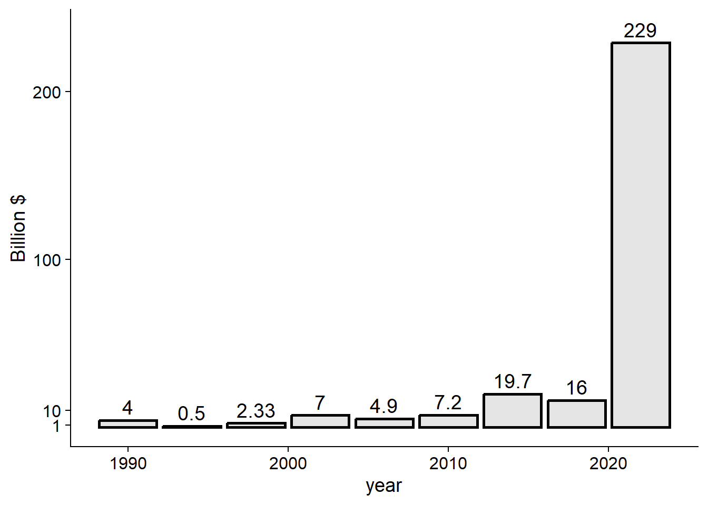
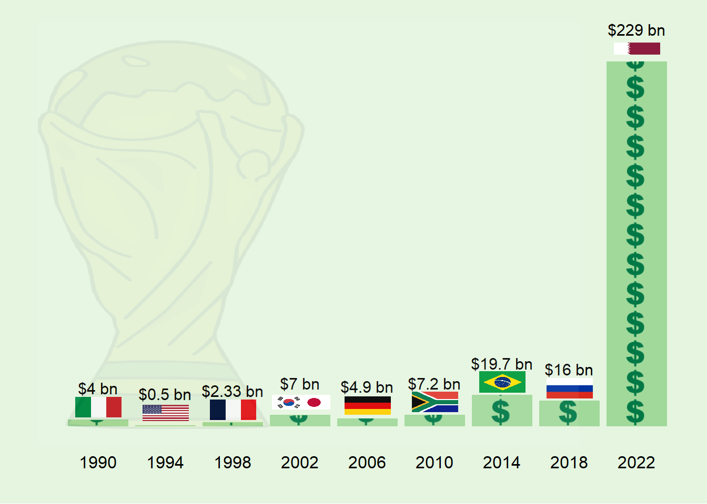

# Cost of hosting world cup

Let's start by loading the libraries that we'll utilize in our analysis


```r
#web scrapping
library(rvest)
#everything tidy?
library(tidyverse)
#handling spatial-data 
library(rnaturalearth)
library(rnaturalearthdata)
library(sf)
library(ggflags)
library(ggspatial)
library(giscoR)
library(rasterpic)
library(countrycode)
library("dataverse")
#adding flags in ggplot
library(ggimage)
#Visually explore data tables 
library(visdat)
#fit text within a defined area
library(ggfittext)
#set the default ggplot theme
theme_set(cowplot::theme_cowplot())
#get image
library(ggwordcloud)
wc_img <- here::here("images/wc12.png")
#define function to control transparency

transparent_0.1 <- function(img) {
  magick::image_fx(img, expression = glue::glue("0.1*a"), channel = "alpha")
}
transparent_0.2 <- function(img) {
  magick::image_fx(img, expression = glue::glue("0.2*a"), channel = "alpha")
}
# get flags form this repo
flagrepo <- "https://raw.githubusercontent.com/hjnilsson/country-flags/master/png250px/"
```


```r
#
# Extract the amount of money
url_2 <- "https://en.wikipedia.org/wiki/Economics_of_the_FIFA_World_Cup"

tbls_lst_2 <-  url_2 %>%
  read_html %>%
  html_table()
#
df_4 <- tbls_lst_2[[2]] %>% 
  janitor::clean_names() %>%
  mutate(host = str_replace(host,  "/\\s", "-")) %>%
  extract(host, c("country","year"), "([A-Z-]+) (\\([0-9]+\\))") %>%
  separate_rows(country,sep = "-") %>%
  mutate(year = parse_number(year),
         #x = strex::str_first_currency(general_cost)[[4]],
         x =  parse_number(general_cost),
         y = ifelse(str_detect(general_cost, "million"),x/1000,x))
df_4$iso2 <- countrycode(df_4$country, "ioc", "iso2c")
```


```r
ggplot()+
  geom_col(data = df_4 %>% distinct(year, y),
           aes(year, y),
           fill = "grey90", color = "black", size = 1)+
  geom_text(data = df_4 %>% distinct(year, y),
            aes(year, y, label = y),
            size = 5, nudge_y = 8)+
  scale_y_continuous(breaks = c(1,10,100,200))+
  labs(y = "Billion $")
```

```
## Warning: Using `size` aesthetic for lines was deprecated in ggplot2 3.4.0.
## ℹ Please use `linewidth` instead.
```




```r
ggplot()+
  geom_col(data = df_4 %>% distinct(year, y),
           aes(year, y))+
  geom_text(data = df_4 %>% distinct(year, y) %>% mutate(y2 =y, y = glue::glue("${y} bn")),
            aes(year, y2, label = y),
            size = 4, nudge_y = 20)+
  ggimage::geom_flag(data = df_4 %>%
                       filter(!country %in% c("JPN", "KOR")),
                     aes(year, y+8, image = iso2),
                     size = 0.07)+
  ggimage::geom_flag(data = df_4 %>%
                       filter(country %in% c("JPN", "KOR")) %>%
                       mutate(year=ifelse(str_detect(country, "JPN"), year+1.5, year)),
                     aes(year-0.7, y+8, image = iso2),
                     size = 0.05)+
   ggpattern::geom_col_pattern(data = df_4 %>% distinct(year,  y),
                               aes(year, y),
                               pattern_filename = I("images/Gold-Dollar-Sign-PNG-HD.png"), 
                               pattern = 'image', 
                               pattern_type = 'tile',
                               pattern_scale = -1,
                               fill = "#a1d99b"
                               )+
    ggimage::geom_image(data = data.frame(x = 1995, y = 120),
                      aes(x,y),
                      image = wc_img,image_fun = transparent_0.2,
                      size = 1.2)+
      scale_x_continuous(breaks = unique(df_4$year))+
  scale_y_continuous(breaks = c(1,10,100,200))+
  labs(y = "", x = "")+
    theme(plot.background = element_rect(fill =  "#e5f5e0"),
        panel.background = element_rect(fill =  "#e5f5e0"),
        panel.grid.major = element_line(colour = "#e5f5e0"),
        axis.line = element_blank(),
        axis.ticks = element_blank(),
        axis.text.y = element_blank())
```




```r
flags <- c()
# Loop and add
for (iso in df_4$iso2) {
  # Download pic and plot
  imgurl <- paste0(flagrepo, tolower(iso), ".png")
  tmpfile <- tempfile(fileext = ".png")
  download.file(imgurl, tmpfile, quiet = TRUE, mode = "wb")
  
  flags <- c(flags, tmpfile)
}
```


```r
ggplot()+
    ggimage::geom_image(data = data.frame(x = 1995, y = 30),
                    aes(x,y),
                    image = wc_img,
                    image_fun = transparent_0.1,
                    size = 1.2)+
    ggimage::geom_image(data = df_4 %>%
                          distinct(year, y) %>%
                          mutate(y2 = y+(y*0.85)) ,
                        aes(year, y2),
                        size = df_4 %>% distinct(year, y) %>% mutate(x = ceiling(log10(y*10))/10) %>% pull(x),
                    image = "images/Gold-Dollar-Sign-PNG-HD.png",
                    image_fun = transparent_0.2)+
   ggpattern::geom_col_pattern(data = df_4 ,
                               aes(year, y, fill = country),
                               position = position_dodge(),
                               pattern_gravity = I("West"),
                               pattern_filename = I(flags), 
                               pattern = 'image', 
                               pattern_type = 'tile',
                               pattern_scale = -1,
                               show.legend = FALSE)+
  geom_text(data = df_4 %>%
              distinct(year, y) %>%
              mutate(y2 = y+(y*0.45),
                     y = glue::glue("${y} bn")),
            aes(year, y2, label = y),
            size = 4)+
  geom_text(data = df_4%>%
              arrange(country) %>%
              group_by(year) %>%
              summarise(iso2 = paste(iso2, collapse = "-")),
          aes(year, label = iso2),
          y = -0.07,
          size = 4)+
  scale_y_continuous(breaks = c(1,10,100,200),
                   trans = scales::pseudo_log_trans(base = 10),
                   expand = expansion(add = c(0.2,0.5))
                   )+
  scale_x_continuous(breaks = unique(df_4$year))+
  labs(y = "", x = "")+
  theme(plot.background = element_rect(fill =  "#e5f5e0"),
      panel.background = element_rect(fill =  "#e5f5e0"),
      panel.grid.major = element_line(colour = "#e5f5e0"),
      axis.line = element_blank(),
      axis.ticks = element_blank(),
      axis.text.y = element_blank(),
      axis.text.x = element_text(size = 15))
```


```r
ggplot()+
    ggimage::geom_image(data = expand_grid(x = c(seq(1990, 2022,length.out = 6)),
                                           y = c(1, 10, 100)),
                      aes(x,y),
                      image = "images/Gold-Dollar-Sign-PNG-HD.png",image_fun = transparent_0.2,
                      size = 0.3)+
 ggpattern::geom_col_pattern(data = df_4 ,
                             aes(year, y, fill = country),
                             position = position_dodge(),
                             pattern_gravity = I("West"),
                             pattern_filename = I(flags), 
                             pattern = 'image', 
                             pattern_type = 'tile',
                             pattern_scale = -1,
                             show.legend = FALSE)+
  scale_y_continuous(breaks = c(1,10,100,200),
                     trans = scales::pseudo_log_trans(base = 10),
                     expand = expansion(add = c(NA,0.5))
                     )+
    scale_x_continuous(breaks = unique(df_4$year))+
  geom_text(data = df_4 %>% distinct(year, y) %>% mutate(y2 = y+(y*0.45), y = glue::glue("${y} bn")),
            aes(year, y2, label = y),
            size = 4)+
    geom_text(data = df_4%>%
                arrange(country) %>%
                group_by(year) %>%
                summarise(iso2 = paste(iso2, collapse = "-")),
            aes(year, label = iso2),
            y = -0.07,
            size = 4)+
  labs(y = "", x = "")+
    theme(plot.background = element_rect(fill =  "#e5f5e0"),
        panel.background = element_rect(fill =  "#e5f5e0"),
        panel.grid.major = element_line(colour = "#e5f5e0"),
        axis.line = element_blank(),
        axis.ticks = element_blank(),
        axis.text.y = element_blank())
```


```r
ggplot()+
  geom_line(data = df_4 %>% distinct(year, y),
            aes(year, y),
            color = "white",
            size = 1)+
  ggflags::geom_flag(data = df_4,
                     aes(year, y, country = tolower(iso2)),
                     size = 9)+
  scale_y_continuous(breaks = c(1,10,100,200),
                     trans = scales::pseudo_log_trans(base = 10),
                     expand = expansion(add = c(0.5,0.5))
                     )+
    scale_x_continuous(breaks = unique(df_4$year))+
  geom_text(data = df_4 %>% distinct(year, y) %>% mutate(y2 = y+(y*0.45)+1, y = glue::glue("${y} bn")),
            aes(year, y2, label = y),
            size = 4)+
    geom_text(data = df_4%>%
                arrange(country) %>%
                group_by(year) %>%
                summarise(iso2 = paste(iso2, collapse = "-"),
                          y = unique(y)) %>% 
                ungroup() %>% 
                mutate(y2 = y-(y*0.45)-1),
            aes(year,y2 ,  label = iso2),
            size = 4)+
  labs(y = "", x = "")+
    theme(plot.background = element_rect(fill =  "#e5f5e0"),
        panel.background = element_rect(fill =  "#e5f5e0"),
        panel.grid.major = element_line(colour = "#e5f5e0"),
        axis.line = element_blank(),
        axis.ticks = element_blank(),
        axis.text.y = element_blank())
```


```r
img_path <- "images/png-transparent-fifa-world-cup-trophy-vince-lombardi-trophy-award-soccer-trophy-sport-medal-black.png"

wordcloud2::wordcloud2(wordcloud2::demoFreq,
                       figPath = img_path,
                       size = 1.5,color = "skyblue")
```

```{=html}
<div id="htmlwidget-087c6660a17b78e87470" style="width:672px;height:480px;" class="wordcloud2 html-widget"></div>
<script type="application/json" data-for="htmlwidget-087c6660a17b78e87470">{"x":{"word":["oil","said","prices","opec","mln","the","last","bpd","dlrs","crude","market","reuter","saudi","will","one","barrel","kuwait","new","official","pct","price","barrels","government","production","sheikh","industry","meeting","minister","world","also","billion","futures","month","output","petroleum","quota","sources","accord","analysts","but","group","gulf","january","markets","report","today","december","demand","economic","economy","energy","help","international","may","nazer","nymex","posted","present","they","traders","158","ability","agreement","ali","april","arabia","budget","emergency","exchange","hold","imports","members","recent","riyals","says","sell","years","abdulaziz","agency","arab","ceiling","company","contract","daily","emirates","expected","expenditure","exports","growth","now","opecs","plans","qatar","quoted","research","reserve","reserves","states","study","united","way","week","west","year","150","according","added","among","asked","brings","buyers","can","change","corp","cut","day","development","effective","exploration","fall","february","fell","free","higher","increase","levels","meet","must","never","per","policy","power","problem","producing","protect","pumping","reduced","revenue","revenues","rise","saying","set","since","spa","strategic","texas","this","total","transaction","weak","yesterday","13nation","1985","198586","1986","1987","198788","address","agreed","alkhalifa","alqabas","alsabah","announced","appears","arabian","arabias","around","average","back","bank","bbl","boost","called","commitment","companies","compared","countrys","current","decrease","denied","dollars","domestic","due","efp","estimate","estimates","export","fixed","foreign","four","future","grade","guard","high","hisham","however","inc","indonesia","indonesias","intermediate","kingdoms","kuwaits","local","low","lower","lowered","made","main","march","mckiernan","measures","mizrahi","moves","much","named","next","officials","plant","position","president","pressure","producer","projected","published","real","refinery","reiterated","remain","rule","say","sector","several","sharp","ship","six","slightly","smaller","spokeswoman","state","sweet","texaco","three","trading","two","weeks","york","1518","198687","20s","285000","500","725","750","948000","activity","adhering","agriculture","along","apparently","appeared","approved","architect","areas","aspen","bankers","based","benchmark","benefits","canada","canadian","cash","changed","changes","circumstance","clearly","closed","coast","come","committee","commodity","consumption","countries","country","crossroads","crucial","cubic","currently","customers","deal","decembers","decline","deficit","deposits","deputy","diamond","differentials","difficulties","direction","discounted","dlr","early","ecuador","effect","embargo","embassy","entering","even","falling","feb","first","fiscal","fiscales","forced","fully","gcc","general","given","grades","halt","hit","hope","humanistic","impact","import","increased","increasing","instead","institute","interview","investment","jersey","june","keep","late","light","limit","limits","line","lost","louisiana","lowest","major","marketing","member","mid","million","ministers","mitigate","months","nearing","net","neutral","none","nuclear","organisation","organization","outlook","overseas","pact","pay","petroliferos","planned","port","positive","postings","predicted","press","pricing","private","probably","problems","pronounced","protected","public","put","quotes","raise","rate","reduction","referring","remarks","reports","return","review","risks","riyal","selfimposed","selling","share","shortfall","spot","steady","stick","strongly","studies","support","take","taken","techniques","throughput","trade","trust","trying","uncertainty","union","value","wam","wanted","weakness","winter","yacimientos","yanbu","zero","zone","100000","108","111","115","12217","1232","1381","13member","156","1600","1635","1650","1667","168","1685","1752","180000","200000","200foot","2226","24hour","2766","300","3749598","3750003","4133","534","5472","614","658","6745","678","718","738","able","abroad","accept","across","add","addressed","adherence","advantage","advisers","after","agricultural","aground","allocated","allocations","allow","almost","already","althani","although","alvite","amidst","analysis","analyst","annual","anything","apparent","aramco","argentine","arrangement","asia","asian","assesses","assign","assigned","associates","attract","available","averaging","aware","bahrain","bahrains","balance","baseless","basic","basis","because","beginning","bijan","bin","bit","bodys","briefly","broadened","brothers","buildings","burden","buy","buyer","calendar","cambridge","capacity","capozza","carrying","center","century","cera","certain","cftc","chairman","challenge","characterized","charging","cheap","cheating","chevron","chv","cited","citing","clever","close","closer","closes","coming","commission","communications","companys","completed","complex","condition","conditions","considered","construction","contacts","continuation","continue","continued","continues","contracted","contributed","control","cooperation","coordination","copany","corps","council","counter","coupled","covered","creek","critical","cts","currency","custom","cuts","cutting","cypriot","daniel","david","days","debtburdened","debut","decided","declared","declines","deemed","defence","delaware","delivered","delivering","departments","deregulate","deregulation","determination","devalue","device","differential","difficulty","dillard","director","discuss","discussing","distribution","distributions","divided","doha","dollar","drawbacks","drop","dropped","earlier","earnings","eastern","easy","ecuadors","editor","edmontonswann","education","eight","either","elaborate","elections","electricity","end","engineers","entitlements","environment","equally","estimated","european","exceed","exceeding","excess","excesses","excessive","exerted","exist","expanded","expansion","expartners","expectations","expects","explained","exporting","exxon","face","faced","faces","facilities","facing","failed","fallen","favours","fee","fernando","figure","figures","finance","firmer","floating","followed","for","forces","foremost","fourth","frank","full","fundamentals","gas","generally","geneva","get","globalization","glut","guaranteed","halting","harvard","heads","health","hedge","hedged","helped","hemisphere","highly","hills","hitting","hoped","housing","houston","immediately","implementation","improve","improvement","include","including","independent","indications","initiate","initiative","institutions","interbank","interest","investments","issue","jamaica","jan","juaymah","jubail","jump","just","khalifa","lack","largest","later","latest","launched","lead","leading","learn","least","lending","less","lesson","level","liberalised","lift","liftings","like","lines","liquidity","little","loan","lodged","longterm","ltd","lukman","lull","maintain","make","manager","manipulate","many","marathon","marathons","marker","mcfadden","means","mercantile","metrers","metres","mid1960s","mid1986","mideast","minus","mlotok","mob","mobil","momentum","money","monopolies","monthend","moussavarrahmani","movement","nation","natural","need","needs","negative","negotiate","neither","network","news","newspaper","nigerian","nine","nonoil","northern","notes","offset","onetwelfth","oneweek","open","opens","operations","opposite","optimism","optimistic","option","order","organiaation","our","outlining","outside","overproducing","part","parties","partly","party","past","paths","paul","paulsboro","payments","pegged","performance","period","pertains","pessimistic","philadelphia","physical","placed","plastics","platinum","point","policies","political","population","positions","postponed","pressures","previous","primarily","primary","principal","procedure","produce","produced","producers","product","products","program","projection","projects","prompted","proposed","proved","providing","provision","publish","purposes","quarter","quiet","quietly","quotas","rallied","ran","ranging","ras","rates","rationalise","readdress","reaffirmed","reasonable","recommending","recovering","recurrent","reference","refineries","refining","reflect","refloat","reform","reforms","regain","regard","regarding","region","regional","reiterate","relaxation","relieve","reluctant","remainder","remained","reported","request","resistance","resisting","resources","respectively","responsibilites","restored","restraint","restrictions","result","reuters","revealed","reviews","right","rilwanu","rising","river","rocks","rosemary","rumour","rushing","sales","salomon","santos","satisfied","saw","scheduled","scheme","seapride","season","secretary","security","seeing","seek","september","series","serve","services","session","sets","seven","severely","shamrock","sharply","shoulder","show","showed","shown","signed","signs","situation","sixmonth","slackens","slide","slump","social","sold","soon","sort","sour","south","southeast","spend","spill","spoke","spokesman","spotnext","spriggs","stabilise","stabilize","stable","start","statement","steel","steering","steps","stiff","storage","strong","subsequently","substitution","succeed","suffer","suffering","suhartos","sunday","sundays","supply","supporting","suppose","surrounding","swift","talks","tanker","tanurah","tapers","teach","telephone","terminals","test","there","third","thomas","though","thought","threemonth","tide","together","told","totalled","tower","trader","trades","traditional","traditionally","transacted","transmission","transport","trends","trusts","try","turmoil","twofold","uae","uncertain","unchanged","under","unions","unitholders","universitys","unlikely","unocal","unusually","urged","use","virtual","wants","water","wealth","wednesday","weekend","welcomed","when","whether","wishes","worldwide","xon","yergin","yesterdays"],"freq":[85,73,48,42,31,26,24,23,23,21,20,20,18,18,17,15,14,14,14,14,13,11,11,11,11,10,10,10,10,9,9,9,9,9,9,9,9,8,8,8,8,8,8,8,8,8,7,7,7,7,7,7,7,7,7,7,7,7,7,7,6,6,6,6,6,6,6,6,6,6,6,6,6,6,6,6,6,5,5,5,5,5,5,5,5,5,5,5,5,5,5,5,5,5,5,5,5,5,5,5,5,5,5,5,4,4,4,4,4,4,4,4,4,4,4,4,4,4,4,4,4,4,4,4,4,4,4,4,4,4,4,4,4,4,4,4,4,4,4,4,4,4,4,4,4,4,4,4,4,4,4,3,3,3,3,3,3,3,3,3,3,3,3,3,3,3,3,3,3,3,3,3,3,3,3,3,3,3,3,3,3,3,3,3,3,3,3,3,3,3,3,3,3,3,3,3,3,3,3,3,3,3,3,3,3,3,3,3,3,3,3,3,3,3,3,3,3,3,3,3,3,3,3,3,3,3,3,3,3,3,3,3,3,3,3,3,3,3,3,3,3,3,3,3,3,3,2,2,2,2,2,2,2,2,2,2,2,2,2,2,2,2,2,2,2,2,2,2,2,2,2,2,2,2,2,2,2,2,2,2,2,2,2,2,2,2,2,2,2,2,2,2,2,2,2,2,2,2,2,2,2,2,2,2,2,2,2,2,2,2,2,2,2,2,2,2,2,2,2,2,2,2,2,2,2,2,2,2,2,2,2,2,2,2,2,2,2,2,2,2,2,2,2,2,2,2,2,2,2,2,2,2,2,2,2,2,2,2,2,2,2,2,2,2,2,2,2,2,2,2,2,2,2,2,2,2,2,2,2,2,2,2,2,2,2,2,2,2,2,2,2,2,2,2,2,2,2,2,2,2,2,2,2,2,2,2,2,2,2,2,2,2,2,2,1,1,1,1,1,1,1,1,1,1,1,1,1,1,1,1,1,1,1,1,1,1,1,1,1,1,1,1,1,1,1,1,1,1,1,1,1,1,1,1,1,1,1,1,1,1,1,1,1,1,1,1,1,1,1,1,1,1,1,1,1,1,1,1,1,1,1,1,1,1,1,1,1,1,1,1,1,1,1,1,1,1,1,1,1,1,1,1,1,1,1,1,1,1,1,1,1,1,1,1,1,1,1,1,1,1,1,1,1,1,1,1,1,1,1,1,1,1,1,1,1,1,1,1,1,1,1,1,1,1,1,1,1,1,1,1,1,1,1,1,1,1,1,1,1,1,1,1,1,1,1,1,1,1,1,1,1,1,1,1,1,1,1,1,1,1,1,1,1,1,1,1,1,1,1,1,1,1,1,1,1,1,1,1,1,1,1,1,1,1,1,1,1,1,1,1,1,1,1,1,1,1,1,1,1,1,1,1,1,1,1,1,1,1,1,1,1,1,1,1,1,1,1,1,1,1,1,1,1,1,1,1,1,1,1,1,1,1,1,1,1,1,1,1,1,1,1,1,1,1,1,1,1,1,1,1,1,1,1,1,1,1,1,1,1,1,1,1,1,1,1,1,1,1,1,1,1,1,1,1,1,1,1,1,1,1,1,1,1,1,1,1,1,1,1,1,1,1,1,1,1,1,1,1,1,1,1,1,1,1,1,1,1,1,1,1,1,1,1,1,1,1,1,1,1,1,1,1,1,1,1,1,1,1,1,1,1,1,1,1,1,1,1,1,1,1,1,1,1,1,1,1,1,1,1,1,1,1,1,1,1,1,1,1,1,1,1,1,1,1,1,1,1,1,1,1,1,1,1,1,1,1,1,1,1,1,1,1,1,1,1,1,1,1,1,1,1,1,1,1,1,1,1,1,1,1,1,1,1,1,1,1,1,1,1,1,1,1,1,1,1,1,1,1,1,1,1,1,1,1,1,1,1,1,1,1,1,1,1,1,1,1,1,1,1,1,1,1,1,1,1,1,1,1,1,1,1,1,1,1,1,1,1,1,1,1,1,1,1,1,1,1,1,1,1,1,1,1,1,1,1,1,1,1,1,1,1,1,1,1,1,1,1,1,1,1,1,1,1,1,1,1,1,1,1,1,1,1,1,1,1,1,1,1,1,1,1,1,1,1,1,1,1,1,1,1,1,1,1,1,1,1,1,1,1,1,1,1,1,1,1,1,1,1,1,1,1,1,1,1,1,1,1,1,1,1,1,1,1,1,1,1,1,1,1,1,1,1,1,1,1,1,1,1,1,1,1,1,1,1,1,1,1,1,1,1,1,1,1,1,1,1,1,1,1,1,1],"fontFamily":"Segoe UI","fontWeight":"bold","color":"skyblue","minSize":0,"weightFactor":3.17647058823529,"backgroundColor":"white","gridSize":0,"minRotation":-0.785398163397448,"maxRotation":0.785398163397448,"shuffle":true,"rotateRatio":0.4,"shape":"circle","ellipticity":0.65,"figBase64":"data:image/png;base64,iVBORw0KGgoAAAANSUhEUgAAA5gAAAIABAMAAAAVpN4UAAAAFVBMVEXm5ub///8AAAC4uLiLi4szMzNfX1/QqwslAAAYm0lEQVR42uydSXubuh7GUdJ2LYHx2uBhXds5XV/spOtjOqyvSZvv/xGuQUxiRvhKws/L5pw3YPVxfkHSf5TF+EUtfj2WvP3n+fnl+9/Q//Xx8Xq+SevRv++jfjnGPoW+cO3ODDDnKBn95jdcuz1gzk7SN7/l+gmYM5NLv+N6B8w5yZPfeW33gDkX6YR+3/VfBpizkP/4A64fDDDNl31TbL6tfcCv/2gwh7K8LZwEMM2Ww1nG7yZgGv1tDr4/iiZgGivHsfT9DQNMUyUZybKgCZjGSeqPvryHs8xuF0l/NGu5HA/TD+jDfH32UDCfX6LRMLcMME2Vjj9+2QRMU+V4mhcKmKbK02iae8A0S7Igk/ZomDsKmEZJ15OHeZtoAdMgyfw1lYfpM8A0R5Kn28rH5GGuGGAaI5Mt7Psx+UEkATP/SwBM7TLzyQaxkmGZ+2gBU7tcZEtfX1pe+3UFTDMkSWfWteySmYQ2AdMIuSxHQCI5mHyKBkztMvP5EOklM181Zw5z/hG8bMX0Y72UhekHCE7rl3l6wZpyg1P21aSAqV3mYZJLTDbyJ72agKlVFnk/cRoslWfprwFTt8zxbWPpDvL2nH7//dWQDgSYumVuV3oDl8zUD1svLtoDpmZJxISBcEC8i3+W1IwYbIB0y8IUiSUd7B2gFnFrIWrA1CqL7U9S1OUODpDQ2s53BZiaJStlM9/k02CXOi0vt/n+BzB1SrfE6CaHJHN5+VAOYJokSUGPv6hDik0aNk+AaVRxyabpZWvJYf+75+5p0ZBZAaZeaZcnz/rL1ueJLS2av+Cb1SxLZmUGMxxKcy/AzCJJ848hzTaCVzIrL+ndUbV8tuhIQHBap7SF7UsfzP9Y1rdQyBPJFc0zUC6AqUkehDUwvuv22ZeFS3ZdbH3XBcwNBUw9UoxGxncPPRbJ7frWFC8pcsMAU48UUkS2yds1IDOWOVEHzEMAmDqkaCYmQDpm2XX+WVLL4Cu/mR5gaoEZiqYG6ZxlyznrrGLAlNZMHjwBTNXSqddY9mc5s/pH44yTbGSXhzUBU7W0K55Vwtxel2z6WbJsnIPfX8I0Lwww1UqxgxN3Ghz6a4Oshg9nQc5TFtcETNUw/TpM2v9qZj6wpldzkSWGAaZiKYK78run3kBmg/eo8mruAVO5FBbIa/o6HbpbeZeHapqEl2U3L2Cqk+VX699sC9qdN7IuD2U35XmFfNEETLWynI5VtEw79ebMFkM1mS72rDvJzDeCV0+FrW1rmupJmlJO8lIVPgCC06qlU9unUot97u/fVAxlN+XNHpI6T8BUK+1az9jGgEhzCnQylNNUnuBmiX6AqVA+VWdZRoeU862Koar5QrG3IJm9PcBULKOqjbgY2IyrgFnNFyLxyE/xphcw1coan4GpXEEB81Sv6eOmJmCqlbRq7w+tf/faYe7i81MZYCqXywqewSXTJZhRPf2Sv+EBYCqV1c2sOxTmpn3NvM2z/BX3AFMXzOuYWdbftpomccCEj7wCTKXyVNnMDs5k562fYg+Q3Vy76aT+A8BUJsvl66zRKXttcdRmvj/Wdi+tiAdMc2DepsplZ2/ZU1sKXwSYaqVTzmWvePfyFgdtJWHbP+fjW/uCeuAthQBTlXTLeZLVIEpWSD24vk/0P9hpHz0LVWBqpF2eGssZWj9fSqUn4484CXjU+4LgtE6YFvsSoyTphEuSh8c30vN4PooHmOqkkCnJxJusOBFK4hgFKylhAUyVME9iYp5w98Ar2qVOYNxwZ8IaMBXCjAS/jXjX3pHGlK2BJ0lZ1mwPU5gpzNoxe6W7JE2SlmrXzoPWW8DUBdNnzQ/70jB9wFQoK3tQCpjzhenUEz4aHg7lYe4BU5ms5vusadPDtjzMADCVyVoo+soNS3bkD5NEuvIwr4CpTNbfuT3lLp+kAIG4nqTTIIN5AUyNMLe3VS5pI3JhlC1i25MwmUUzhekBpkaYpUZcx0+JW4jIHPK2BUyjYGZ+OcLGLJrBl9ydN2OYs4xnDnjl4ocXw1mmKWGr1FO/QnDaJJj7MTC9LFnP4xldWX4eYJoB80KH9YXmubTp7JqYJIvMcAVMU2DGL5vb1987LaJnOcz4X3EBU6l8GgSz7zCp25bh+fvHmbAiJzrLDQNMdfIwCGaP06DcvSl9jddpdh5gmgVzRfsMmMrZF3bm+ImyfvyAadCb+Yd2PncVR3azYIkPmCZOs90Hve1rMJP2FQsf06yBGyCr1u+wCybzeUmfDZhGmiZW57JZGfm29yVWuv8BzLnBpPnINEx+Ey80L0mCO888mJ2WZv7tFylYkjWoAEzDYPJMkqgndPlxfn6J/HKl0KEwWwDTFJhJ/iUZELosGudZaVOn+cJ80HhmGpLs61RR7diW1cYjOK0xoaulQHo5FGaWwk58wDQRZuYz7+qi51TaVuQfAEx1ckB917oPpifATOmFYm9FwDQD5oWw7mpbT5yGWRYwKR3pB5gq5HN/EmWc0MX6Nkiu+CZ/rnYkAUwFkvS2K1gNglmehnevUbXzE2CqkexT2N1ULX54OQZm61lTgPl/l6SziTc/aKbTHL0ApkGSMfoSNjdtYjwjpHMujvc4T4BplHx+ef3+8fHr4+P1fMyfSO/6fTAP3a0vAVO9rFz5Xae3v/epuyktYJoj3V53X9RzxgJgGiNtaZgeYCqUSXuYvoej3ibCUcdOd44wZxnPZIsf/Q/3NLWMv3/Y0Q8RwWlVkvr+e8lGaXx42V8j3QYT/WaVd4L+febTTHaXirvaQ/cxUl2JCBQwVcp0tdt+vB6zu9bxeHy9Xcdj8sSX3qSS9lbRgKlUDj76oiPdqxXmBjB1nWsic/Gs2rY10wNMXcdHAebcYTp3mWZb7MwAMLUduSjZvbIdJgNMtTKcBvOSRMkA0wx5mPhq+l+ttoq/DWDqO0Bc7kqPMGl0swPmzGBeW2FeAVO1PE2EGdcGNRo4/zLAVC4P02E6Lanwc4U544SuaTS9ZgNnw+b525h7psG0mTZJDanZJjtmAaYeGU2AuWvaRm2JBZiaJJ3iOohHWjQ0NgVMTZJOgLmvL5qZUxYwVUqabVOcKR696pY4mHly4jxhktOGpHIxbTu7ENOiAVODPMTbTi6laSZp66WTOAMGmFqkHbNI5XLKDqjolRgwwNQjl35x/Gyp4Hn8omkRJyxYAqYWWS4ikH03N8lQhL7Ntu79MWASoScIcaTnWe7cjAIGmPpgHkpNQeK3K5Lczwq+6pulA5gapF1q8ZLcOcm9muLICw8wNUinak+wf6ReTWHkhT9zD9Dcs/MCmt11JBy1QWlkssiLbBGcViufCt94vuJ9G0+T5CPfWGZ7WsDUlgNUEODHoY64fpL8szHLDf+7IICpWDq1uTJ+u9iXEXPtbl+sMolX8MpH3gOmaimmYGV3WU/rLgElLYySL7ySL5nAMc0ql4eqzzzfiQ6ZbLf7DH4xmMdhrgFTuRQyPnZEuOt87yb5ni+LfNwoK36Px/UAU7l0qnkD4sPOWwdJcahFURl2U+EeMNXLCqQfwsuWPP7yt7J+/vpzrg/1uVSvEJOFaWJAEvQ2zfooHk7/5/nleDwfj19Z6cqHyl0NO/7bOKwBU4OsF4pskl5PzZ/NfiAK+lY5TpMmgTXAVC2b4l7vYxyUYsvaJGP29heyB0wdsnF7c2YDh6pYpLzDCOPJJICpXLZEvd6HfLbmyOUHSLmCyQqY6mRrieZ772fpW3OXpxPPRZkrzBknSiy63QLNn429C9/Clg6zNO2BiOC0etnt5vmT2iJiLdDz97CtyXfyrlPA1CN7Xerb36/n41eSmZuvf/3uDvshtzYBU4Oc2ECv1vr5Nm+vAFOTtO8Gk4dEn1LXAWBqkIt7sdzmhmsAmLrk3WbZZGQ3bxsMmBpkeCeYe5I6IXaAqU3eaQe0pSSdZVeAqU3eaQfkJTDdLHQCmFrknXZAQTLyoTgDAzB1yPvApMnIpWMTAFOHjO7BcpXAdP18/wOYWuRddkDXfKgVYGqU9n1m2WzG9ub925hzPJN2RsFGNdGjvFtpMO/fxsxhkjvAvMRDcac9BUydMO+wA0qGItx5AJg6YU7uu58m/Sx4Tjtg6pTTd0BeFv2K9z+AqVMuJ8MkaY5BXp8JmLqkM5XlLssxSA67BUydktxnlrVTgxMwtcKcup3lpmWUlg4BplaYhzsYJqnDfg2YmuXE7SxvjelmdWCAqVW691syr4CpWU7czu4Lw8TfA6ZmSe6wZNI8egKYemGG05dMO03rmv9vY9YRPDbxfLckgJnuiNcMzYN1y0nbWVKaqT3A1C6nbGe3yVCLUv99wNQqp2xnV6xkqu4BU7+clGQQD3MqHXMCmHplOCX8VSyZW8A0QB4mLJmsCImuAdMAaU9YMuNjNOySYw8wNUt3wpLJiiDaBTANkIsJSyYr/IEBYJogpxS/F1lEDDDnDJO7fGzANElG8ksmy63MDWAaIQ8Twl/5krkCTCOkLb9ksrz0yHsEmA8QwZOEuU7CubbQohTBad1yOSGWmc/RAWAaISXjJgm+3LO7B0wzpHTBtFUcBk8Bc8Ywd0Km5hYwDZGR9JKZb542gGmIlOo5kmxf81KVNWAaIqVsk72QdetZgDljmFSwai6AaYiUCYLxRdIW7BTANEBS6fTnkzDpAqYJUq7HWmnJzDogAqZ+KZGgRwSXwRYwjZEniebPwv5nA5jGyCe5kEmx/1k/BswHiGfKBME8MaztzfrrP1JwWqYWPhCzhy6AaYwcb2jymanCFjCNkHJ9uZaV1gaAaYIc3dhgRcTkIQaY5sAca2jy86JOlbPAANMImGMNzYAI+58NYBokxxqalAj7nzVgGiTtsf4f8r/27mVbTSQKAzBlsnpMgTAWFMfRvoyj6WQczWWuK+n3f4QORTzhTiGVVXvv9TP7DzAgX5Sydl0a7Z9MAZMt5tZg/rrpAkxCMZ1b/1L19k9+AyahGM+tf6l6++fn/pnAJBLnjv9R9fZP1R4CJpE4s9cgLO9NgUkUc1avwd5gRu2dbTVmgdGI95n1r7C+IPiO/eNLKk7PnHBbYV5rS8gAk1Kc9UPzYDDruMBki2nujYFJNc4Za1CYe5P6ShXApBTnjDXYmnuj+hgSYFKK4bz2jw7rVTMFTFpxTmeewWy8Q4HJFdPUMgNg0o3XWY1ZHaaNBhEwSUX7LqBqX+Ko8QdgkorHWe2fxvUbYBKL0UzMe6t3D5gsMW/tBhMw+WKa0lHcXKpUCKaQkQYz5g6Zp06bk6hRnCYV1zMq00FzON8JmMSi9ZAuM6+2sVX1AZjU4rxlRu7N711gkorWQ7ounauByRbz0P5SLoBJDvP+bGN2D0xymJaz+opOY3YHTHKYlp2zu05jdhMAk1qMnm3MZsDkitltzAKTLeap08NwASa5mDzZmDXrWwKTVlzPwIzan1Vg0orxk41Z04sgBFNKPdNy5OymO2BIxuOLKk5bDrbMupcCkyvmrfshBibBaDVy9lBemXa20QQmsWjV0x52xgvtgUkwnq262TuYW2ASjEerXyYd9g0wCUab/rxN0GkqZcBkipkBUw7mrbx4DUzyMbEaANS58AJMgjG16mbvfIRvwCQY11YDgDrN3hMwCcbYqmbS6SpSwKQYbX6ZBJ1OXC0IU0w902YYdFZeHPdUq1Gc5od569k4DJhMMVXPln7AJBmna2Dlxa3R0gUwScbJGlhhMO89c2+BSS1O1sC2BrNnhBcwycWjzQCg9qzcLTBJxpUVZtr56QlMgjGyGc3VbsxmwOSJWd7Q3tAPmEwxy4vbzSRg0oyJxS8Trfqm+AGTHeYWmHzi2qIx26l63oBJMsY2mEnf5FspmILqmfHkaK6gO8FaSapnCsIMJkdz9XQTaWCSjGpyNFdPaQWYLDFNsUvlwJSAabrUY2CKwDR9PUlfRwIwCWJep5dzajdm98AkinmfXM6p05gFJk/M3sbsDphEMc/zG7NbYBLFPE4u5xT3rwsETGaYpjGbApNLXE1iRv2LPAGTXoxmN2aByRPTtH/usjEF1TPHVzUwl/Z/+aI4zQyz2s+2v1sImARjMjXMIAUmm5hOYUb9ow+ASTCup9YmPQJTBKa5+Nq/mQIwCcZ4dmO22uYNmARjONGYjYHJKI60f1Rv+ycPgMkP8zKAGQKTH+ahvPgMTBGYoept/wCTIeYemHIwN+XZdGifW2CywszKs5F4TEn1zOGBs6fy7HFgMjWK07wwh87ugUkW8z68mkHYu1AiMPlhbsqz66FePmCSxDwPFzP7RwgBkx/maWhU7RaYZDGPw/Wv/jliwGSHWf4ACcPhXYuBSTGuhldzClNgisAsB3OF0fAW1MCkGKORwVxnYIrAHBj/A0yGmNWu0sAUgWnEEmCKwLxoPbRVqjBMUfXMZHjNvPPwcjIoTjPCLP/PqhyYEjDNMmvrkVVLgUkypvaLGQCTJebIK/MxbwiYXDBHXpnAJBzXM1+ZwGSGOfbKfEwCAyYTzLFXJjAJx3jmKxOYvDA3Y6/MXAGTE+Zl7JUJTMKxp86lx16ZwGSFuddjr8xcA5Nu7KlxBT1LBkvFlFXQ62muDtYyTVMXxWmyUfX8MPlx5g5MCZgbg5kDUwLmrTwbAVMEZliePQJTAubWYObAlIBZDiQYXYUWmHwwzQOugCkB03Sy6xyYEjDNOII1MCVgVlu5RcCUgJkZzOvozn3ApIt57QwjiHNgCsA0eyyObykFTC6YZrT6+D7U0jBl1TOv7TUOR9uyVekaxWn6mJk5FwFTAmZ1NgemAMxq7a0UmHzjvbldgj4DUwDmJixjmANTAKYyMQKmAMxN2D/yEpgMMZWJyRTmDpj0MctCphobYolPJhvMwsxJmPpdgk8m8Vj9FDmZ2tf0BxOY9DHNKgaBWufA5I9Z/UGdgckf81YVgyw+mOIwZdUzf2A+ll2/22CiOE0a87G5RZIDkzvm7vFdkwOTO+Z3/TNGwOT/ND9jmANTTDwDU0xMcmBKiZZfssDkEO+2mFtgUo8rW8t8EwCTdFSJtWWhgUk6qtTaspy/CUzK8ZW95SUEJvFP5tH6hSmwz0TaO9O2w2CrA4mPL6ieaV38yndinldscdrE8DptudfAZBEthnLtFTC5RH2c+o4FJp+o/xiz/KQDYDKKIwMti5MOgMkqKv330McyDIDJIEaHeoy/dym/HnTt3jgDJtl4LZpnw/fNL9h3v7rjzZ3XIgQm0RibpQyaZ8N/vpifnV+/vVPte88vey4Ck1yMXnrp6h1CzaN29vzooAUmwVj1n2vLe88v6wsDk178WZXeaKt7z7WN34BJLj66fT7q6YtfaivVconAJBZ/zUj4qKe6FGp1MiUIU05BL8oby3ONXRy219hDcZpYvDarIiMXr5ujuoBJLraWfH77MvKgc/H71kZ+wCQX2/O+ikN1QfNi1a2nZMAkF7sF6c+mgVe7+Ed+fe0ddABMUrF3fknZGfu4uPwm/tC/8TQwicWh2bVf//3TtOFf/fVhaGhQBkxi8Zw/feyASSzmCw5g0orREswMmKTicQnmFpikYr7oACbHRQxG5oMBk0pcLcPcAJNQzBceQjBF1DPjpZgHFKfJxGgpZgZMKlGdl2LugEkGM198AJNKTJdj3oBJJEbLMTNg0ojquhxzD0waMcwdHAqYJGLiAvMCTBJx5QJzA0wS8eoCswAmiZg7OYBJISZuMC/AJBAjN5gZMAnEqxvMQgAm+wpemDs6FIrT3mPiCvMCTN9RrVxhlmNHgOkX8+4Kcw9M75i5swOYvuPaHeYJmJ5j5A4zA6bfaL9Zgs1mUsD0i5nnLl+awPQaXWIqYHqNiUvMCzC9xsglZgZMn9Fdl0HVbQBMn5i50wOYPuPaLeaJfdmBcwUvcovJfP195pgrt5iPSbfA9LJdglvMApgeY+74UMD0FlPXmDdgeouRa8wMmN7i0TXmNgSmr3h1jVkA01vMnR/A9BXX7jFPwPQUI/eYGTA9xcQ95gWYnmLqHvMGTDnvTGD6ijEaQFrMLLDfgKlQnPYUlXtMjDTwhum+BwiY3jDd980C01t0XzUBprfovp4JTH/x97R/gOkjLl8Cun9BaGD6iI57Zy/A9BjVb/mWBaYfTKc/TraYnuA1rt12zALTZ3TZBNph5rTn6LCz/YAFKjxHd2/Ncpgl938NzqPzzEO4rH7x/tfgj6kdtYFOGpgEIhbcF4Sp78468oDpPS7X3GtgUolLNR+WwKQQl2nutQImoaj/ft7ykw6ASSo+P4v6pgNgEosqfKqbdq/CAJgE4xPdB2+1nMeXhan161kjaYu3jx5NYJKMsXW7dn+Q8LyiMbUO39tQflZSnlc0ZqD1qw+jX7fFtzda0PP+whRQweuPr7/3S359I/N5Q3FPU4vmT6/++vDf9y/lx/TLl/++vXvz0jcvEvN/PPbiPrgkUKUAAAAASUVORK5CYII=","hover":null},"evals":[],"jsHooks":{"render":[{"code":"function(el,x){\n                        console.log(123);\n                        if(!iii){\n                          window.location.reload();\n                          iii = False;\n\n                        }\n  }","data":null}]}}</script>
```


```r
#https://lepennec.github.io/ggwordcloud/articles/ggwordcloud.html
img_path <- "images/png-transparent-fifa-world-cup-trophy-vince-lombardi-trophy-award-soccer-trophy-sport-medal-black.png"
ggplot() +
  geom_text_wordcloud_area(data = love_words,
                           aes(size = speakers),
                           color = "#31a354",
                           label = "$",
                           mask = png::readPNG(img_path),
                           eccentricity = 2,
                           rstep = 0.001,
                           tstep = 0.01,
                           perc_step = 0.01,
                           grid_size = 0.1,
                           grid_margin = 2,
                           rm_outside = TRUE
                           ) +
  scale_size_area(max_size = 40) +
  theme_minimal() 
```

```
## Some words could not fit on page. They have been removed.
```


```r
ggsave("images/worldcloud_dollar.png")
```

```
## Saving 7 x 5 in image
```


```r
ggplot()+
    ggimage::geom_image(data = data.frame(x = 1995, y = 30),
                  aes(x,y),
                  image = wc_img,
                  image_fun = transparent_0.1,
                  size = 1.2)+
    ggimage::geom_image(data = df_4 %>%
                          distinct(year, y) ,
                        aes(year, y),
                        size = df_4 %>% distinct(year, y) %>% mutate(x = ceiling(log10(y*10))/10) %>% pull(x),
                    image = "images/Gold-Dollar-Sign-PNG-HD.png",
                    image_fun = transparent_0.2,
                    nudge_y = 45)+
  geom_line(data = df_4 %>% distinct(year, y),
            aes(year, y),
            color = "white",
            size = 1)+
  ggflags::geom_flag(data = df_4,
                     aes(year, y, country = tolower(iso2)),
                     size = 9)+
  scale_y_continuous(breaks = c(1,10,100,200),
                     expand = expansion(add = c(10,55))
                     )+
    scale_x_continuous(breaks = unique(df_4$year))+
  geom_text(data = df_4 %>% distinct(year, y),
            aes(year, y, label =  glue::glue("${y} bn")),
            size = 4,
            nudge_y = 20)+
  labs(y = "", x = "")+
    theme(plot.background = element_rect(fill =  "#e5f5e0"),
        panel.background = element_rect(fill =  "#e5f5e0"),
        panel.grid.major = element_line(colour = "#e5f5e0"),
        axis.line = element_blank(),
        axis.ticks = element_blank(),
        axis.text.y = element_blank())
```


```r
ggplot()+
    ggimage::geom_image(data = data.frame(x = 1995, y = 140),
                  aes(x,y),
                  image = "images/worldcloud_dollar.png",
                  image_fun = transparent_0.2,
                  size = 2)+
  geom_line(data = df_4 %>% distinct(year, y),
            aes(year, y),
            color = "white",
            size = 1)+
  ggflags::geom_flag(data = df_4,
                     aes(year, y, country = tolower(iso2)),
                     size = 9)+
  scale_y_continuous(breaks = c(1,10,100,200),
                     expand = expansion(add = c(10,55))
                     )+
    scale_x_continuous(breaks = unique(df_4$year))+
  geom_text(data = df_4 %>% distinct(year, y),
            aes(year, y, label =  glue::glue("${y} bn")),
            size = 4,
            nudge_y = 25)+
  labs(y = "", x = "")+
    theme(plot.background = element_rect(fill =  "#e5f5e0"),
        panel.background = element_rect(fill =  "#e5f5e0"),
        panel.grid.major = element_line(colour = "#e5f5e0"),
        axis.line = element_blank(),
        axis.ticks = element_blank(),
        axis.text.y = element_blank())
```


```r
#https://dataverse.harvard.edu/dataset.xhtml?persistentId=doi:10.7910/DVN/CPQEHN
wc_server <- "dataverse.harvard.edu"
wc_doi <- "10.7910/DVN/CPQEHN"
wc_file <- dataverse::dataset_files(dataset = wc_doi, 
                                    server = wc_server)

wc_data_raw <- energy <- dataverse::get_dataframe_by_name(
  filename = wc_file[[1]]$label,
  .f = readxl::read_xlsx,original = TRUE,
  dataset = wc_doi, 
  server = wc_server)
```

```
## New names:
## • `` -> `...1`
## • `` -> `...2`
## • `` -> `...3`
## • `SOURCE` -> `SOURCE...5`
## • `SOURCE` -> `SOURCE...7`
## • `SOURCE` -> `SOURCE...9`
## • `SOURCE` -> `SOURCE...11`
## • `SOURCE` -> `SOURCE...13`
## • `SOURCE` -> `SOURCE...15`
## • `SOURCE` -> `SOURCE...17`
## • `SOURCE` -> `SOURCE...19`
```


```r
wc_data <- wc_data_raw %>%
  janitor::clean_names()
wc_data <- wc_data[-1,-2]
wc_data <- wc_data %>%
  tidyr::fill(x1,
              .direction = "down") %>% 
  dplyr::rename(event_type = "x1") %>%
  dplyr::select(!starts_with("source")) %>% 
  tidyr::separate(x3, into = c("year", "host"), sep = 5) %>% 
  tidyr::extract(host, into = "host" , regex = "([[:alpha:]\\s\\&]+)") %>% 
  mutate(host = str_trim(host), 
         year = as.integer(year)) %>% 
  mutate(across(matches("cost|number|revenue"), as.numeric))
```

```
## Warning in mask$eval_all_mutate(quo): NAs introduced by coercion

## Warning in mask$eval_all_mutate(quo): NAs introduced by coercion
```


```r
wc_data <- wc_data %>%
  mutate(host = case_when(
    host == "West Germany" ~ "Germany",
    host == "England" ~ "UK",
    TRUE ~ as.character(host)),
    host_type = ifelse(host %in% maps::world.cities$country.etc, "country", "city"),
    host_type = ifelse(host == "Japan & South Korea", "country", host_type)) %>%
  left_join(maps::world.cities , by = c("host"="name")) %>%
  mutate(host_country = ifelse(host_type=="country", host, country.etc),
         host_city = ifelse(host_type=="city", host, NA),
         host_country = case_when(
           host_city == "PyeongChang" ~ "South Korea",
           host_city == "Japan & South Korea" ~ "Japan & South Korea",
           host_city =="Lake Placid" ~ "US",
           TRUE ~ as.character(host_country)
         ))
```


```r
wc_data %>% 
  ggplot()+
  geom_violin(aes(cost_of_organisation, y = event_type, fill = event_type))
```


```r
wc_data %>% 
  pivot_longer(matches("cost"),
               names_to = "cost_type",
               values_to = "cost_value") %>% 
  ggplot(aes(year,cost_value, color = event_type, group = event_type))+
  geom_point()+
  geom_line()+
  scale_y_continuous(trans = "log10")+
  facet_wrap(~cost_type)
```


```r
wc_data %>% 
  pivot_longer(matches("cost"),
               names_to = "cost_type",
               values_to = "cost_value") %>% 
  group_by(host_country, event_type, year) %>% 
  summarize(cost_value = mean(cost_value)) %>% 
  ungroup() %>% 
  group_by(host_country) %>% 
  mutate(country_avg_cost = mean(cost_value)) %>% 
  ungroup() %>% 
  arrange(country_avg_cost) %>% 
  mutate(host_country = fct_inorder(host_country)) %>% 
  ggplot(aes(cost_value, host_country))+
  geom_point(aes(color = event_type))+
  geom_line(aes(group = host_country))+
  scale_x_continuous(trans = "log10")
```

```
## `summarise()` has grouped output by 'host_country', 'event_type'. You can
## override using the `.groups` argument.
```


```r
wc_data %>% 
  ggplot(aes(year,number_of_athletes, color = event_type, group = event_type))+
  geom_point()+
  geom_line()+
  scale_y_continuous(trans = "log10")
```


```r
wc_data %>% 
  pivot_longer(matches("revenue"),
               names_to = "revenue_type",
               values_to = "revenue_value") %>% 
  ggplot(aes(year,revenue_value, color = event_type, group = event_type))+
  geom_point()+
  geom_line()+
  scale_y_continuous(trans = "log10")+
  facet_wrap(~revenue_type)
```

```
## Warning: Removed 32 rows containing missing values (`geom_point()`).
```


