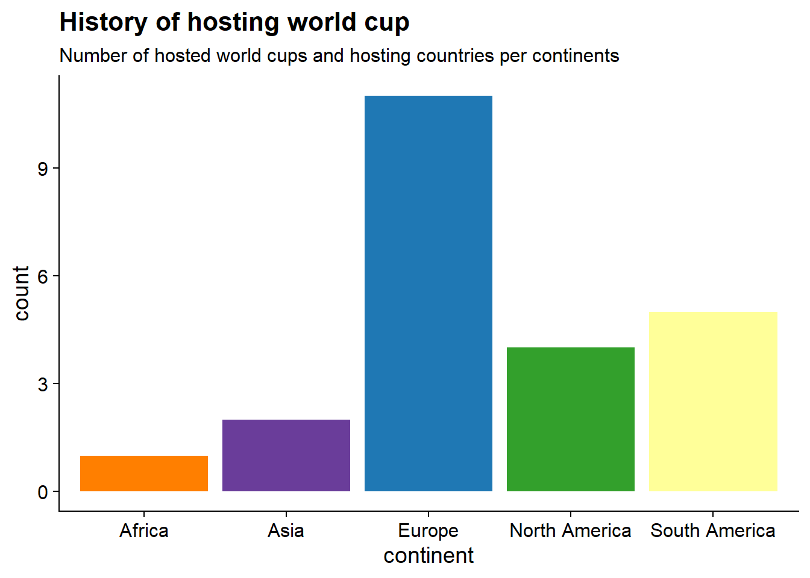
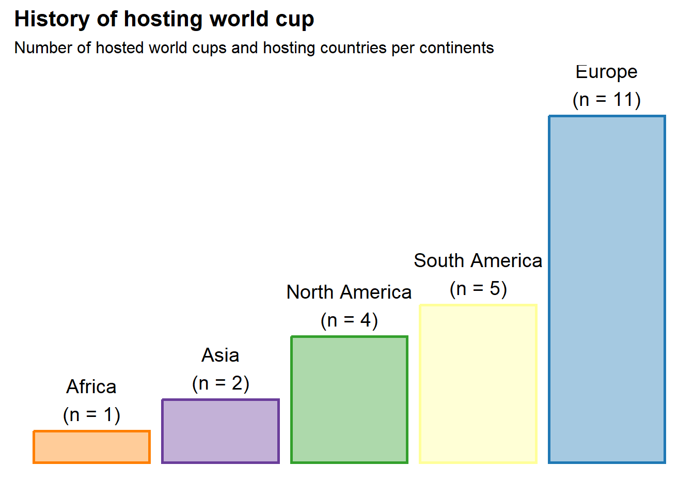
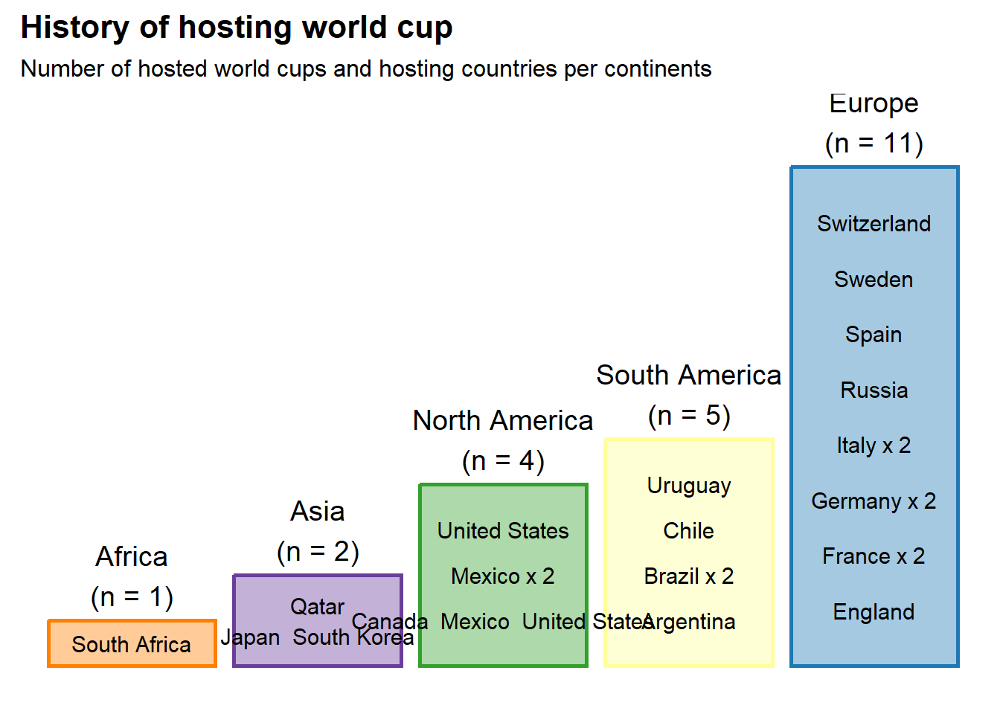

# History of hosting FIFA World Cup

Load libraries


```r
library("rnaturalearth")
```

```
## Warning: package 'rnaturalearth' was built under R version 4.2.1
```

```r
library("rnaturalearthdata")
```

```
## Warning: package 'rnaturalearthdata' was built under R version 4.2.2
```

```r
library(rvest)
```

```
## Warning: package 'rvest' was built under R version 4.2.2
```

```r
library(tidyverse)
```

```
## ── Attaching packages ─────────────────────────────────────── tidyverse 1.3.1 ──
```

```
## ✔ ggplot2 3.4.0      ✔ purrr   0.3.5 
## ✔ tibble  3.1.8      ✔ dplyr   1.0.10
## ✔ tidyr   1.2.0      ✔ stringr 1.4.1 
## ✔ readr   2.1.2      ✔ forcats 0.5.1
```

```
## Warning: package 'ggplot2' was built under R version 4.2.2
```

```
## Warning: package 'tibble' was built under R version 4.2.2
```

```
## Warning: package 'purrr' was built under R version 4.2.2
```

```
## Warning: package 'dplyr' was built under R version 4.2.2
```

```
## Warning: package 'stringr' was built under R version 4.2.2
```

```
## ── Conflicts ────────────────────────────────────────── tidyverse_conflicts() ──
## ✖ dplyr::filter()         masks stats::filter()
## ✖ readr::guess_encoding() masks rvest::guess_encoding()
## ✖ dplyr::lag()            masks stats::lag()
```

```r
library(sf)
```

```
## Warning: package 'sf' was built under R version 4.2.2
```

```
## Linking to GEOS 3.9.3, GDAL 3.5.2, PROJ 8.2.1; sf_use_s2() is TRUE
```

```r
library(ggflags)
library(ggspatial)
library(ggplot2)
library(giscoR)
```

```
## Warning: package 'giscoR' was built under R version 4.2.2
```

```r
library(dplyr)
library(rasterpic)
```

```
## Warning: package 'rasterpic' was built under R version 4.2.2
```

```r
library(countrycode)
```

```
## Warning: package 'countrycode' was built under R version 4.2.2
```

```r
library(ggimage)
```

```
## Warning: package 'ggimage' was built under R version 4.2.2
```

```
## 
## Attaching package: 'ggimage'
```

```
## The following object is masked from 'package:ggflags':
## 
##     geom_flag
```

```r
theme_set(cowplot::theme_cowplot())
```

## Data collection

In this project we will use the data made available in this Wikipedia article about [FIFA World Cup hosts](https://en.wikipedia.org/wiki/FIFA_World_Cup_hosts)

To do that, we are going to use the [rvest](https://rvest.tidyverse.org/) package to explore and scrape this tables directly into R.


```r
# URL of the article
url <- "https://en.wikipedia.org/wiki/FIFA_World_Cup_hosts"
# Read the webpage and obtain the pieces of the article containing tables
tbls_lst <-  url %>%
  read_html %>%
  html_table()
```

The tables are in the house! However, this too much. Let's select only the tables of interest for this tutorial. This is limited to the subset of tables showing the list of countries that have submitted a bid or actually hosted the world cup. As an extra, we will also utilize the performance of host countries in our analysis.


```r
# Select tables of interest
tbls_lst <- tbls_lst[c(1,9,10)]

# Assign names to the tables
tables_names <- c("List of hosts",
                  "Total bids by country",
                  "Host country performances")
names(tbls_lst) <- tolower(tables_names) %>% str_replace_all(" ","_")
```

Let's have a quick look at the three selected tables


```r
tbls_lst %>% 
  map(function(table){
    gt::gt(head(table))
           }
    )
```

```
## $list_of_hosts
## <div id="icrcgczxof" style="overflow-x:auto;overflow-y:auto;width:auto;height:auto;">
##   <style>html {
##   font-family: -apple-system, BlinkMacSystemFont, 'Segoe UI', Roboto, Oxygen, Ubuntu, Cantarell, 'Helvetica Neue', 'Fira Sans', 'Droid Sans', Arial, sans-serif;
## }
## 
## #icrcgczxof .gt_table {
##   display: table;
##   border-collapse: collapse;
##   margin-left: auto;
##   margin-right: auto;
##   color: #333333;
##   font-size: 16px;
##   font-weight: normal;
##   font-style: normal;
##   background-color: #FFFFFF;
##   width: auto;
##   border-top-style: solid;
##   border-top-width: 2px;
##   border-top-color: #A8A8A8;
##   border-right-style: none;
##   border-right-width: 2px;
##   border-right-color: #D3D3D3;
##   border-bottom-style: solid;
##   border-bottom-width: 2px;
##   border-bottom-color: #A8A8A8;
##   border-left-style: none;
##   border-left-width: 2px;
##   border-left-color: #D3D3D3;
## }
## 
## #icrcgczxof .gt_heading {
##   background-color: #FFFFFF;
##   text-align: center;
##   border-bottom-color: #FFFFFF;
##   border-left-style: none;
##   border-left-width: 1px;
##   border-left-color: #D3D3D3;
##   border-right-style: none;
##   border-right-width: 1px;
##   border-right-color: #D3D3D3;
## }
## 
## #icrcgczxof .gt_title {
##   color: #333333;
##   font-size: 125%;
##   font-weight: initial;
##   padding-top: 4px;
##   padding-bottom: 4px;
##   padding-left: 5px;
##   padding-right: 5px;
##   border-bottom-color: #FFFFFF;
##   border-bottom-width: 0;
## }
## 
## #icrcgczxof .gt_subtitle {
##   color: #333333;
##   font-size: 85%;
##   font-weight: initial;
##   padding-top: 0;
##   padding-bottom: 6px;
##   padding-left: 5px;
##   padding-right: 5px;
##   border-top-color: #FFFFFF;
##   border-top-width: 0;
## }
## 
## #icrcgczxof .gt_bottom_border {
##   border-bottom-style: solid;
##   border-bottom-width: 2px;
##   border-bottom-color: #D3D3D3;
## }
## 
## #icrcgczxof .gt_col_headings {
##   border-top-style: solid;
##   border-top-width: 2px;
##   border-top-color: #D3D3D3;
##   border-bottom-style: solid;
##   border-bottom-width: 2px;
##   border-bottom-color: #D3D3D3;
##   border-left-style: none;
##   border-left-width: 1px;
##   border-left-color: #D3D3D3;
##   border-right-style: none;
##   border-right-width: 1px;
##   border-right-color: #D3D3D3;
## }
## 
## #icrcgczxof .gt_col_heading {
##   color: #333333;
##   background-color: #FFFFFF;
##   font-size: 100%;
##   font-weight: normal;
##   text-transform: inherit;
##   border-left-style: none;
##   border-left-width: 1px;
##   border-left-color: #D3D3D3;
##   border-right-style: none;
##   border-right-width: 1px;
##   border-right-color: #D3D3D3;
##   vertical-align: bottom;
##   padding-top: 5px;
##   padding-bottom: 6px;
##   padding-left: 5px;
##   padding-right: 5px;
##   overflow-x: hidden;
## }
## 
## #icrcgczxof .gt_column_spanner_outer {
##   color: #333333;
##   background-color: #FFFFFF;
##   font-size: 100%;
##   font-weight: normal;
##   text-transform: inherit;
##   padding-top: 0;
##   padding-bottom: 0;
##   padding-left: 4px;
##   padding-right: 4px;
## }
## 
## #icrcgczxof .gt_column_spanner_outer:first-child {
##   padding-left: 0;
## }
## 
## #icrcgczxof .gt_column_spanner_outer:last-child {
##   padding-right: 0;
## }
## 
## #icrcgczxof .gt_column_spanner {
##   border-bottom-style: solid;
##   border-bottom-width: 2px;
##   border-bottom-color: #D3D3D3;
##   vertical-align: bottom;
##   padding-top: 5px;
##   padding-bottom: 5px;
##   overflow-x: hidden;
##   display: inline-block;
##   width: 100%;
## }
## 
## #icrcgczxof .gt_group_heading {
##   padding-top: 8px;
##   padding-bottom: 8px;
##   padding-left: 5px;
##   padding-right: 5px;
##   color: #333333;
##   background-color: #FFFFFF;
##   font-size: 100%;
##   font-weight: initial;
##   text-transform: inherit;
##   border-top-style: solid;
##   border-top-width: 2px;
##   border-top-color: #D3D3D3;
##   border-bottom-style: solid;
##   border-bottom-width: 2px;
##   border-bottom-color: #D3D3D3;
##   border-left-style: none;
##   border-left-width: 1px;
##   border-left-color: #D3D3D3;
##   border-right-style: none;
##   border-right-width: 1px;
##   border-right-color: #D3D3D3;
##   vertical-align: middle;
## }
## 
## #icrcgczxof .gt_empty_group_heading {
##   padding: 0.5px;
##   color: #333333;
##   background-color: #FFFFFF;
##   font-size: 100%;
##   font-weight: initial;
##   border-top-style: solid;
##   border-top-width: 2px;
##   border-top-color: #D3D3D3;
##   border-bottom-style: solid;
##   border-bottom-width: 2px;
##   border-bottom-color: #D3D3D3;
##   vertical-align: middle;
## }
## 
## #icrcgczxof .gt_from_md > :first-child {
##   margin-top: 0;
## }
## 
## #icrcgczxof .gt_from_md > :last-child {
##   margin-bottom: 0;
## }
## 
## #icrcgczxof .gt_row {
##   padding-top: 8px;
##   padding-bottom: 8px;
##   padding-left: 5px;
##   padding-right: 5px;
##   margin: 10px;
##   border-top-style: solid;
##   border-top-width: 1px;
##   border-top-color: #D3D3D3;
##   border-left-style: none;
##   border-left-width: 1px;
##   border-left-color: #D3D3D3;
##   border-right-style: none;
##   border-right-width: 1px;
##   border-right-color: #D3D3D3;
##   vertical-align: middle;
##   overflow-x: hidden;
## }
## 
## #icrcgczxof .gt_stub {
##   color: #333333;
##   background-color: #FFFFFF;
##   font-size: 100%;
##   font-weight: initial;
##   text-transform: inherit;
##   border-right-style: solid;
##   border-right-width: 2px;
##   border-right-color: #D3D3D3;
##   padding-left: 5px;
##   padding-right: 5px;
## }
## 
## #icrcgczxof .gt_stub_row_group {
##   color: #333333;
##   background-color: #FFFFFF;
##   font-size: 100%;
##   font-weight: initial;
##   text-transform: inherit;
##   border-right-style: solid;
##   border-right-width: 2px;
##   border-right-color: #D3D3D3;
##   padding-left: 5px;
##   padding-right: 5px;
##   vertical-align: top;
## }
## 
## #icrcgczxof .gt_row_group_first td {
##   border-top-width: 2px;
## }
## 
## #icrcgczxof .gt_summary_row {
##   color: #333333;
##   background-color: #FFFFFF;
##   text-transform: inherit;
##   padding-top: 8px;
##   padding-bottom: 8px;
##   padding-left: 5px;
##   padding-right: 5px;
## }
## 
## #icrcgczxof .gt_first_summary_row {
##   border-top-style: solid;
##   border-top-color: #D3D3D3;
## }
## 
## #icrcgczxof .gt_first_summary_row.thick {
##   border-top-width: 2px;
## }
## 
## #icrcgczxof .gt_last_summary_row {
##   padding-top: 8px;
##   padding-bottom: 8px;
##   padding-left: 5px;
##   padding-right: 5px;
##   border-bottom-style: solid;
##   border-bottom-width: 2px;
##   border-bottom-color: #D3D3D3;
## }
## 
## #icrcgczxof .gt_grand_summary_row {
##   color: #333333;
##   background-color: #FFFFFF;
##   text-transform: inherit;
##   padding-top: 8px;
##   padding-bottom: 8px;
##   padding-left: 5px;
##   padding-right: 5px;
## }
## 
## #icrcgczxof .gt_first_grand_summary_row {
##   padding-top: 8px;
##   padding-bottom: 8px;
##   padding-left: 5px;
##   padding-right: 5px;
##   border-top-style: double;
##   border-top-width: 6px;
##   border-top-color: #D3D3D3;
## }
## 
## #icrcgczxof .gt_striped {
##   background-color: rgba(128, 128, 128, 0.05);
## }
## 
## #icrcgczxof .gt_table_body {
##   border-top-style: solid;
##   border-top-width: 2px;
##   border-top-color: #D3D3D3;
##   border-bottom-style: solid;
##   border-bottom-width: 2px;
##   border-bottom-color: #D3D3D3;
## }
## 
## #icrcgczxof .gt_footnotes {
##   color: #333333;
##   background-color: #FFFFFF;
##   border-bottom-style: none;
##   border-bottom-width: 2px;
##   border-bottom-color: #D3D3D3;
##   border-left-style: none;
##   border-left-width: 2px;
##   border-left-color: #D3D3D3;
##   border-right-style: none;
##   border-right-width: 2px;
##   border-right-color: #D3D3D3;
## }
## 
## #icrcgczxof .gt_footnote {
##   margin: 0px;
##   font-size: 90%;
##   padding-left: 4px;
##   padding-right: 4px;
##   padding-left: 5px;
##   padding-right: 5px;
## }
## 
## #icrcgczxof .gt_sourcenotes {
##   color: #333333;
##   background-color: #FFFFFF;
##   border-bottom-style: none;
##   border-bottom-width: 2px;
##   border-bottom-color: #D3D3D3;
##   border-left-style: none;
##   border-left-width: 2px;
##   border-left-color: #D3D3D3;
##   border-right-style: none;
##   border-right-width: 2px;
##   border-right-color: #D3D3D3;
## }
## 
## #icrcgczxof .gt_sourcenote {
##   font-size: 90%;
##   padding-top: 4px;
##   padding-bottom: 4px;
##   padding-left: 5px;
##   padding-right: 5px;
## }
## 
## #icrcgczxof .gt_left {
##   text-align: left;
## }
## 
## #icrcgczxof .gt_center {
##   text-align: center;
## }
## 
## #icrcgczxof .gt_right {
##   text-align: right;
##   font-variant-numeric: tabular-nums;
## }
## 
## #icrcgczxof .gt_font_normal {
##   font-weight: normal;
## }
## 
## #icrcgczxof .gt_font_bold {
##   font-weight: bold;
## }
## 
## #icrcgczxof .gt_font_italic {
##   font-style: italic;
## }
## 
## #icrcgczxof .gt_super {
##   font-size: 65%;
## }
## 
## #icrcgczxof .gt_footnote_marks {
##   font-style: italic;
##   font-weight: normal;
##   font-size: 75%;
##   vertical-align: 0.4em;
## }
## 
## #icrcgczxof .gt_asterisk {
##   font-size: 100%;
##   vertical-align: 0;
## }
## 
## #icrcgczxof .gt_indent_1 {
##   text-indent: 5px;
## }
## 
## #icrcgczxof .gt_indent_2 {
##   text-indent: 10px;
## }
## 
## #icrcgczxof .gt_indent_3 {
##   text-indent: 15px;
## }
## 
## #icrcgczxof .gt_indent_4 {
##   text-indent: 20px;
## }
## 
## #icrcgczxof .gt_indent_5 {
##   text-indent: 25px;
## }
## </style>
##   <table class="gt_table">
##   
##   <thead class="gt_col_headings">
##     <tr>
##       <th class="gt_col_heading gt_columns_bottom_border gt_right" rowspan="1" colspan="1" scope="col">Year</th>
##       <th class="gt_col_heading gt_columns_bottom_border gt_left" rowspan="1" colspan="1" scope="col">Host nation(s)</th>
##       <th class="gt_col_heading gt_columns_bottom_border gt_left" rowspan="1" colspan="1" scope="col">Continent</th>
##     </tr>
##   </thead>
##   <tbody class="gt_table_body">
##     <tr><td class="gt_row gt_right">1930</td>
## <td class="gt_row gt_left">Uruguay</td>
## <td class="gt_row gt_left">South America</td></tr>
##     <tr><td class="gt_row gt_right">1934</td>
## <td class="gt_row gt_left">Italy</td>
## <td class="gt_row gt_left">Europe</td></tr>
##     <tr><td class="gt_row gt_right">1938</td>
## <td class="gt_row gt_left">France</td>
## <td class="gt_row gt_left">Europe</td></tr>
##     <tr><td class="gt_row gt_right">1942</td>
## <td class="gt_row gt_left">Canceled because of World War II</td>
## <td class="gt_row gt_left">Canceled because of World War II</td></tr>
##     <tr><td class="gt_row gt_right">1946</td>
## <td class="gt_row gt_left">Canceled because of World War II</td>
## <td class="gt_row gt_left">Canceled because of World War II</td></tr>
##     <tr><td class="gt_row gt_right">1950</td>
## <td class="gt_row gt_left">Brazil</td>
## <td class="gt_row gt_left">South America</td></tr>
##   </tbody>
##   
##   
## </table>
## </div>
## 
## $total_bids_by_country
## <div id="hoxsazpjwd" style="overflow-x:auto;overflow-y:auto;width:auto;height:auto;">
##   <style>html {
##   font-family: -apple-system, BlinkMacSystemFont, 'Segoe UI', Roboto, Oxygen, Ubuntu, Cantarell, 'Helvetica Neue', 'Fira Sans', 'Droid Sans', Arial, sans-serif;
## }
## 
## #hoxsazpjwd .gt_table {
##   display: table;
##   border-collapse: collapse;
##   margin-left: auto;
##   margin-right: auto;
##   color: #333333;
##   font-size: 16px;
##   font-weight: normal;
##   font-style: normal;
##   background-color: #FFFFFF;
##   width: auto;
##   border-top-style: solid;
##   border-top-width: 2px;
##   border-top-color: #A8A8A8;
##   border-right-style: none;
##   border-right-width: 2px;
##   border-right-color: #D3D3D3;
##   border-bottom-style: solid;
##   border-bottom-width: 2px;
##   border-bottom-color: #A8A8A8;
##   border-left-style: none;
##   border-left-width: 2px;
##   border-left-color: #D3D3D3;
## }
## 
## #hoxsazpjwd .gt_heading {
##   background-color: #FFFFFF;
##   text-align: center;
##   border-bottom-color: #FFFFFF;
##   border-left-style: none;
##   border-left-width: 1px;
##   border-left-color: #D3D3D3;
##   border-right-style: none;
##   border-right-width: 1px;
##   border-right-color: #D3D3D3;
## }
## 
## #hoxsazpjwd .gt_title {
##   color: #333333;
##   font-size: 125%;
##   font-weight: initial;
##   padding-top: 4px;
##   padding-bottom: 4px;
##   padding-left: 5px;
##   padding-right: 5px;
##   border-bottom-color: #FFFFFF;
##   border-bottom-width: 0;
## }
## 
## #hoxsazpjwd .gt_subtitle {
##   color: #333333;
##   font-size: 85%;
##   font-weight: initial;
##   padding-top: 0;
##   padding-bottom: 6px;
##   padding-left: 5px;
##   padding-right: 5px;
##   border-top-color: #FFFFFF;
##   border-top-width: 0;
## }
## 
## #hoxsazpjwd .gt_bottom_border {
##   border-bottom-style: solid;
##   border-bottom-width: 2px;
##   border-bottom-color: #D3D3D3;
## }
## 
## #hoxsazpjwd .gt_col_headings {
##   border-top-style: solid;
##   border-top-width: 2px;
##   border-top-color: #D3D3D3;
##   border-bottom-style: solid;
##   border-bottom-width: 2px;
##   border-bottom-color: #D3D3D3;
##   border-left-style: none;
##   border-left-width: 1px;
##   border-left-color: #D3D3D3;
##   border-right-style: none;
##   border-right-width: 1px;
##   border-right-color: #D3D3D3;
## }
## 
## #hoxsazpjwd .gt_col_heading {
##   color: #333333;
##   background-color: #FFFFFF;
##   font-size: 100%;
##   font-weight: normal;
##   text-transform: inherit;
##   border-left-style: none;
##   border-left-width: 1px;
##   border-left-color: #D3D3D3;
##   border-right-style: none;
##   border-right-width: 1px;
##   border-right-color: #D3D3D3;
##   vertical-align: bottom;
##   padding-top: 5px;
##   padding-bottom: 6px;
##   padding-left: 5px;
##   padding-right: 5px;
##   overflow-x: hidden;
## }
## 
## #hoxsazpjwd .gt_column_spanner_outer {
##   color: #333333;
##   background-color: #FFFFFF;
##   font-size: 100%;
##   font-weight: normal;
##   text-transform: inherit;
##   padding-top: 0;
##   padding-bottom: 0;
##   padding-left: 4px;
##   padding-right: 4px;
## }
## 
## #hoxsazpjwd .gt_column_spanner_outer:first-child {
##   padding-left: 0;
## }
## 
## #hoxsazpjwd .gt_column_spanner_outer:last-child {
##   padding-right: 0;
## }
## 
## #hoxsazpjwd .gt_column_spanner {
##   border-bottom-style: solid;
##   border-bottom-width: 2px;
##   border-bottom-color: #D3D3D3;
##   vertical-align: bottom;
##   padding-top: 5px;
##   padding-bottom: 5px;
##   overflow-x: hidden;
##   display: inline-block;
##   width: 100%;
## }
## 
## #hoxsazpjwd .gt_group_heading {
##   padding-top: 8px;
##   padding-bottom: 8px;
##   padding-left: 5px;
##   padding-right: 5px;
##   color: #333333;
##   background-color: #FFFFFF;
##   font-size: 100%;
##   font-weight: initial;
##   text-transform: inherit;
##   border-top-style: solid;
##   border-top-width: 2px;
##   border-top-color: #D3D3D3;
##   border-bottom-style: solid;
##   border-bottom-width: 2px;
##   border-bottom-color: #D3D3D3;
##   border-left-style: none;
##   border-left-width: 1px;
##   border-left-color: #D3D3D3;
##   border-right-style: none;
##   border-right-width: 1px;
##   border-right-color: #D3D3D3;
##   vertical-align: middle;
## }
## 
## #hoxsazpjwd .gt_empty_group_heading {
##   padding: 0.5px;
##   color: #333333;
##   background-color: #FFFFFF;
##   font-size: 100%;
##   font-weight: initial;
##   border-top-style: solid;
##   border-top-width: 2px;
##   border-top-color: #D3D3D3;
##   border-bottom-style: solid;
##   border-bottom-width: 2px;
##   border-bottom-color: #D3D3D3;
##   vertical-align: middle;
## }
## 
## #hoxsazpjwd .gt_from_md > :first-child {
##   margin-top: 0;
## }
## 
## #hoxsazpjwd .gt_from_md > :last-child {
##   margin-bottom: 0;
## }
## 
## #hoxsazpjwd .gt_row {
##   padding-top: 8px;
##   padding-bottom: 8px;
##   padding-left: 5px;
##   padding-right: 5px;
##   margin: 10px;
##   border-top-style: solid;
##   border-top-width: 1px;
##   border-top-color: #D3D3D3;
##   border-left-style: none;
##   border-left-width: 1px;
##   border-left-color: #D3D3D3;
##   border-right-style: none;
##   border-right-width: 1px;
##   border-right-color: #D3D3D3;
##   vertical-align: middle;
##   overflow-x: hidden;
## }
## 
## #hoxsazpjwd .gt_stub {
##   color: #333333;
##   background-color: #FFFFFF;
##   font-size: 100%;
##   font-weight: initial;
##   text-transform: inherit;
##   border-right-style: solid;
##   border-right-width: 2px;
##   border-right-color: #D3D3D3;
##   padding-left: 5px;
##   padding-right: 5px;
## }
## 
## #hoxsazpjwd .gt_stub_row_group {
##   color: #333333;
##   background-color: #FFFFFF;
##   font-size: 100%;
##   font-weight: initial;
##   text-transform: inherit;
##   border-right-style: solid;
##   border-right-width: 2px;
##   border-right-color: #D3D3D3;
##   padding-left: 5px;
##   padding-right: 5px;
##   vertical-align: top;
## }
## 
## #hoxsazpjwd .gt_row_group_first td {
##   border-top-width: 2px;
## }
## 
## #hoxsazpjwd .gt_summary_row {
##   color: #333333;
##   background-color: #FFFFFF;
##   text-transform: inherit;
##   padding-top: 8px;
##   padding-bottom: 8px;
##   padding-left: 5px;
##   padding-right: 5px;
## }
## 
## #hoxsazpjwd .gt_first_summary_row {
##   border-top-style: solid;
##   border-top-color: #D3D3D3;
## }
## 
## #hoxsazpjwd .gt_first_summary_row.thick {
##   border-top-width: 2px;
## }
## 
## #hoxsazpjwd .gt_last_summary_row {
##   padding-top: 8px;
##   padding-bottom: 8px;
##   padding-left: 5px;
##   padding-right: 5px;
##   border-bottom-style: solid;
##   border-bottom-width: 2px;
##   border-bottom-color: #D3D3D3;
## }
## 
## #hoxsazpjwd .gt_grand_summary_row {
##   color: #333333;
##   background-color: #FFFFFF;
##   text-transform: inherit;
##   padding-top: 8px;
##   padding-bottom: 8px;
##   padding-left: 5px;
##   padding-right: 5px;
## }
## 
## #hoxsazpjwd .gt_first_grand_summary_row {
##   padding-top: 8px;
##   padding-bottom: 8px;
##   padding-left: 5px;
##   padding-right: 5px;
##   border-top-style: double;
##   border-top-width: 6px;
##   border-top-color: #D3D3D3;
## }
## 
## #hoxsazpjwd .gt_striped {
##   background-color: rgba(128, 128, 128, 0.05);
## }
## 
## #hoxsazpjwd .gt_table_body {
##   border-top-style: solid;
##   border-top-width: 2px;
##   border-top-color: #D3D3D3;
##   border-bottom-style: solid;
##   border-bottom-width: 2px;
##   border-bottom-color: #D3D3D3;
## }
## 
## #hoxsazpjwd .gt_footnotes {
##   color: #333333;
##   background-color: #FFFFFF;
##   border-bottom-style: none;
##   border-bottom-width: 2px;
##   border-bottom-color: #D3D3D3;
##   border-left-style: none;
##   border-left-width: 2px;
##   border-left-color: #D3D3D3;
##   border-right-style: none;
##   border-right-width: 2px;
##   border-right-color: #D3D3D3;
## }
## 
## #hoxsazpjwd .gt_footnote {
##   margin: 0px;
##   font-size: 90%;
##   padding-left: 4px;
##   padding-right: 4px;
##   padding-left: 5px;
##   padding-right: 5px;
## }
## 
## #hoxsazpjwd .gt_sourcenotes {
##   color: #333333;
##   background-color: #FFFFFF;
##   border-bottom-style: none;
##   border-bottom-width: 2px;
##   border-bottom-color: #D3D3D3;
##   border-left-style: none;
##   border-left-width: 2px;
##   border-left-color: #D3D3D3;
##   border-right-style: none;
##   border-right-width: 2px;
##   border-right-color: #D3D3D3;
## }
## 
## #hoxsazpjwd .gt_sourcenote {
##   font-size: 90%;
##   padding-top: 4px;
##   padding-bottom: 4px;
##   padding-left: 5px;
##   padding-right: 5px;
## }
## 
## #hoxsazpjwd .gt_left {
##   text-align: left;
## }
## 
## #hoxsazpjwd .gt_center {
##   text-align: center;
## }
## 
## #hoxsazpjwd .gt_right {
##   text-align: right;
##   font-variant-numeric: tabular-nums;
## }
## 
## #hoxsazpjwd .gt_font_normal {
##   font-weight: normal;
## }
## 
## #hoxsazpjwd .gt_font_bold {
##   font-weight: bold;
## }
## 
## #hoxsazpjwd .gt_font_italic {
##   font-style: italic;
## }
## 
## #hoxsazpjwd .gt_super {
##   font-size: 65%;
## }
## 
## #hoxsazpjwd .gt_footnote_marks {
##   font-style: italic;
##   font-weight: normal;
##   font-size: 75%;
##   vertical-align: 0.4em;
## }
## 
## #hoxsazpjwd .gt_asterisk {
##   font-size: 100%;
##   vertical-align: 0;
## }
## 
## #hoxsazpjwd .gt_indent_1 {
##   text-indent: 5px;
## }
## 
## #hoxsazpjwd .gt_indent_2 {
##   text-indent: 10px;
## }
## 
## #hoxsazpjwd .gt_indent_3 {
##   text-indent: 15px;
## }
## 
## #hoxsazpjwd .gt_indent_4 {
##   text-indent: 20px;
## }
## 
## #hoxsazpjwd .gt_indent_5 {
##   text-indent: 25px;
## }
## </style>
##   <table class="gt_table">
##   
##   <thead class="gt_col_headings">
##     <tr>
##       <th class="gt_col_heading gt_columns_bottom_border gt_left" rowspan="1" colspan="1" scope="col">Country</th>
##       <th class="gt_col_heading gt_columns_bottom_border gt_right" rowspan="1" colspan="1" scope="col">Bids</th>
##       <th class="gt_col_heading gt_columns_bottom_border gt_left" rowspan="1" colspan="1" scope="col">Years</th>
##       <th class="gt_col_heading gt_columns_bottom_border gt_right" rowspan="1" colspan="1" scope="col">Times  hosted</th>
##     </tr>
##   </thead>
##   <tbody class="gt_table_body">
##     <tr><td class="gt_row gt_left">Germany</td>
## <td class="gt_row gt_right">8</td>
## <td class="gt_row gt_left">1938, 1962,[a] 1966,[a]1974,[a]1982,[a]1990,[a]1998, 2006</td>
## <td class="gt_row gt_right">2</td></tr>
##     <tr><td class="gt_row gt_left">Argentina</td>
## <td class="gt_row gt_right">5</td>
## <td class="gt_row gt_left">1938, 1962, 1970, 1978, 2014</td>
## <td class="gt_row gt_right">1</td></tr>
##     <tr><td class="gt_row gt_left">England</td>
## <td class="gt_row gt_right">5</td>
## <td class="gt_row gt_left">1966, 1990, 1998, 2006, 2018</td>
## <td class="gt_row gt_right">1</td></tr>
##     <tr><td class="gt_row gt_left">Italy</td>
## <td class="gt_row gt_right">5</td>
## <td class="gt_row gt_left">1930, 1934, 1974, 1982, 1990</td>
## <td class="gt_row gt_right">2</td></tr>
##     <tr><td class="gt_row gt_left">Mexico</td>
## <td class="gt_row gt_right">5</td>
## <td class="gt_row gt_left">1970, 1978, 1986,[b] 2002, 2026[c]</td>
## <td class="gt_row gt_right">3</td></tr>
##     <tr><td class="gt_row gt_left">Morocco</td>
## <td class="gt_row gt_right">5</td>
## <td class="gt_row gt_left">1994, 1998, 2006, 2010, 2026</td>
## <td class="gt_row gt_right">0</td></tr>
##   </tbody>
##   
##   
## </table>
## </div>
## 
## $host_country_performances
## <div id="wzjzqalldy" style="overflow-x:auto;overflow-y:auto;width:auto;height:auto;">
##   <style>html {
##   font-family: -apple-system, BlinkMacSystemFont, 'Segoe UI', Roboto, Oxygen, Ubuntu, Cantarell, 'Helvetica Neue', 'Fira Sans', 'Droid Sans', Arial, sans-serif;
## }
## 
## #wzjzqalldy .gt_table {
##   display: table;
##   border-collapse: collapse;
##   margin-left: auto;
##   margin-right: auto;
##   color: #333333;
##   font-size: 16px;
##   font-weight: normal;
##   font-style: normal;
##   background-color: #FFFFFF;
##   width: auto;
##   border-top-style: solid;
##   border-top-width: 2px;
##   border-top-color: #A8A8A8;
##   border-right-style: none;
##   border-right-width: 2px;
##   border-right-color: #D3D3D3;
##   border-bottom-style: solid;
##   border-bottom-width: 2px;
##   border-bottom-color: #A8A8A8;
##   border-left-style: none;
##   border-left-width: 2px;
##   border-left-color: #D3D3D3;
## }
## 
## #wzjzqalldy .gt_heading {
##   background-color: #FFFFFF;
##   text-align: center;
##   border-bottom-color: #FFFFFF;
##   border-left-style: none;
##   border-left-width: 1px;
##   border-left-color: #D3D3D3;
##   border-right-style: none;
##   border-right-width: 1px;
##   border-right-color: #D3D3D3;
## }
## 
## #wzjzqalldy .gt_title {
##   color: #333333;
##   font-size: 125%;
##   font-weight: initial;
##   padding-top: 4px;
##   padding-bottom: 4px;
##   padding-left: 5px;
##   padding-right: 5px;
##   border-bottom-color: #FFFFFF;
##   border-bottom-width: 0;
## }
## 
## #wzjzqalldy .gt_subtitle {
##   color: #333333;
##   font-size: 85%;
##   font-weight: initial;
##   padding-top: 0;
##   padding-bottom: 6px;
##   padding-left: 5px;
##   padding-right: 5px;
##   border-top-color: #FFFFFF;
##   border-top-width: 0;
## }
## 
## #wzjzqalldy .gt_bottom_border {
##   border-bottom-style: solid;
##   border-bottom-width: 2px;
##   border-bottom-color: #D3D3D3;
## }
## 
## #wzjzqalldy .gt_col_headings {
##   border-top-style: solid;
##   border-top-width: 2px;
##   border-top-color: #D3D3D3;
##   border-bottom-style: solid;
##   border-bottom-width: 2px;
##   border-bottom-color: #D3D3D3;
##   border-left-style: none;
##   border-left-width: 1px;
##   border-left-color: #D3D3D3;
##   border-right-style: none;
##   border-right-width: 1px;
##   border-right-color: #D3D3D3;
## }
## 
## #wzjzqalldy .gt_col_heading {
##   color: #333333;
##   background-color: #FFFFFF;
##   font-size: 100%;
##   font-weight: normal;
##   text-transform: inherit;
##   border-left-style: none;
##   border-left-width: 1px;
##   border-left-color: #D3D3D3;
##   border-right-style: none;
##   border-right-width: 1px;
##   border-right-color: #D3D3D3;
##   vertical-align: bottom;
##   padding-top: 5px;
##   padding-bottom: 6px;
##   padding-left: 5px;
##   padding-right: 5px;
##   overflow-x: hidden;
## }
## 
## #wzjzqalldy .gt_column_spanner_outer {
##   color: #333333;
##   background-color: #FFFFFF;
##   font-size: 100%;
##   font-weight: normal;
##   text-transform: inherit;
##   padding-top: 0;
##   padding-bottom: 0;
##   padding-left: 4px;
##   padding-right: 4px;
## }
## 
## #wzjzqalldy .gt_column_spanner_outer:first-child {
##   padding-left: 0;
## }
## 
## #wzjzqalldy .gt_column_spanner_outer:last-child {
##   padding-right: 0;
## }
## 
## #wzjzqalldy .gt_column_spanner {
##   border-bottom-style: solid;
##   border-bottom-width: 2px;
##   border-bottom-color: #D3D3D3;
##   vertical-align: bottom;
##   padding-top: 5px;
##   padding-bottom: 5px;
##   overflow-x: hidden;
##   display: inline-block;
##   width: 100%;
## }
## 
## #wzjzqalldy .gt_group_heading {
##   padding-top: 8px;
##   padding-bottom: 8px;
##   padding-left: 5px;
##   padding-right: 5px;
##   color: #333333;
##   background-color: #FFFFFF;
##   font-size: 100%;
##   font-weight: initial;
##   text-transform: inherit;
##   border-top-style: solid;
##   border-top-width: 2px;
##   border-top-color: #D3D3D3;
##   border-bottom-style: solid;
##   border-bottom-width: 2px;
##   border-bottom-color: #D3D3D3;
##   border-left-style: none;
##   border-left-width: 1px;
##   border-left-color: #D3D3D3;
##   border-right-style: none;
##   border-right-width: 1px;
##   border-right-color: #D3D3D3;
##   vertical-align: middle;
## }
## 
## #wzjzqalldy .gt_empty_group_heading {
##   padding: 0.5px;
##   color: #333333;
##   background-color: #FFFFFF;
##   font-size: 100%;
##   font-weight: initial;
##   border-top-style: solid;
##   border-top-width: 2px;
##   border-top-color: #D3D3D3;
##   border-bottom-style: solid;
##   border-bottom-width: 2px;
##   border-bottom-color: #D3D3D3;
##   vertical-align: middle;
## }
## 
## #wzjzqalldy .gt_from_md > :first-child {
##   margin-top: 0;
## }
## 
## #wzjzqalldy .gt_from_md > :last-child {
##   margin-bottom: 0;
## }
## 
## #wzjzqalldy .gt_row {
##   padding-top: 8px;
##   padding-bottom: 8px;
##   padding-left: 5px;
##   padding-right: 5px;
##   margin: 10px;
##   border-top-style: solid;
##   border-top-width: 1px;
##   border-top-color: #D3D3D3;
##   border-left-style: none;
##   border-left-width: 1px;
##   border-left-color: #D3D3D3;
##   border-right-style: none;
##   border-right-width: 1px;
##   border-right-color: #D3D3D3;
##   vertical-align: middle;
##   overflow-x: hidden;
## }
## 
## #wzjzqalldy .gt_stub {
##   color: #333333;
##   background-color: #FFFFFF;
##   font-size: 100%;
##   font-weight: initial;
##   text-transform: inherit;
##   border-right-style: solid;
##   border-right-width: 2px;
##   border-right-color: #D3D3D3;
##   padding-left: 5px;
##   padding-right: 5px;
## }
## 
## #wzjzqalldy .gt_stub_row_group {
##   color: #333333;
##   background-color: #FFFFFF;
##   font-size: 100%;
##   font-weight: initial;
##   text-transform: inherit;
##   border-right-style: solid;
##   border-right-width: 2px;
##   border-right-color: #D3D3D3;
##   padding-left: 5px;
##   padding-right: 5px;
##   vertical-align: top;
## }
## 
## #wzjzqalldy .gt_row_group_first td {
##   border-top-width: 2px;
## }
## 
## #wzjzqalldy .gt_summary_row {
##   color: #333333;
##   background-color: #FFFFFF;
##   text-transform: inherit;
##   padding-top: 8px;
##   padding-bottom: 8px;
##   padding-left: 5px;
##   padding-right: 5px;
## }
## 
## #wzjzqalldy .gt_first_summary_row {
##   border-top-style: solid;
##   border-top-color: #D3D3D3;
## }
## 
## #wzjzqalldy .gt_first_summary_row.thick {
##   border-top-width: 2px;
## }
## 
## #wzjzqalldy .gt_last_summary_row {
##   padding-top: 8px;
##   padding-bottom: 8px;
##   padding-left: 5px;
##   padding-right: 5px;
##   border-bottom-style: solid;
##   border-bottom-width: 2px;
##   border-bottom-color: #D3D3D3;
## }
## 
## #wzjzqalldy .gt_grand_summary_row {
##   color: #333333;
##   background-color: #FFFFFF;
##   text-transform: inherit;
##   padding-top: 8px;
##   padding-bottom: 8px;
##   padding-left: 5px;
##   padding-right: 5px;
## }
## 
## #wzjzqalldy .gt_first_grand_summary_row {
##   padding-top: 8px;
##   padding-bottom: 8px;
##   padding-left: 5px;
##   padding-right: 5px;
##   border-top-style: double;
##   border-top-width: 6px;
##   border-top-color: #D3D3D3;
## }
## 
## #wzjzqalldy .gt_striped {
##   background-color: rgba(128, 128, 128, 0.05);
## }
## 
## #wzjzqalldy .gt_table_body {
##   border-top-style: solid;
##   border-top-width: 2px;
##   border-top-color: #D3D3D3;
##   border-bottom-style: solid;
##   border-bottom-width: 2px;
##   border-bottom-color: #D3D3D3;
## }
## 
## #wzjzqalldy .gt_footnotes {
##   color: #333333;
##   background-color: #FFFFFF;
##   border-bottom-style: none;
##   border-bottom-width: 2px;
##   border-bottom-color: #D3D3D3;
##   border-left-style: none;
##   border-left-width: 2px;
##   border-left-color: #D3D3D3;
##   border-right-style: none;
##   border-right-width: 2px;
##   border-right-color: #D3D3D3;
## }
## 
## #wzjzqalldy .gt_footnote {
##   margin: 0px;
##   font-size: 90%;
##   padding-left: 4px;
##   padding-right: 4px;
##   padding-left: 5px;
##   padding-right: 5px;
## }
## 
## #wzjzqalldy .gt_sourcenotes {
##   color: #333333;
##   background-color: #FFFFFF;
##   border-bottom-style: none;
##   border-bottom-width: 2px;
##   border-bottom-color: #D3D3D3;
##   border-left-style: none;
##   border-left-width: 2px;
##   border-left-color: #D3D3D3;
##   border-right-style: none;
##   border-right-width: 2px;
##   border-right-color: #D3D3D3;
## }
## 
## #wzjzqalldy .gt_sourcenote {
##   font-size: 90%;
##   padding-top: 4px;
##   padding-bottom: 4px;
##   padding-left: 5px;
##   padding-right: 5px;
## }
## 
## #wzjzqalldy .gt_left {
##   text-align: left;
## }
## 
## #wzjzqalldy .gt_center {
##   text-align: center;
## }
## 
## #wzjzqalldy .gt_right {
##   text-align: right;
##   font-variant-numeric: tabular-nums;
## }
## 
## #wzjzqalldy .gt_font_normal {
##   font-weight: normal;
## }
## 
## #wzjzqalldy .gt_font_bold {
##   font-weight: bold;
## }
## 
## #wzjzqalldy .gt_font_italic {
##   font-style: italic;
## }
## 
## #wzjzqalldy .gt_super {
##   font-size: 65%;
## }
## 
## #wzjzqalldy .gt_footnote_marks {
##   font-style: italic;
##   font-weight: normal;
##   font-size: 75%;
##   vertical-align: 0.4em;
## }
## 
## #wzjzqalldy .gt_asterisk {
##   font-size: 100%;
##   vertical-align: 0;
## }
## 
## #wzjzqalldy .gt_indent_1 {
##   text-indent: 5px;
## }
## 
## #wzjzqalldy .gt_indent_2 {
##   text-indent: 10px;
## }
## 
## #wzjzqalldy .gt_indent_3 {
##   text-indent: 15px;
## }
## 
## #wzjzqalldy .gt_indent_4 {
##   text-indent: 20px;
## }
## 
## #wzjzqalldy .gt_indent_5 {
##   text-indent: 25px;
## }
## </style>
##   <table class="gt_table">
##   
##   <thead class="gt_col_headings">
##     <tr>
##       <th class="gt_col_heading gt_columns_bottom_border gt_right" rowspan="1" colspan="1" scope="col">Year</th>
##       <th class="gt_col_heading gt_columns_bottom_border gt_left" rowspan="1" colspan="1" scope="col">Team</th>
##       <th class="gt_col_heading gt_columns_bottom_border gt_left" rowspan="1" colspan="1" scope="col">Result</th>
##       <th class="gt_col_heading gt_columns_bottom_border gt_left" rowspan="1" colspan="1" scope="col">Note</th>
##       <th class="gt_col_heading gt_columns_bottom_border gt_right" rowspan="1" colspan="1" scope="col">Pld</th>
##       <th class="gt_col_heading gt_columns_bottom_border gt_right" rowspan="1" colspan="1" scope="col">W</th>
##       <th class="gt_col_heading gt_columns_bottom_border gt_right" rowspan="1" colspan="1" scope="col">D</th>
##       <th class="gt_col_heading gt_columns_bottom_border gt_right" rowspan="1" colspan="1" scope="col">L</th>
##       <th class="gt_col_heading gt_columns_bottom_border gt_right" rowspan="1" colspan="1" scope="col">GF</th>
##       <th class="gt_col_heading gt_columns_bottom_border gt_right" rowspan="1" colspan="1" scope="col">GA</th>
##       <th class="gt_col_heading gt_columns_bottom_border gt_right" rowspan="1" colspan="1" scope="col">GD</th>
##     </tr>
##   </thead>
##   <tbody class="gt_table_body">
##     <tr><td class="gt_row gt_right">1930</td>
## <td class="gt_row gt_left">Uruguay</td>
## <td class="gt_row gt_left">Champions</td>
## <td class="gt_row gt_left">Best result, later equalled</td>
## <td class="gt_row gt_right">4</td>
## <td class="gt_row gt_right">4</td>
## <td class="gt_row gt_right">0</td>
## <td class="gt_row gt_right">0</td>
## <td class="gt_row gt_right">15</td>
## <td class="gt_row gt_right">3</td>
## <td class="gt_row gt_right">+12</td></tr>
##     <tr><td class="gt_row gt_right">1934</td>
## <td class="gt_row gt_left">Italy</td>
## <td class="gt_row gt_left">Champions</td>
## <td class="gt_row gt_left">Best result, later equalled</td>
## <td class="gt_row gt_right">5</td>
## <td class="gt_row gt_right">4</td>
## <td class="gt_row gt_right">1</td>
## <td class="gt_row gt_right">0</td>
## <td class="gt_row gt_right">12</td>
## <td class="gt_row gt_right">3</td>
## <td class="gt_row gt_right">+9</td></tr>
##     <tr><td class="gt_row gt_right">1938</td>
## <td class="gt_row gt_left">France</td>
## <td class="gt_row gt_left">Quarter-finals</td>
## <td class="gt_row gt_left">Best result, later improved</td>
## <td class="gt_row gt_right">2</td>
## <td class="gt_row gt_right">1</td>
## <td class="gt_row gt_right">0</td>
## <td class="gt_row gt_right">1</td>
## <td class="gt_row gt_right">4</td>
## <td class="gt_row gt_right">4</td>
## <td class="gt_row gt_right">0</td></tr>
##     <tr><td class="gt_row gt_right">1950</td>
## <td class="gt_row gt_left">Brazil</td>
## <td class="gt_row gt_left">Runners-up</td>
## <td class="gt_row gt_left">Best result, later improved</td>
## <td class="gt_row gt_right">6</td>
## <td class="gt_row gt_right">4</td>
## <td class="gt_row gt_right">1</td>
## <td class="gt_row gt_right">1</td>
## <td class="gt_row gt_right">22</td>
## <td class="gt_row gt_right">6</td>
## <td class="gt_row gt_right">+16</td></tr>
##     <tr><td class="gt_row gt_right">1954</td>
## <td class="gt_row gt_left">Switzerland</td>
## <td class="gt_row gt_left">Quarter-finals</td>
## <td class="gt_row gt_left">Equalled best result</td>
## <td class="gt_row gt_right">4</td>
## <td class="gt_row gt_right">2</td>
## <td class="gt_row gt_right">0</td>
## <td class="gt_row gt_right">2</td>
## <td class="gt_row gt_right">11</td>
## <td class="gt_row gt_right">11</td>
## <td class="gt_row gt_right">0</td></tr>
##     <tr><td class="gt_row gt_right">1958</td>
## <td class="gt_row gt_left">Sweden</td>
## <td class="gt_row gt_left">Runners-up</td>
## <td class="gt_row gt_left">Best result</td>
## <td class="gt_row gt_right">6</td>
## <td class="gt_row gt_right">4</td>
## <td class="gt_row gt_right">1</td>
## <td class="gt_row gt_right">1</td>
## <td class="gt_row gt_right">12</td>
## <td class="gt_row gt_right">7</td>
## <td class="gt_row gt_right">+5</td></tr>
##   </tbody>
##   
##   
## </table>
## </div>
```

Looks good, but not perfect. As expected, the scrapped tables are not optimal for analysis. Let's push the tables through a few rounds of quality control.


```r
# Clean columns' names
tbls_lst <- lapply(tbls_lst,  janitor::clean_names)
# Extract the amount of money
tbls_lst$host_country_performances  <- tbls_lst$host_country_performances %>%
  mutate(esult = str_replace(result, " \\(top 12\\)", "")) %>%
  dplyr::rename(country = "team",
                years = "year")
#let's correct the entry of Colombia since it withdrew from hosting due to economic concerns
tbls_lst$total_bids_by_country <- tbls_lst$total_bids_by_country %>% 
  mutate(times_hosted = ifelse(country == "Colombia", 0, times_hosted))
#Replace "West Germany" with "Germany"
tbls_lst$host_country_performances  <- tbls_lst$host_country_performances %>%
  mutate(team = str_replace(country, "West Germany", "Germany"))
tbls_lst$list_of_hosts <- tbls_lst$list_of_hosts %>% 
  mutate(host_nation_s = str_replace(host_nation_s, "West Germany", "Germany"))
#Order the results and set them as levels
results_order <- c("Champions",
                   "Runners-up",
                   "Third place",
                   "Fourth place",
                   "Quarter-finals",
                   "Round of 16",
                   "Second round",
                   "First round",
                   "TBD"
                   )
tbls_lst$host_country_performances  <- tbls_lst$host_country_performances %>%
  mutate(result = factor(result, levels = results_order),
         country = str_replace(country, "West Germany", "Germany")) 
```

Now that the data is analysis-ready, it is time to explore some interesting questions!

## How many world cups were hosted in each continent?

We will exclude the dates in which the championship were cancelled because of Warld War II


```r
df_host <- tbls_lst$list_of_hosts %>% 
  filter(!str_detect(continent, "Canceled"))
```

Let's look at a basic plot of the data


```r
df_host %>% 
  ggplot(aes(continent))+
  geom_bar()
```


This doesn't look pretty. Let's make it more attractive! First, let's add a some colors.


```r
#Assign colors to each continent
conti_cols <- c(Europe = "#1f78b4",
                Asia = "#6a3d9a",
                `South America` = "#ffff99",
                `North America` = "#33a02c",
                Africa = "#ff7f00")
#show colors in the plot
df_host %>% 
  ggplot(aes(continent, fill = continent))+
  geom_bar()+
  scale_color_manual(values = conti_cols)+
  scale_fill_manual(values = conti_cols)
```


Second, let's add some text and remove the legend since it doesn't add to the plot.


```r
df_host %>% 
  ggplot(aes(continent, fill = continent))+
  geom_bar(show.legend = FALSE)+
  scale_color_manual(values = conti_cols)+
  scale_fill_manual(values = conti_cols)+
    labs(title = "History of hosting world cup",
       subtitle = "Number of hosted world cups and hosting countries per continents")
```



Next, I think we can get rid off the axis and label each bar with important information.


```r
df_host %>% 
  group_by(continent) %>% 
  summarise(n = n())%>%
  ungroup() %>% 
  arrange(n) %>%
  mutate(continent = factor(continent, levels = unique(continent))) %>% 
  ggplot(aes(continent, n))+
  geom_col(aes(color = continent), fill = "white",  show.legend = FALSE, linewidth = 1)+
  geom_col(aes(fill = continent), alpha = 0.4, show.legend = FALSE)+
  geom_text(data = . %>% 
              mutate(cont_n = glue::glue("{continent}\n(n = {n})")),
            aes(label = cont_n), size = 5,nudge_y = 1)+
  labs(title = "History of hosting world cup",
       subtitle = "Number of hosted world cups and hosting countries per continents")+
  scale_color_manual(values = conti_cols)+
  scale_fill_manual(values = conti_cols)+
  theme(axis.line = element_blank(),
        axis.ticks = element_blank(),
        axis.text = element_blank(),
        axis.title = element_blank())
```



Finally, squeeze the names of the hosting countries inside the bars of the corresponding continent


```r
df_host %>% 
  group_by(continent) %>% 
  summarise(n = n())%>%
  ungroup() %>% 
  arrange(n) %>%
  mutate(continent = factor(continent, levels = unique(continent))) %>% 
  ggplot(aes(continent, n))+
  geom_col(aes(color = continent), fill = "white",  show.legend = FALSE, linewidth = 1)+
  geom_col(aes(fill = continent), alpha = 0.4, show.legend = FALSE)+
  geom_text(data = . %>% 
              mutate(cont_n = glue::glue("{continent}\n(n = {n})")),
            aes(label = cont_n), size = 5,nudge_y = 1)+
  geom_text(data = df_host %>%
              group_by(continent, host_nation_s) %>% 
              summarise(n_host = n()) %>% 
              group_by(continent) %>% 
              mutate(n_cont = n(),
                     prop = sum(n_host)/(n_cont+1),
                     cum_prop = cumsum(prop))%>%
              ungroup() %>% 
              mutate(host_nation_s = ifelse(n_host >1 , glue::glue("{host_nation_s} x {n_host}"), host_nation_s)),
            aes(y = cum_prop, label = host_nation_s),
            size = 4
              )+
  labs(title = "History of hosting world cup",
       subtitle = "Number of hosted world cups and hosting countries per continents")+
  scale_color_manual(values = conti_cols)+
  scale_fill_manual(values = conti_cols)+
  theme(axis.line = element_blank(),
        axis.ticks = element_blank(),
        axis.text = element_blank(),
        axis.title = element_blank())
```

```
## `summarise()` has grouped output by 'continent'. You can override using the
## `.groups` argument.
```



## What is the timeline of world cup hosting?

d


```r
df_tm <- df_host %>% 
  complete(year = full_seq(year, 4)) %>% 
  mutate(continent = ifelse(is.na(continent), "Cancelled", continent),
         host_nation_s = ifelse(is.na(host_nation_s), "Cancelled", host_nation_s))

df_tm <- df_tm[1:30,] %>% 
  mutate(y = rep(6:1, each = 5),
         x = rep(1:5, 6),
         host_nation_s = case_when(
           str_detect(host_nation_s, "Canada") ~ "Canada\nMexico\nUnited States",
           str_detect(host_nation_s, "Japan") ~ "Japan\nSouth Korea",
           TRUE ~ host_nation_s),
         continent = factor(continent, levels = unique(continent))) %>% 
  filter(!is.na(continent))
```

Let's look at the timeline of hosting the world cup in the form of chronologically ordered tiles (AKA waffle plot)


```r
df_tm %>% 
  ggplot(aes(x, y, fill = continent ))+
  geom_tile(color = "black", size = 1)+
  geom_text(aes(label = host_nation_s), size = 4.5)+
  scale_color_manual(values = conti_cols)+
  scale_fill_manual(values = conti_cols)
```

```
## Warning: Using `size` aesthetic for lines was deprecated in ggplot2 3.4.0.
## ℹ Please use `linewidth` instead.
```


Looks good! Let's add the year information and beautify the plot more


```r
df_tm %>% 
  ggplot(aes(x, y, fill = continent ))+
  geom_tile(color = "black", size = 1)+
  geom_text(aes(label = host_nation_s), size = 3.1)+
  geom_text(data = . %>% 
              group_by(y) %>% 
              mutate(range = glue::glue("({min(year)}-{max(year)})")) %>% 
              ungroup(),
            aes(label = range),
            x = -0.5,
            size = 5)+
  scale_x_discrete(expand = expansion(add = 2))+
  guides(fill = guide_legend(nrow = 1))+
  labs(title = "History of hosting world cup",
       subtitle = "Host countries of world cups chronologically orderd and colored by continent")+
  coord_fixed(0.7)+
  scale_color_manual(values = conti_cols)+
  scale_fill_manual(values = conti_cols)+
  theme(title = element_text(size = 10),
        axis.line = element_blank(),
        axis.ticks = element_blank(),
        axis.text = element_blank(),
        axis.title = element_blank(),
        legend.position = "top",
        panel.border = element_rect(linewidth = 2,linetype = "solid", color = "black"))
```


Map

```r
# For country names

world <- ne_countries(scale = "medium", returnclass = "sf")
wcp_hosts <- gisco_get_countries(country = unique(df_host$host_nation_s), epsg = 3857)
```

```
## Warning in countrycode_convert(sourcevar = sourcevar, origin = origin, destination = dest, : Some values were not matched unambiguously: Canada  Mexico  United States, Japan  South Korea
```

```
## Warning in countrycode_convert(sourcevar = sourcevar, origin = origin, destination = dest, : Some strings were matched more than once, and therefore set to <NA> in the result: Canada  Mexico  United States,Canada,Mexico,United States; Japan  South Korea,Japan,South Korea
```

```
## Warning in gsc_helper_countrynames(unit, "eurostat"): Countries ommited: Japan
##  South Korea,Canada  Mexico  United States . Review the names of switch to ISO3
## or Eurostat codes.
```

```
## Warning in countrycode_convert(sourcevar = sourcevar, origin = origin, destination = dest, : Some values were not matched unambiguously: Canada  Mexico  United States, Japan  South Korea
```

```
## Warning in countrycode_convert(sourcevar = sourcevar, origin = origin, destination = dest, : Some strings were matched more than once, and therefore set to <NA> in the result: Canada  Mexico  United States,Canada,Mexico,United States; Japan  South Korea,Japan,South Korea
```

```
## Warning in gsc_helper_countrynames(country, "eurostat"): Countries ommited:
## Japan  South Korea,Canada  Mexico  United States . Review the names of switch to
## ISO3 or Eurostat codes.
```

```r
# We paste the ISO2 code to each african country
wcp_hosts$iso2 <- countrycode(wcp_hosts$ISO3_CODE, "iso3c", "iso2c")

# Get flags from repo - low quality to speed up the code
flagrepo <- "https://raw.githubusercontent.com/hjnilsson/country-flags/master/png250px/"


# Base map of the world
plot <- ggplot(world) +
  geom_sf(fill = "grey90") +
  theme_minimal() +
  theme(panel.background = element_rect(fill = "lightblue"))

# Loop and add
for (iso in wcp_hosts$iso2) {
  # Download pic and plot
  imgurl <- paste0(flagrepo, tolower(iso), ".png")
  tmpfile <- tempfile(fileext = ".png")
  download.file(imgurl, tmpfile, quiet = TRUE, mode = "wb")
  
  # Raster
  x <- wcp_hosts %>% filter(iso2 == iso)
  x_rast <- rasterpic_img(x, tmpfile, crop = TRUE, mask = TRUE)
  plot <- plot + layer_spatial(x_rast)
}

plot +
  geom_sf(data = wcp_hosts, fill = NA)
```


## What is the history of biding and


```r
tbls_lst$total_bids_by_country %>% 
  arrange(bids,times_hosted) %>% 
  mutate(country = factor(country, levels = (country))) %>% 
  ggplot()+
  geom_col(aes(country,bids), fill = "red", alpha = 0.3)+
  geom_col(aes(country,times_hosted), fill = "red", alpha = 1)+
  coord_flip()
```


```r
df_2 <- tbls_lst$total_bids_by_country %>% 
  mutate(years = str_extract_all(years, "[0-9]+")) %>% 
  unnest(years) %>% 
  mutate(years = as.numeric(years))

df_2b <- tbls_lst$total_bids_by_country %>% 
  separate_rows(years, sep = "[^[:digit:].]+") %>% 
  filter(!nchar( years)== 0) %>% 
  mutate(years = as.numeric(years)) %>% 
  arrange(bids) %>% 
  mutate(country = factor(country, levels = unique(country))) 
  
df_3 <- df_host %>% 
  mutate(host_nation_s = str_replace(host_nation_s, "West Germany", "Germany"),
         host_nation_s = str_split(host_nation_s, "\\s{2}")) %>%
  unnest(host_nation_s) %>% 
  dplyr::rename(country="host_nation_s",
                host_year = "year") %>%
  full_join(df_2, by = "country") %>% 
  mutate(host_year = ifelse(is.na(continent), years, host_year)) %>% 
  arrange(bids,desc(host_year )) %>% 
  mutate(country = factor(country, levels = unique(country)),
         bids = factor(bids, levels = sort(unique(bids), decreasing = TRUE)))
```


```r
df_3 %>% 
  ggplot()+
  geom_tile(aes(years, country),
            fill = "#c7eae5", color = "white", size = 1) +
  geom_tile(data = . %>% filter(times_hosted>0 & host_year == years),
            aes(years, country),
            fill="#35978f", color = "black", size = 1) +
  geom_rect(data = tibble(xmin = 1942, xmax = 1946, ymin = -Inf, ymax = Inf),
    mapping = aes(ymin = ymin, ymax = ymax, xmin = xmin, xmax = xmax), 
    alpha = 0.1,
    fill = "black",
    color = "black",
    inherit.aes = FALSE
  )+
  geom_vline(xintercept = c(1942, 1946), col = "black", lty = 2, alpha = 0.7)+
  scale_x_discrete(limits = seq(min(df_3$years),max(df_3$years),4))+
  annotate("text",
           angle = 90, x = 1944, y = 17.5,size =7,
           label = "World Cups of 1942 and 1946 were both cancelled because of WW2")+
  #facet_grid(bids~.,scales = "free_y", space = "free_y")+
  labs(title = "History of hosting world cup",
       subtitle = "Bidding (faint color) and hosting (dark color) countries of all world cups")+
  theme(axis.ticks.y = element_blank(),
        axis.line.y = element_blank(),
        panel.grid.major = element_line(colour = "grey80"),
        panel.grid.major.x = element_blank())
```

```
## Warning: Continuous limits supplied to discrete scale.
## ℹ Did you mean `limits = factor(...)` or `scale_*_continuous()`?
```


```r
#
df_3$iso2 <- countrycode(df_3$country, "country.name", "iso2c")
```

```
## Warning in countrycode_convert(sourcevar = sourcevar, origin = origin, destination = dest, : Some values were not matched unambiguously: Yugoslavia, England
```

```r
res_cols <- c("#FFD700",
              "#c0c0c0",
              "#CD7F32",
              "#3e260f",
              "#c6dbef",
              "#6baed6",
              "#2171b5",
              "#08519c"
              )
names(res_cols) <- results_order[-length(results_order )]
df_3 %>% 
  ggplot()+
  geom_tile(aes(years, country),
            fill = "grey80", color = "white", size = 0.1) +
  geom_tile(data = tbls_lst$host_country_performances %>% filter(result != "TBD") ,
            aes(years, country, fill = result),
             color = "black", size = 0.1) +
  ggimage::geom_flag(data = df_3 %>% distinct(country,iso2),
            aes(y = country, image=iso2),
            x = 1925,
            size =0.03)+
  scale_fill_manual(values = res_cols)+
  geom_rect(data = tibble(xmin = 1942, xmax = 1946, ymin = -Inf, ymax = Inf),
            mapping = aes(ymin = ymin, ymax = ymax, xmin = xmin, xmax = xmax), 
            alpha = 0.05,
            fill = "red",
            color = "black",
            size = 0.1,
            inherit.aes = FALSE
  )+
  scale_x_discrete(limits = seq(min(df_3$years),max(df_3$years),4),
                   expand = expansion(add = c(4,NA)))+
  annotate("text",
           angle = 90, x = 1944, y = 17.5,size = 2.5,color = "red",
           label = "World Cups of 1942 and 1946 were both cancelled because of WW2")+
  #facet_grid(bids~.,scales = "free_y", space = "free_y")+
  labs(title = "History of hosting world cup",
       subtitle = "World cups' submitted bids (faint boxes;no outline) and results of hosting countries(dark boxes;black outline)")+
  guides(fill = guide_legend(nrow = 1,override.aes = list(size =0.5)))+
  theme(title = element_text(size = 9),
        axis.text.x = element_text(size = 8, angle = 45,),
        axis.ticks.y = element_blank(),
        axis.line.y = element_blank(),
        axis.title.y = element_blank(),
        axis.text.y = element_text(size = 7.8),
        panel.grid.major = element_line(colour = "grey80"),
        panel.grid.major.x = element_blank(),
        legend.title = element_blank(),
        legend.text = element_text(size = 6),
        legend.spacing.x = unit(0.1,"cm" ),
        legend.position = "top")
```

```
## Warning: Continuous limits supplied to discrete scale.
## ℹ Did you mean `limits = factor(...)` or `scale_*_continuous()`?
```

```
## Warning: Removed 2 rows containing missing values (`geom_image()`).
```


